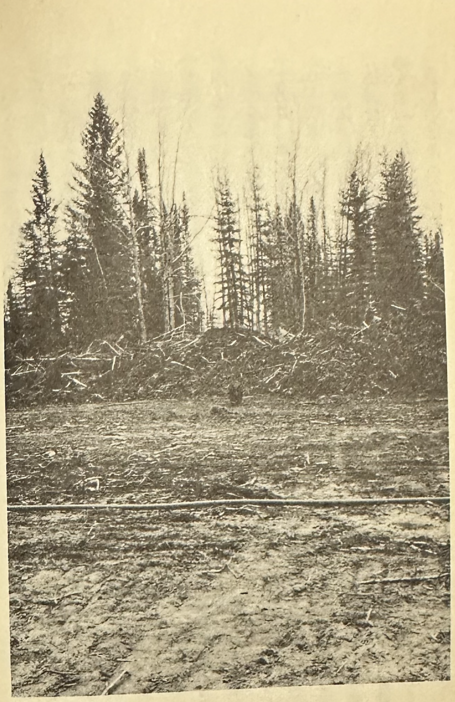
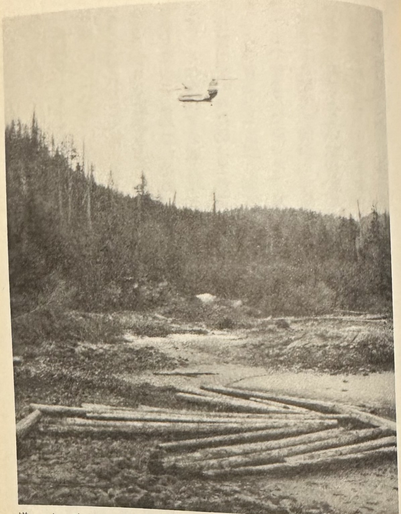
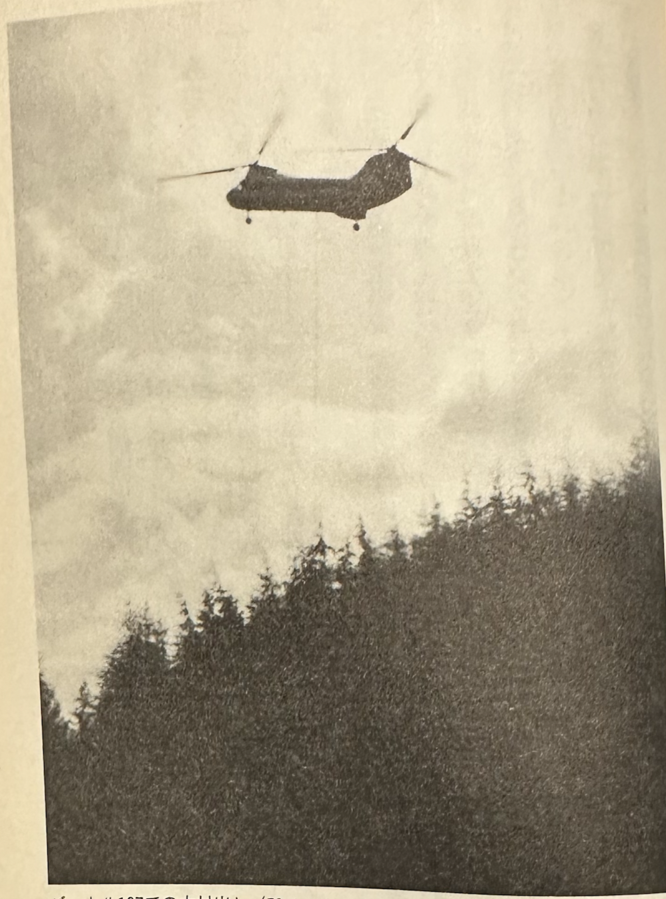

# Bush Pilot Story

Takeshi Yamaguchi

(translated using Google Translate)

We would like to express our gratitude to our senior colleague, Mr. Ari Kamiho, for providing us with photographs to help us produce this book.

## Introduction

Although the term may differ, people called "bush pilots" are active all over the world. The bush pilots mentioned here are pilots in the Northwest Territories of northern Canada who fly in small planes and helicopters to any location requested by their customers. The story written here is based on my own experiences.

The story begins in the early 1970s, when northern Canada was booming with oil, uranium, and iron exploration. Many small planes and helicopters equipped with floats were in operation. The book tells the stories of helicopter pilots who were involved in such operations.

## I'm amazed that I've been alive until now

### （1）The Town of Inuvik

Looking back, it seems like Inuvik still retained some of the atmosphere of its pioneering days.

It's a small town, and if you walk down the main street for just ten minutes you'll already be outside the town, with wooden buildings lining both sides of the road. All the buildings are built on stilts, and because they were built on permafrost, every summer the permafrost thaws and the weight of the buildings themselves causes the pillars to sink into the ground.

Apparently, the floor was built high from the beginning for this reason, but after a few years, this raised floor will probably become the same height as a normal building.

On the outskirts of town stands a large, domed Roman Orthodox church, shaped like an igloo, with a unique cross on top of the dome. It's amazing that such a large church could be found in this far north.

How did it come to be built here?

In October, the main street of the town of Inuvik was a slushy mess of mud and snow.

It's not easy to cross this main street, which is only about 20 meters wide.

Even with my boots on, I nearly lost my balance and fell over as an oil company pickup truck sped through, kicking up mud.

On the main street is the town's only supermarket, Hudson's Bay, but unlike the large buildings found in southern cities, it is a single-story wooden building that resembles a slightly larger retail store.

On the other side is the Eskimo Inn, a hotel and restaurant.

There are two hotels in town, but the Eskimo Inn seems to be the more popular pub and restaurant.

It's my daily routine to walk five minutes from my apartment to the Eskimo Inn restaurant for breakfast.

The town is located at the eastern end of the delta region, where the Mackenzie River originates from Great Slave Lake in the south of the Northwest Territories, flows north, and finally empties into the Arctic Ocean, and is currently in the midst of an oil boom.

It is a base for supplying materials and food and rotating personnel to the oil drilling platforms that line the Beaufort Sea (Arctic Ocean), which lies outside the mouth of the Mackenzie River, 100 kilometers north of here.

Two or three days after I arrived here, I was also tasked with performing this personnel change and food supply operation by helicopter. However, I couldn't understand the English they were speaking, so I spent the whole time concentrating all my attention on listening to what they were telling me and to which platform.

I don't know if it was because of that, but about a week later, when I got out of bed to brush my teeth one morning, I felt sick and vomited blood. I took some medicine and it got better, but I'm worried about what the future holds.

This small town was also flooded with huge Western capital, and was swept up in the raging waves, changing rapidly, as if prehistoric dinosaurs were roaming the area and devouring the smaller dinosaurs everywhere.

In fact, before the oil fever hit, the area was dotted with only a few Eskimo (Eskimo is a derogatory term for them; here we will refer to them as Inuit) villages.

The Inuit previously lived by hunting caribou, fishing for Arctic char and prawn trout, and gathering wild blueberries, but this all changed when oil was discovered in the Beaufort Sea.

It must have been very difficult for the Inuit, who had made a living by hunting for many years, to adapt to such sudden changes in their lifestyle. Some chose to leave the town and continue living as they had always done, while others who chose to live in the town were forced to adapt to modern lifestyles, whether they liked it or not.

It seems that harmful things like alcoholism and smoking among children, which are common in modern life, are also entering this area.

A group of Inuit boys were standing on the steps in front of the hotel, smoking cigarettes and chatting.

Some of the guys were smoking cigars, and I glanced at them as I entered the hotel.

The hotel is warm, and the air is filled with the sound of people talking and the smell of cigars. When you enter the restaurant, the windows open up due to steam, the wooden walls are faded black, the wooden floors are black with oil and mud, and there are faded photographs hanging on the walls. You're instantly seized by the feeling of being transported into a fantasy, wondering what a hotel must have looked like during the Gold Rush.

Just inside the hotel entrance there is a convenience store run by a dignified white woman selling cigarettes, chewing tobacco, cigars, gum, chocolate, and more.

When I first came to this hotel, I tried to buy some cigarettes, but the lady couldn't understand my pronunciation, so we had a long argument.

Since then, this lady has remembered my face and greets me with a "Hi" every morning when I pass by.

I am the only Japanese person in this town, so I have no choice but to speak English.

Before I was sent here, my boss gave me three weeks to do my job, but he said that if I couldn't do the job within that time, I would be fired. So since I came here, every day I've been speaking English, even when I sleep and when I wake up, and yet I still don't understand what they're saying, and time just passes by.

I get frustrated thinking about how I need to get to the point where I can do the job independently, but there's nothing I can do about it.

One day, thinking I wanted to study English, I went to the only movie theater in town and sat in my seat while waiting for a movie to start.

The theater went dark and the movie started, but what appeared on the screen was in Japanese.

The movie was called "Undersea War" and was apparently made in Japan quite some time ago. It didn't really help me study English, but I was lucky to get a little break from my English-filled life.

Two weeks ago, I boarded a plane from an airport in Alberta with my chief pilot, Jan, and my colleague, Mike, and arrived here in Inuvik after a two-hour flight. Jan had brought us to meet Jim, the base manager, and to learn about polar flying from him.

At the Inuvik airport, the maintenance chief, Russ, was waiting for me. He was small, chubby, and spoke particularly fast.

In particular, they use slang constantly, so it's impossible to understand what they're saying.

After a brief chat, we left the airport and sped along the snow-covered, slippery roads in his pickup truck to the base.

After driving on the icy road for about fifteen minutes, a long, narrow lake came into view up ahead.

There are several hangars along the lake.

Our company also has a hangar here, but it is not very large and would only be filled to capacity if two Jet Rangers with floats were placed there.

The Jet Rangers here have huge floats and are slow, only going about 80 miles per hour.

Furthermore, if the control stick is not kept in the "neutral" position, it will immediately resonate with the ground and start dancing, making it a temperamental vehicle.

Anyway, I'm spending these three weeks here trying to see if I can work.

### （2）The Lost Mike

A week after arriving in Inuvik, Mike, who had been doing flight work around Inuvik until then, got his first real job.

He was originally from Texas and served in the Vietnam War as a machine gunner on a Huey helicopter (armed medium helicopter).

He is a typical Texan, cheerful and talkative, but also prone to acting without much thought.

He once took off without properly calculating the helicopter's fuel, only to return to the airport only to find that he had run out of fuel and ended up sitting in the taxiway.

The fact that he tells such a story suggests that he is not good at making detailed plans, or perhaps careful calculations were not necessary during the Vietnam War, but in any case, he has a reckless personality.

Flying in polar regions requires careful planning, and neglecting it can put your life at risk.

On a gloomy day with a light snowfall, Mike and his mechanic, Greg, set off from their base in Inuvik in a Jet Ranger equipped with floats, bound for the town of Old Crow in Yukon.

At that time, the Dempster Highway, running north to south, was being constructed in Yukon, and he was there to work on that project.

The town of Old Crow is 250 miles west of Inuvik, about a three-hour flight.

At that time, there was no GPS (Global Positioning System) yet, so helicopters could only fly using magnetic compasses and directional gyros and were not equipped with any other navigational equipment.

In those days, flying over the polar regions by helicopter was extremely difficult.

Two days after he took off, we received a call from the local area saying, "The helicopter hasn't arrived yet. What's going on?"

It's been two days, so it's certain that he's lost.

Realizing this was a serious problem, they immediately began making contact to start a search, but the atmosphere around them didn't seem very tense.

I wonder if getting lost is an everyday occurrence around here, or maybe people have just given up, which is unfortunate for those who have given up.

Jean says, "The helicopter is equipped with an ELT (distress signal transmitter), so the search plane from the search and rescue center will find us right away," but will they really be able to find us right away? The missing helicopter is loaded with a week's worth of emergency food, so we should be fine for a while, but camping without a hunting rifle in an area where bears and wolves roam must be extremely lonely.

Anyway, Jean and I decided to get into another Jet Ranger and begin our search in parallel with the Royal Canadian Air Force's search.

We first decided to fly the course of the flight plan Mike had submitted, departing from our base at Long Lake in Inuvik and flying west across the vast Mackenzie Delta.

The Mackenzie Delta is a vast delta region formed when a river originating from Great Slave Lake flows into the Arctic Ocean. Stretching for several tens of kilometers, it is made up of countless streams and swamps of various sizes.

After flying west for about 30 minutes, we left the delta and entered the hilly region.

To the west of here the hills give way to low mountainous terrain, and the helicopter continued west, searching the ground in the hope that an emergency distress signal would reach the helicopter's receiver, but there was no response.

Heading west out of the mountains, we enter a tundra area of ​​streams and swamps again.

At this point, the town of Old Crow is just around the corner.

We couldn't find it on this route, so we decided to return to the base in Inuvik.

We decided to change course to the east and head home, but on the way back we decided to take a course a little north into the mountains.

As we crossed the northern side of the mountains and emerged onto the plains, Jean pointed and said, "Look at that!"

A wavy black line can be seen stretching from the horizon across the white tundra plain.

We turn the helicopter in that direction and approach.

As we got closer, we saw a large herd of caribou (wild reindeer) migrating.

At this time every year, caribou feed on moss and grass in the northern tundra, and as winter begins, they migrate south in groups in search of food.

They follow the same migration route every year, traveling from south to north at the end of winter and from north to south at the beginning of winter.

I can see Caribbean 1, which is a size larger than the others, walking silently in front of me.

When viewed from above, it looks like a group of ants walking in a line, and it continues on and on until the horizon.

I became curious as to how far the flock continued, so I decided to fly along with them to find out.

After flying for about ten minutes, we arrived at the end of the flock.

Just when I thought this was the end, I saw a pack of Arctic wolves following us a few hundred metres behind us.

That's not all.

Behind them are brown bears. These carnivores move along with the migration of their prey.

This is a very efficient hunting method, as they attack weakened caribou that have fallen away from the herd.

They don't have to go out of their way to hunt; they can just follow the herd and enjoy the feast.

Bears, on the other hand, can just steal the prey that wolves are eating.

With such limited food, it's like an entire food chain is on the move.

Later, by chance, they came across a pack of Arctic wolves hunting reindeer.

From the air, you can see the hunting process clearly. The wolves are divided into two groups: one that drives the reindeer and one that lies in wait. The latter lie on the ground, waiting for the reindeer to be driven in.

Seeing this, I was impressed by how intelligent these animals are.

Let's get back to the topic.

Since that day, we have searched every day for any route that Mike may have taken, but to no avail.

No useful information was coming in from the search and rescue center. After a week had passed, the atmosphere in the office became heavy and everyone became silent. Then, a fellow pilot, Dip, spoke up and said, "Maybe they've entered Alaska."

Their destination, the town of Old Crow, is located near the western edge of Yukon, about 40 kilometers from the Alaska border.

If they get lost in Alaska, Canadian search and rescue centers cannot operate.

Dave immediately contacted a US search and rescue center.

Dave is a helicopter pilot, just like Mike, and was a former US Army veteran, and had joined the company before Mike.

After the report was made, the search and rescue center in Alaska immediately mobilized, and a search plane from Alaska began searching for the missing plane.

On the third day, the office received a call from an American search and rescue center.

They caught the distress signal and found the missing plane.

According to the story, even when seen from above, both of them appeared to be safe, so everyone was relieved.

Two days later, both men returned to base in good health, but they said that it had been snowing and visibility was poor, so they missed their destination, the town of Old Crow, and ended up crossing the border into the Alaskan mountains. Running low on fuel, they decided to make an emergency landing beside a nearby stream and wait for rescue.

They kept warm by burning the remaining fuel and ate emergency food, but after a week they ran out of it, so they had no choice but to try fishing in a nearby stream using the fishing hook and line that had been included with the emergency food, but nature was not so kind to them.

In the end, they didn't catch a single one, and as they got hungry they began to feel more and more like giving up, so Greg the mechanic decided to take one last photo with the camera he had brought with him, and the two of them went to Heli no Sato to take some photos.

I was shown the photo later, and it showed the two of them standing next to the helicopter with pitiful expressions on their faces.

It was a stroke of sheer luck that we camped for over a week in this area, where bears and wolves are common, and did not encounter any of these predators.

After that, as soon as Mike returned to Inuvik, he continued to go out and have fun as usual, without any remorse, but a week later he was called back to headquarters and returned to Calgary.

I later heard that he was fired straight away.

This incident taught us that even a slight carelessness can lead to a life-threatening situation.

### （3）Single Point Disposal

One day, Jim, the Inuvik base manager, asked me, "I have a new job for you. Would you like to try it?"

Up until then, the only work I had been given was regular flights transporting personnel and food to offshore platforms around Inuvik, so I gladly replied, "Let me do it!"

Jim thought about it for a while, then said, "This job is difficult, but if you can do it, I'll consider you a full-fledged pilot here," and I suddenly became motivated.

The job was to put a helicopter on the ship and observe the ice conditions in each direction the ship was heading from the air, and find a route that was not blocked by ice. However, the problem was that the ship had already set sail, and its exact location was unknown.

In the first place, this ship is hired by the government to distribute food, fuel, miscellaneous goods, vehicles, etc. to Inuit villages on polar islands before winter arrives, towing two barges (rafts) filled to the brim with food, fuel, miscellaneous goods, vehicles, etc.

In winter, villages on polar islands have almost no means of transportation and are trapped all winter, so they have to rely on the food on the raft and the prey they hunt to survive the winter.

By the way, the reason why this job suddenly came up is that the ship has its own helicopter on board.

However, the helicopter took off from the ship mid-voyage to replenish food supplies for the crew and returned to the town of Inuvik.

After that, the plane took off with the cabin filled with food, but unfortunately the pilot had loaded too much luggage without considering its weight, and the plane crashed into a nearby river as soon as it took off.

The pilot was safe, but food had to be delivered to the ship quickly, and more importantly, the pilot wanted the helicopter to return to the ship as soon as possible so that he could find a safe route for the ship.

The problem is that the ship is constantly moving and its exact location is unknown, and even when you ask the pilot, all he can do is point at the map and say, "It's probably around here," so it's completely unreliable.

Anyway, I decided to fly to the place he pointed to on the map.

First, we fly to the town of Taktiaktuk, about 150 kilometers north of Inuvik, facing the Arctic Ocean, where we refuel, then head northeast and across the tundra of swamps and streams under a bell-colored sky.

After flying for about an hour, the sky ahead began to fade into white.

There is a heavy fog.

If you change direction here, you'll lose track of your destination, so just keep going straight.

The fog gradually gets thicker, and finally it drops down to just above the ground and we move straight ahead, but looking around we can only see about 30 meters.

The world had become completely white.

I can see that the road is starting to get a little uphill, but I keep going straight without looking back.

If you change direction even a little bit here, the compass needle will start spinning and you won't know which way you're going.

After a while, I started to smell something like sulfur.

This area is called Smoky Mountain, and there are apparently hot springs nearby, but I don't have time to look for them.

I wonder how far I flew through this pure white world.

It was probably only about 20 minutes, but it felt extremely long, and just as I was beginning to think about turning back, the fog suddenly cleared.

At the same time, there was no ground there.

He jumped over a cliff.

Looking down, you can see the pitch-black sea far below and floating ice floes.

The sea stretched out from here.

From here on, we had to fly in a straight line over the icy sea to the single point.

This will be our second refueling stop, and we plan to head north from there.

By the way, the real name of this place called Single Point is Cape Point.

At the time, the United States was in the midst of the Cold War with the Soviet Union, and in order to jointly defend itself against Soviet aerial attacks, it established a radar network called the Dewline Sight from Alaska to the far north of eastern Canada.

This single point is also one of the names of the radar site.

From there, we changed course to due north and flew for about an hour to reach the spot he was pointing out.

However, it is extremely difficult to find a small boat floating on the surface of the sea covered in drifting ice.

After refueling, the aircraft headed north toward its target location.

After about an hour, we arrived at our destination, but as expected, the ship was nowhere to be found.We gradually increased the search radius and searched the surrounding area thoroughly, but we still couldn't find it.

As fuel was running low, we decided to return to the single-point radar site.

A second search failed to find the ship, and as the sun was setting, we decided to call it a day's search and stay the night at the radar site.

Once inside the site, it appears warm and comfortable to live in.

After a light meal, a staff member gave us a tour of the facilities inside.

The room where the radar is operated is off-limits, but a window gives a glimpse into the inside of the radar room.

It was dimly lit inside and we could see Canadian and American soldiers working together.

I learned for the first time that there are people who have to stay away from their families in such a remote place and keep watch for Soviet invading planes 24 hours a day.

The second day of the search began early the next morning.

Today we decided to search a little further west from yesterday's location, so after filling up on fuel we set off heading northwest.

After flying for about an hour, we spotted something that looked like garbage in the drift ice and approached it.

As we got closer, we realized it was the ship and barge we were looking for.

A tugboat can be seen pulling the second barge.

We landed the helicopter on top of the barge and entered the ship, where we were greeted by the captain and other crew members.

"We were worried because you were late," the captain said happily, approaching me.

After exchanging greetings in my poor English, Captain Dan asked me about our plans for the day.

The message said the ship was about to carry cargo to the village of Saxhaba 1 on Banks Island, one of the islands in the far north.

The ship has been delayed because it has been stopped here for the whole day waiting for a helicopter.

So after we landed we immediately set off for Sachs Harbor.

After that, we rested in the cabin for a while, and then the captain brought in one of the crew members.

The captain said, "His relative is in critical condition and he may need to return home. Please pick him up and return to Shingle Point immediately.

If we get there there's a phone so we can contact them, what do you think?" I hesitated for a moment, not knowing what to do.

The only fuel the ship had was Bell 47 gasoline, which would not be suitable for the Jet Ranger.

Furthermore, we only have a little over an hour of fuel left at the edge.

We only have enough fuel to get us to Single Point, and when we refueled this morning we found that we only had one drum of jet fuel left at Single Point, enough for two hours.

If we don't find the boat the next time we come back, we'll be on the verge of going back to Single Point.

The ship is behind schedule and is heading north, and the crew is urging them to hurry up.

They fill up on the remaining fuel at Single Point Base and return to the ship, but it is already difficult to find the ship on the surface of the ocean covered with drifting ice, and since the ship is moving, the search takes time.

If they can't find it, they'll have to return to Single Point Base, which could mean they run out of fuel.

There is a huge float attached to the bottom of the helicopter that gets in the way and prevents it from going very fast.

I have never resented this float more than I did at that moment.

The crew member wanted us to leave as soon as possible, so we decided to head to Single Point anyway.

The weather was much better than the previous day, and after flying for about an hour over the sea covered in ice, we came into view of a distinctive round radar dome.

After landing at Single Point, we refueled and waited while he went to make a call to base.

He returned after a while and said that he had to go home, so he would wait here for the charter plane.

I ended up returning to the ship alone.

I wasn't sure if I'd be able to find the ship since it had moved from its original position, but I headed off in the direction I'd come from.

We flew for about an hour, but as expected, there was no sign of the ship.

"What should we do? Should we search a bit more, or head back to Single Point?"

I muttered to myself.

If we continue like this, we won't be able to return to Single Point.

"Oh well! Let's go a little further," we thought, and continued on for ten, then twenty minutes, when we saw a small ship ahead.

"Oh, thank goodness. Now I don't have to go down into the cold, icy ocean."

Breathing a sigh of relief, I approached the ship.

The next afternoon we arrived at our destination, Sachs Harbor.

While the barge was unloading its cargo of food, fuel, snowmobiles, trucks, etc., I got off the boat and looked around the village. There was only a small settlement, and it was a desolate place with no grass or trees.

I passed through the village and climbed the road, wondering how the people living in such a far northern place survive the freezing cold and pitch black winter all day long.

After climbing for a while, we could see the gravel runway.

The remains of the plane are placed next to it.

The plane's exterior was peeling and it looked old, but as I was walking along wondering what story it had, the captain called out to me from the bottom of the hill, "We're leaving in an hour, so don't be late."

Since there didn't seem to be anything else to see, I decided to go back the way I came.

After unloading its cargo, the ship immediately set sail for its departure point, Inuvik.

Along the way, we flew by helicopter twice to check the condition of the drifting ice, but it was not in a condition that posed any problems, and when the boat returned to the coast of Taktiaktuk, the captain told us, "We no longer need the helicopter, so you can return to Inuvik," so we immediately took off from the boat and headed toward Inuvik.

It was a quick flight from here to Inuvik, so it was a relaxed journey back, but when I arrived back in Inuvik safely, I felt a mixture of relief that my work had somehow been completed, and anxiety about what kind of dangerous work would come next.

In any case, we were lucky that we didn't run out of fuel and have to make an emergency landing in the cold ocean.

I'll never do something so reckless again. No matter how many lives I have, it won't be enough.

### （4）The Helicopter Skiing Story

We left Calgary and have been driving on frozen roads in our company car for over three hours.

There were no streetlights on the road, and in the pitch black, the snow shone white in the headlights and flew away.

It's just over two hours from here to Caribou Mountain Ski Area.

We passed through Banff, left Highway 1 in the town of Golden, and headed south onto Highway 65, but the road was frozen over in places and had turned into black ice.It was late at night, and once we got onto Highway 65, there were no cars passing by.

If you lose control of your car on this black ice, it will instantly crash into the snow bank on the side of the road and become unable to move.

And if no cars pass by until tomorrow morning, they might freeze to death.

It was just after nine o'clock when we arrived at our destination, the motel in Caribou Mountain Ski Area.

There's a restaurant next to the motel, both run by a talkative Greek man in his forties.

As I entered the restaurant, the owner approached me and said, "It's late, isn't it? Dinner isn't ready yet. Would you like something to eat?"

Heli-skiing work rotates weekly, with crews arriving every Sunday night.

"Give me a crap sandwich and a coffee," I said, sitting down and eating alone while thinking about the flight the next day.

Since last year, Jet Ranger has been heli-skiing in the Cariboo Ski Area many times, so I'm familiar with the terrain here, but this was the first time the company had entrusted me with heli-skiing on the Bell 204.

The company had given me a 204 model for this heli-skiing trip, but I've only been flying it for about eight hours so I'm not used to it yet.

But I'm sure we can do it somehow.

Anyway, the skiers are coming tomorrow morning, so I'll study the manual again tonight.

After a late dinner, I went to say hello to Hans, the Austrian manager of the heli-skiing company.

He is the manager and ski guide here, and he is also the person who pioneered Cariboo Mountain Ski Area.

Cariboo Mountain Ski Area has over 30 ski runs alone, the highest of which starts from the summit at 8,600 feet.

This course is a straight downhill course with a 40 degree incline, with some parts even reaching a 50 degree incline.

He slides down the virgin snow, kicking up snow so that it covers his knees.

I can't ski so I don't really understand, but apparently people come from as far away as Europe, as well as Canada and the US, to ski on the virgin snow here.

The heli-skiing tours here include day tours, where you can enjoy heli-skiing for a day, and week tours, where you can stay overnight at a lodge and enjoy skiing for a week.

This week's tour involves staying in a mountain lodge deep in the mountains, where no roads are available, and enjoying heli-skiing.Every morning, the helicopter takes off from a heliport next to a motel at the foot of the mountain, picks up skiers at the lodge, and takes them to different courses three times in the morning and three times in the afternoon.

After dropping off Skier 1 at the top of the mountain, the helicopter immediately plummets, waits for Skier 1 to come down at the bottom of the ski route, and then takes him to the next run.

During the week at the mountain lodge, you will spend your time skiing during the day and playing chess or reading in the quiet lodge with no television at night, but there is a specialized staff member who will prepare all three meals for you.

I don't like cheese, so the food here wasn't to my taste. However, the mountain lodge was chic, with the walls and floors paneled with beautiful wood grain, and the tables and chairs all made of wood.

There are various photographs hanging on the walls of this living room, but there is one that stands out.

The photo shows skiers sliding down a slope, with a helicopter resting its wings in the foreground, waiting for the skiers to come down.

The problem is that a huge avalanche is coming up behind the skiers.

Judging from the photo, there is no time for the helicopter to start its engine and take off with the skiers on board.

I had intended to ask Hans what happened to the photo afterwards, but I forgot to ask.

I still remember it and wonder what happened after that.

The next morning, when I looked out the window, the snow that had been falling since the previous night had stopped.

The sky is covered with thin clouds, but visibility is good and there seems to be no wind.

"This looks like it'll be fine today. It's a pretty good day for the first flight of the 204," I muttered to myself, and went to meet my guide, Hans, to ask about today's ski schedule.

A navy blue 204 was resting on the heliport.

The mechanic in charge came over and said, "The snow that fell yesterday has stuck to the main rotor, so it will take a while to remove it."

I wonder why the mechanic didn't put on the rotor cover even though it had been snowing since last night, but it's too late now.

Still, I was annoyed by the mechanic's attitude, as if to say that it wasn't my fault that the car froze, but that the weather was bad.

I'm getting anxious as the time for the day skiers to arrive is approaching, but I can't seem to remove the ice that's stuck to the rotors as I'd hoped.

While we were doing this, a bus carrying skiers arrived.

The skiers first listen to the ski guide's instructions on what to be careful of when getting on and off the helicopter, and what to be careful of when heli-skiing, and then each person is given a beacon to wear around their chest.

This is to help you quickly find your buried spot if you are caught in an avalanche.

Around ten o'clock, the ice finally cleared from the wings and we took off, picking up the impatiently waiting skiers.

Today we are scheduled to take you to the course that starts at the highest point, around 8,000 feet.

The helicopter, carrying a total of eight people - six skiers, the guide, and myself - rose steadily and pierced the low-hanging clouds.

Above the clouds, there was no wind and the blue sky spread out, and the surrounding mountains were covered in snow and shining white.

After about ten minutes of climbing, the landing point for the ski course came into view, at an altitude of 8,600 feet.

Circling above the landing site, the plane assessed the wind direction and prepared for landing.

The landing site was near the summit, a flat area of ​​snow about 1.5 times the length of the helicopter.

If you move even a little bit from that position, you'll roll down a 40-degree slope.

Mountains jut out on both sides of the slope, and the ski course stretches out in a straight line straight below like a water chute.

From here, the skiers slide down to the helicopter's waiting area 3,000 feet below, but the landing area is so narrow that skiers cannot move far away after disembarking from the helicopter and must crouch near it to avoid the strong winds from the helicopter.

If it were to be blown away by the helicopter's wind pressure, it would roll down the ski course.

The other side of the ski course is like a steep cliff, and you can see the river flowing in a straight line far below.

After dropping off the first group of skiers, we returned to the main heliport to pick up the second group of skiers, and the low clouds that had been there in the morning had disappeared, making it a perfect day for skiing.

We took off with a second load of skiers, took the same route up, and made our final approach.

We took a slightly higher approach and gradually began to descend while keeping an eye on the spot where we had just landed, but since there were no mountains nearby that were higher than this peak, it was like descending to the peak of Mount Fuji.

The approach was now in the final stages and the speed had dropped considerably.

At that moment, the landing point in front of me suddenly rose up and in an instant, it had moved far up in the air.

The plane began to descend rapidly. At this point, a snowy slope was already approaching ahead, and the plane continued to descend rapidly.

There was no time or altitude to turn and escape.

My body was frozen and I could feel the adrenaline rushing through my body.

"Namusab!" I shouted in my heart.

A few seconds later, the snow smoke kicked up by the helicopter obscured everything, and I froze, gripping the control stick tightly, thinking, "Next comes the impact of the crash."

But the shock never came.

As the thick snow smoke around us gradually disappeared, the surroundings became faintly visible.

I looked around to see what had happened, but the engine and rotors were still spinning.

The plane appears to have landed as well.

I asked Hans, the guide sitting next to me, as calmly as possible, "We've landed in a slightly different place, please let the passengers out," and when he opened the door and looked out the back, he was surprised.

"We can't get the skiers off like this. Their backs are in the air and if they jump off they'll roll down the steep slope," he shouted, adding, "Please move them to a proper landing spot somehow."

However, the rotor RPM needle on the instrument panel had dropped significantly, completely outside the normal range, and the helicopter itself was barely holding on, with only the front of its skids (ski-like landing gear) resting on the snowy slope, and the rear of it floating in the air.

I was relieved that the main rotor had not hit the slope ahead, but then I was at a loss as to how to get out of this situation.

If you try to increase the rotation speed by lowering the collective pitch lever, the aircraft will lose balance and will obviously roll headfirst down the slope.

However, pulling the pitch lever would reduce the rotor speed even further.

The passengers sitting behind me looked at me with concern.

"Is it really necessary to let the passengers off from the back?" I asked Hans again, but his answer was the same.

What should I do? I can't just wait like this until the fuel runs out.

At this point, a risky idea came to mind.

The idea was that if the aircraft could be flipped 180 degrees and made parallel to the slope, the pitch lever could be lowered, and once the pitch lever was lowered, the main rotor speed would be restored.

For now, there doesn't seem to be any other way out of this situation.

Once that was decided, the next step was to figure out how to flip the aircraft 180 degrees.

There was a steep slope ahead, so I first rotated the aircraft left until it was parallel to the slope.

The aircraft then continued to rotate left while lowering the nose to avoid the tail hitting the slope, gradually tilting the aircraft to the angle of the slope.

Just as the plane was about to make a 180-degree turn, it began to slide down the slope.

Looking ahead, the plane was not stopping but was gradually gaining speed, as it was a steep slope of fresh snow with no bumps whatsoever.

When I realized that there was no way to stop it, I made up my mind to move the pitch lever to its lowest position and restore the main rotor speed as quickly as possible.

The aircraft is fitted with helicopter skis, so it gradually picks up speed as it glides down the slope.

I wonder how long it was.

It was probably only a few tens of seconds, but it felt extremely long to me.

I remember yelling at the passengers behind me, "Hold on tight!!"

Looking at the rotor RPM, I saw that it was gradually increasing. I continued downhill, praying that the RPM would return to normal as soon as possible.

When the plane suddenly floated up, it felt like all the tension in my body was released.

It was pure luck that the plane didn't have any bumps in the hundreds of metres it slid down.

I jumped into the air again and looked at the spot where I had just skied down, and saw clear marks from the helicopter's skis on the snow.

"I can't believe he managed to jump up safely!" I thought, impressed even now.

After that, undeterred, we headed back to the landing spot at the top of the mountain.

When we arrived above the landing site, unlike the previous time, the wind was blowing from the opposite direction.

This caused a rapid loss of speed during the approach, which is what happened above.

So this time we made the approach from the opposite direction and landed safely at the landing site.

After that, the skiers decided to stop after this one ski run and cancel the next two runs, so they decided to return to the main heliport.

It's no wonder.

If you experience a fright like that, you'll lose all motivation to ski.

Even I broke out in a cold sweat, and to be honest, I wished I could have cancelled the rest of the flight.

About two days later, I got a call from my boss.

We received a report that "That pilot is dangerous, so let him go," so we were told to "come back, we're going to bring down the heli-ski."

So, I was quickly taken off heli-skiing.

However, I think I may be the only person in the world who has ever made a straight descent from 8,000 feet on a 204.

At any rate, I never want to do something so reckless again, but at the same time, I realize how lucky I was to be alive.

## Bush Pilot Going South

I'm currently on a plane heading to Los Angeles.

The reason I was on this plane was because I had left Vancouver and was heading south to Los Angeles for my first business trip outside of Canada.

I'm scheduled to take over from pilot Tom in Los Angeles and then board a tuna boat from Panama.

He was hired to search for tuna using a small helicopter called a Hughes 300 that was on board the tuna boat.

However, I have never ridden in this helicopter, the Hughes 300.

So he will be trained by his replacement pilot, Tom.

However, it turns out that Tom, who was originally supposed to meet in Panama, is actually in Los Angeles.

There are no Hughes 300s in LA, so I have no idea how they're going to train me.

Anyway, I'll just have to meet Tom in Los Angeles and ask him how it works.

There, I am scheduled to meet the mechanic who will be in charge of my car for the first time.

The mechanic is American, and we will be meeting in Los Angeles and going to Panama together, but I haven't been told anything about what kind of person he is, so I'm worried about whether we will be able to get along well when working together.

I arrived at Los Angeles Airport and headed straight to the designated hotel. When I arrived, I received a message that I would be meeting Tom, the replacement pilot for that night, and the mechanic who would be in charge of my flight.

That night, when I arrived at the appointed time in the lounge on the first floor, a white man immediately approached me.

There were still few customers in the lounge at this time, so they must have noticed me right away.

I exchanged greetings with my replacement pilot, Tom, for the first time and headed towards the bar.

There I was introduced to Joe, the fuel engineer I would be working with.

He is a tall, thin man in his late thirties.

Then he began to speak.

He spoke briskly, as if to say that he had plenty of experience with airlines, including the 707 and DCI8, and that if it was anything to do with airplanes, he should be left to me. It seems that this man was born with a mouth first.

*Bell 47G5 descending into the tundra*

So I asked him if he had any experience with the Hughes 300, which we would be handling today. He replied, "I handled a Bell 47 in the past, but I haven't touched a helicopter for a while. But I'm fine." I was so stunned that I couldn't say anything else.

But he didn't seem to notice my surprise and continued talking about his impressive career.

Regardless, I told Tom that this was his first time doing the job, that he had never flown a Hughes 300 before, and that I wanted him to practice takeoffs and landings at least two or three times.

However, his reply was curt.

"We don't have the aircraft or facilities to train here in Los Angeles, so you'll have to go to Panama and do it yourself.

"I've never flown a Hughes 300 either. I've been flying a Bell 47 until now, but this time, when the ship docked, they changed to a new aircraft. I think they have a brand new Hughes 300 on board, so I'd like you to go and check it out and train on it yourself," he said.

At that moment, my mind was in a state of confusion and I couldn't think of what to say next.

He told me to train on a small aircraft that I had never flown before.

I was at a loss and began to think about just going home, but I decided to make a decision once I got there, so on that fiery day I decided to fly to my destination, Panama.

On that day, I will be flying from Los Angeles to Panama on a Pan American airline, with a stopover at Managua Airport in Nicaragua on the way.

There was a few hours' waiting time at Managua Airport, which wasn't enough time to sightsee, and since I don't speak Spanish anyway, I decided not to leave the airport.

When we landed at Managua Airport and stepped out into the lobby, a muggy tropical heat washed over us.

The police officers at the airport were also carrying light machine guns, which made me realize that I had left Canada behind.

It was night when we arrived at the airport in Panama.

With the dispatcher's instructions, Joe the mechanic and I were able to exit through a side aisle, while passengers were waiting in a long line at immigration.

Is the power of money at work here too?

We left the airport and got into a taxi to head to the hotel our coordinator had recommended, but it was pitch black all around and we had no idea where we were or how we were getting there.

The coordinator was talking to the taxi driver in Spanish, but I couldn't understand a word of it, and Joe, who was sitting next to me, seemed to be asleep and didn't say a word, so I decided to sleep on the way to the hotel and closed my eyes.

The next morning, I got out of bed and opened the curtains.

And there, a world of pure green spread out before me.

The jungle is right next to the hotel.

For some reason, I was moved by the green world that spread across the morning mist, and it dawned on me that I had indeed come close to the equator.

Today, after breakfast, our coordinator will pick up Joe and me at the hotel, and then we will head to the port.

The ship we will be riding on this time has completed repairs at the dock and is preparing to depart, but we don't know what's happening with the helicopter.

What's more, I don't know what will happen with training, so I'm extremely anxious.

The town of Balboa is the largest town on the Pacific side of the Panama Canal, and from there we go to Balboa Port.In order to enter the port, we have to go through the Panama Canal Zone, which is controlled by the United States on both sides of the Panama Canal, and we cannot enter without obtaining an American visa.

This is probably also part of the security policy of the great power, America.

Anyway, I got my passport stamped and entered Port Balboa.

The target ship was the Granada, a 1,100-ton ship.

The sleek, pure white hull was moored alongside the pier.

The helicopter I was to board was perched atop the top deck of the ship, a brand new, pure white aircraft.

While glancing at the aircraft, I went to meet the captain and the other crew members.

The captain (everyone here calls him Skipper) is a man named John, who looks to be in his mid-thirties.

I say probably because his face is covered with beard, so it is impossible to tell whether he is old or young.

The deck master and chief engineer are both white, and the other crew members appear to be from Central or South America.

I later learned that both the captain and the deck master were second-generation immigrants from Portugal.

I realized in a strange way that Portugal is a country with a thriving fishing industry, just like Japan.

The skipper told me that we had changed to a new helicopter this time and to check everything before we set sail, but I was still unsure whether I should go or go back.

He didn't answer Skipper about it and just watched the new helicopter from a distance, but Joe, the equipment technician, had already gone into the helicopter parts shed and started looking it over.

He is determined to make as much money as possible from this job.

I also started to feel like, "I've come this far, so it's time to start making a lot of money!"

Being a practical man, I became interested in the helicopter I had been watching from a distance, so I went into the helicopter's cabin, picked up the manual and began learning how to start it.

The Hughes 300 can carry up to three people, but usually only two.

There are two fuel tanks on the left and right behind the cabin, allowing it to fly for about five hours, but it cannot go very fast because it has huge floats on the skids.

In addition, a small box containing smoke bombs, food, and drinking water is attached to the side of the float in case of an emergency water landing.

This is a shark repellent powder that apparently gives off a smell that sharks dislike, so I just hope I never have to use it.

He has been slowly going through the engine start procedure with the manual in one hand, but since it is his first time starting the engine, it is understandable that he is slow, but I don't like the fact that Joe, the tie-breaker, has been hiding in the shadows of the deck and looking at me.

He knows I've never been in this type of helicopter before, so he always takes refuge in a safe place.

Understandably, this took a bit of a toll on my self-esteem.

Well, I told myself that the piloting feel of all small helicopters would probably be similar, and started the engine for the first time.

Rotor speed is at 100% and we're ready for takeoff.

It's a tense moment.

I slowly raised the collective pitch lever and the aircraft took off smoothly as if nothing had happened.

Once it takes off, it's all ours, and after hovering still for a while, we try it out by making a hovering turn, and it seems to be a very obedient aircraft.

The aircraft will then land and inspect the equipment installed on the aircraft.

This aircraft is equipped with an ADF (direction finder), but perhaps because the ship's radio waves are not receiving adequate power, the ADF needle no longer points in the direction of the ship once it is about five kilometers away.

I tested it several times, but it still didn't work.

There was no time to replace the ship's equipment, so I was wondering what to do when the skipper brought over a small square box and something that looked like a short stick.

The skipper said, "This is a ship's transponder, which will show up on the radarscope on this ship.

"As long as we load this onto the helicopter, the ship will be able to find us no matter where we are, so there's no problem! Just attach this transponder somewhere on the helicopter," he said, and quickly left.

The next step was difficult, as the transponder was originally designed for ships and was not designed to be attached to a helicopter.

Security Officer Joe and I carried the small metal box and antenna around the helicopter, searching for a suitable place to attach it, but we couldn't find a suitable spot, let alone the time to modify it and attach it.

Finally, mechanic Joe said, "I guess we have no choice but to attach this whole box to the outside of the aircraft," and lined it up with the anti-collision light on the tail boom, secured it in place with duct tape, and then wrapped it around with safety wire.

Joe said, "It's wrapped up so tightly it won't fall off," but it's me who will be flying, and I'm very worried.

If this were to fall into the ocean, you'd be lost in the middle of the vast Pacific Ocean with only a useless direction finder.

The only thing they can rely on is a transponder strapped to the back of the helicopter with duct tape.

With this, we can constantly monitor the helicopter from the boat, which is reassuring, but it's scary to think about what would happen if it broke.

Anyway, there was only a day and a half left until departure, so Joe and I quickly went to the city to buy some necessary items.

This is a Spanish-speaking country, so English is not spoken when taking taxis or shopping in stores, so we had to rely on Joe's Spanish handbook, but we managed to buy everything we needed.

On the day of departure, Chief Fengineering Officer Doug was busy disassembling the engine of one of the five racing motorboats loaded on the aft deck.

The Granada is equipped with five motorboats and one slightly larger vessel called a cutter.

We will discuss later how to use these boats.

The day of departure was a perfect sunny day with only a light breeze. The boat left the pier and set off to fish for tuna.

I sat on the top deck, gazing idly at the passing scenery as the Granada left the port of Balboa.

Palm trees quietly passed before our eyes, and we enjoyed the tropical breeze as we passed under a large bridge and out to the open sea, cruising on a boat that glides silently under the blazing sun.

Just then, the deckmaster came up and pointed to an island ahead, saying, "That island is the last piece of land you'll see. After that it's just ocean, so keep your eyes peeled." I too found myself vaguely wondering if this would be the last I'd see, or if I'd be able to return to this port alive.

The ship appears to be heading southwest, but I have no idea where it is actually going.

It seems that fishing grounds are a closely guarded secret among fishermen, and no one is allowed into the captain's cabin, let alone shown the captain's nautical charts.

Shortly after we were out in the open sea, about three crew members came up to the top deck.

I later learned that they were migrant workers from Costa Rica.

They each held binoculars and took positions on either side of the ship, gazing out at the horizon.

Intrigued, I asked them if they could see tuna through the binoculars or if they were looking for something else, but they answered in Spanish, so I got nowhere.

After having this pointless conversation for a while, I finally realized that they were looking for dolphins, but I didn't know why.

This boat is supposed to be looking for tuna?

*In flight aboard the Granada. The helicopter in question is a Hughes 300.*

As this was going on, John, the skipper, came up onto the top deck, smoking a cigar and sporting a scruffy beard. He said that he didn't shave it until he returned from fishing because he was worried that shaving it would lead to poor catches.

Now, let's set off in search of our first tuna.

I started the helicopter engine with a bit of nervousness.

Skipper is smoking his trademark cigar.

The smoke tickles my nerves pleasantly. The doors on both sides are removed so the wind can blow through the cabin.

Once the rotor speed was increased to 100 percent, mechanic Joe began to remove the chains securing the helicopter to the deck.

Then it's ready for takeoff.

I nervously slowly pulled up the collective lever, and at the same time the helicopter slowly separated from the ship and rose into the air.

Seen from above, the Granada glides smoothly along the water, its pure white hull standing out clearly against the blue sea.

The scene is like a painting.

"Fly in this direction," the skipper said, pointing. We headed 90 degrees from the ship's direction and continued flying at an altitude of 10 feet.

The skipper was holding binoculars and occasionally scanning the horizon, and as we were flying I thought to myself, "Maybe the captain is looking for dolphins too," when he asked me, "Can you see the dolphins jumping over there?"

I looked in the direction he was pointing but couldn't see anything.

I flew in that direction, wondering if the captain had very good eyesight or was just guessing.

After about ten minutes, I finally saw the dolphin jumping, but the skipper said that this dolphin was no good.

I don't understand at all what's wrong.

They are here to fish for tuna, but they are just chasing dolphins.

I have a lot of questions right now, but what's more important is whether I can get back to the ship safely.

The ship had long since disappeared from view.

The direction finder isn't working either.

*Tuna landing (20 tons of tuna on board the Granada)*

The only thing that reassured me was the radio notification that the transponder shoulder number attached with duct tape to the tail of the hull was appearing on the ship's radar scope.

However, it is frightening to think what would happen if the transponder stopped working or the radio signal stopped working. The helicopter has floats so it floats on water, and it is loaded with a week's worth of food, so they won't die immediately, but if the boat doesn't find them, the agony until death will only be prolonged.

Even when I think about such things, I don't feel any sense of crisis at all. Is it because of the brilliant sunlight, blue sky, and sea?

The skipper takes time to change course.

It seems to be flying in large circles around the ship.

As I was thinking that, he suddenly pointed and said, "Go in that direction."

As usual, I couldn't see anything. After flying for a while, I could see dolphins jumping.

"That's a spinner, so there's a tuna in it," the skipper says.

When I asked the skipper why the dolphin was called a spinner, he replied that it was called a spinner because it rotates its body when it jumps.

It's a very easy to understand name.

As we approached the dolphins, they ran away as fast as they could, apparently startled by the sound of the helicopter.

The skipper ordered us to go to the front of the pack.

As the helicopter increased its speed and arrived at the front of the pod, we saw a black mass moving in front of the lead dolphin.

The skipper calls the mother ship over the radio, saying, "Those are tuna. This school is about 20 tons."

The helicopter waits above the dolphins until the boat arrives.

Let me explain why tuna are found in groups of dolphins.

The tuna search for fish to feed the dolphins.

Instead, when the tuna is in danger of being attacked by a predator such as a shark, it hides under the dolphin's belly and the dolphin drives the predator away.

The dolphins below swim patiently, unaware of what their fate holds.

About 30 minutes later, the white hull of the Granada appeared in the distance.

The Granada stops away from the dolphins so as not to startle them, and then lowers each of the speedboats on board into the sea.

Each speedboat seems to carry the same migrant crew members who are always on the top deck looking through binoculars.

The skipper radios from the hem of the ship, giving the go command, and the Granada's speedboats, lined up in a line with space between them, form a single file and circle around the dolphins at a distance.

It's like a cowboy driving a herd of cattle on horseback.

The speedboat keeps the group at a distance and gradually shrinks the circle of dolphins that are spread out, forcing them to gather in one place.

The dolphins and tuna have no idea what is happening, but sensing danger, the scattered pods gather together in one place.

When the timing was right, the skipper in the helicopter above gave the signal, and the cutter boat loaded on the back of the Granada began to slide out to sea.

The two ends of the purse seine are connected to the cutter boat and the Granada, and the two boats circle the dolphins in the middle, which is the most tense part.

While the net is surrounding them, the dolphins and tuna desperately try to escape, heading in a direction where the net has not yet been lowered, but a speedboat scares them with the sound of its engine and blocks their escape route.

If the dolphins do not stop at the sound and flee from the circle, the fishing attempt is a failure.

Once the nets are lowered, the skipper changes personality.

He shouted instructions one after another to the crew of the speedboat, telling them to go right, turn left, so loudly that it hurt his ears even to listen from the sidelines.

When the fish finally try to escape, they lower the helicopter just above the water surface in an attempt to scare them away with the noise of the helicopter, but this doesn't seem to be very effective compared to the noise of a speedboat.

If the dolphin still escapes, they will say that it was because of my poor piloting.

Although I find this extremely unpleasant, I keep quiet.

Once the net has circled around and blocked the exit, there is no need for the helicopter.

In the ocean, dolphins are struggling desperately to escape from a purse seine net with its exit blocked.

Until the bottom of the purse seine net closes, the tuna can still escape if they try to go lower, but that's the sad thing about tuna and dolphins - they don't go deep enough.

Once the bottom of the net is closed, there is no way out.

After closing the bottom of the net, the crew lowers the part of the net above the water surface to allow the dolphins to escape, but most of the dolphins get caught in the net underwater and drown.

Only a few lucky surviving dolphins are able to escape.

As soon as the skipper gets off the helicopter he goes to the aft deck to see how much tuna has been landed.

After landing, I would usually be exhausted from being yelled and shouted at by the skipper and would go back to my room to get some rest.

By the way, there is a swordfish horn lying around in this room.

It is unclear who left it there or why, but the horn is very hard and heavy, making it perfect for use as a club.

I'm thinking of hitting Skipper over the head with this one day.

On the aft deck, tuna and dolphins were being scooped up from the purse seine nets with a large landing net and brought out onto the deck.

The dead dolphins are then dumped into the sea, and only the tuna is placed in the hold of the ship.

Seeing this scene, Western countries criticize the eating habits of other countries, saying that it's wrong to catch fish or eat dolphins these days, but shouldn't those countries be the ones to blame the companies and individuals who made their fortunes by killing dolphins in this wasteful way in the first place?

At that time, environmental conservation groups were not yet widely known, but it would be extremely unfair to say that it is okay for people who did whatever they wanted and destroyed nature back then to not do that now.

Whether in the past or now, if someone builds wealth by destroying nature or going against nature conservation, shouldn't they be subject to a tax, such as a nature destruction tax or a nature conservation law violation tax, as compensation?

At the time, I continued working without questioning anything, but now I think that the way we fished back then was all about plundering everything.

By the way, there is a Portuguese cook on board the ship, and the food he makes is quite delicious.

They serve paella-style dishes, pate-like dishes like those used in tuna sandwiches, and other dishes that are created every day using limited ingredients.

The food here seems to suit my taste, and I never get tired of eating it every day.

Mechanic Montana Joe always orders a large refill.

It's strange that she is so thin considering that.

Where do the nutrients we eat go?

This mechanic, Joe, had long been known as Montana Joe.

His crew noticed his tendency to boast about his background, and someone remarked, "Well, you must be famous in your hometown of Montana!", hence the nickname.

Anyway, I watch him work every day, and I can't imagine that he has any experience maintaining helicopters.

Well, the helicopter is flying smoothly for now, so I tell myself that there's no point in adding more to my worries, and I just pray each day that the day's flights will end safely.

One day, as usual, I went out looking for tuna with my skipper. We were about 30 miles away from the boat, and the blue of the sky and the indigo of the sea were separated by the horizon, and the white clouds floating in the sky cast shadows on the surface of the sea, creating black stains.

My helicopter slowly moves through it.

Suddenly, I looked over the surface of the sea and saw something huge floating. As I got closer, I could see how huge it was even from 300 meters above the water. It had brown skin with spots, but it didn't look like a whale.

"That's a whale shark," the skipper told me. In Japan it's called a whale shark, but even so, it must be over 30 meters long.

At that moment, a radio call suddenly came from the ship.

A tense voice came over the radio saying, "The plane has disappeared from the radarscope. Stay where you are and don't move."

I looked at the skipper, but he said, "Continue on the same course." When I said, "Didn't I tell you not to move from this point?" the skipper remained silent.

There was a moment of silence, but we decided to continue on the same course as the skipper had said.

The radio keeps reporting the situation, but the plane still doesn't appear on the radarscope. The skipper keeps informing the ship of the course every time it changes course, and I am reminded of the story of a pilot who flew on this ship before.

I heard this story from the chief engineer a few days ago.A pilot who worked there before also had a problem with his transponder, and he immediately headed in the direction of the mother ship, but he couldn't find the ship and was running low on fuel, so he was forced to splash down in the Pacific Ocean and wait for the mother ship to find him.

The helicopter is equipped with floats, so it does float on the water, but it is unstable and there is no telling when it might flip over.

Fortunately, the mother ship found us and nothing happened, but that may not happen to us.

Considering the skipper's course changes and the time, we should already be able to see the Granada ahead, but all we could see was the blue sky and the vast ocean.

There was still enough fuel left for two and a half hours of flight, but anxiety was gradually building up within me.

At that moment, a report came over the radio that an aircraft had appeared on the radarscope.

According to the radio, the course was slightly off to the left, but it was roughly what I had expected. At this point, I gave the skipper a second thought.

For once, I didn't mind the cigar ashes he was smoking in the cabin blowing into my face. I always complain about the wind blowing ashes into my face during flights, but today I decided not to complain.

When they returned to the ship, they investigated why the aircraft had disappeared from the radarscope, but the cause remained unclear, and it remained a source of concern.

It seemed that the Cranata had now traveled south, approaching the equator. One day, I asked Al, the deckmaster, where we were, and he told me that we had reached the west of the Galapagos Islands.

Since you can't actually see the island, it's hard to get a sense of it, but the intense sunlight makes you feel like you're near the equator.

As I was on the top deck talking to a crew member who was looking through binoculars and scanning the horizon, a crew member next to me shouted, "Flipper!"

I also looked through my binoculars and could see dolphins jumping on the horizon.

You can see him spinning his body as he jumps.

It looks like a spinner.

We immediately prepared the aircraft and took off, and when we were above the school of fish, the skipper said, "Maybe it's Naton," and gave instructions over the radio to prepare for fishing.

As usual, the powerboat is lowered and the fishing begins.

From above, their fishing methods look a bit like Indians raiding a wagon or cowboys herding cattle.

Once the net closed, the usual chaos ensued: desperately trying to escape, the dolphins dived under, jumped to the surface, some drowned and floating on their bellies, some caught dead in the net, and the whole lot was thrown onto the deck of the boat by a large net.

Dead dolphins are simply dumped back into the sea, so there are many dead dolphins floating around the boat.

I stood on the side of the ship, smoking a cigarette and absentmindedly watching the scene.

At that moment, I noticed a small dolphin approaching the boat, and I wondered why it had come to such a place, so I watched it carefully.

From their perspective, the dolphins would have wanted to get away from these demonic humans as quickly as possible, so they didn't understand why they were floating nearby.

The dolphin went right up to a small dead dolphin floating and tried to wake it up by poking it.

It was then that I finally understood the dolphin's behavior.

It was probably a mother desperately trying to wake up her dead child, who was floating in the water.

Even from the boat, it was clear that the child had drowned and died long ago.

The mother probably wants to escape from this terrifying ship as quickly as possible, but she is even more worried about her child and is desperately trying to save him.

Watching this scene, I was filled with a sense of helplessness and shame.

At that moment, I didn't think of the mother dolphin as a dolphin, but as a mother.If this were the human world, how many people would be able to overcome their fears like this mother dolphin and come to the rescue of her child?

When I asked myself this question, I felt ashamed. I was killing creatures solely for my own benefit, even those that were not directly intended as food.

I gradually became depressed, realizing that humans are selfish creatures who will kill other living things just for their own benefit.

Since that day, I've definitely lost motivation for this job.

It had been almost a month since they set out fishing, but the hold was still only about half full of tuna.

I heard that the tuna was being purchased whole by a Japanese trading company.

If we continue to search for tuna every day and take them down every time we find them, I can't help but think that tuna will become extinct in the near future.

Anyway, I haven't come across any tuna for the past few days.

The captain heads to various fishing grounds he knows, but misses them all.

When the captain was no longer able to find any tuna, some of the crew members began to criticise him, and even an outsider could see that the captain himself was getting frustrated.

Eventually, he stopped coming to the dining hall and eating with everyone.

The ship cannot return to Port Balboa until its holds are full.

There is no way of knowing how many more days it will take to fill up.

One day, the skipper spotted a large school of hammerhead sharks and gave the order to cast a net to catch their fins.

When we lifted it out of the net and lowered it onto the deck, the deck was filled with sharks that were jumping around vigorously, and even if we went out onto the deck to cut off their fins, they would bite us if we got too close.

So he struck each one over the head with a club, knocking them unconscious, and then cut off their fins.

The sharks' bodies were then dumped back into the sea, and the cook cut off some of the flesh from the backs of several of the sharks.

Apparently it will be used as an ingredient for dinner tonight.

That night, as expected, we were served shark steak.

It was grilled over charcoal like a barbecue, had no odor, and I was surprised at how delicious it was.

It has been a month and a half since we left the port of Balboa, but the hold is still only about two-thirds full of tuna.

Water and food were also running low.

My skipper and I fly for two hours every morning and two hours in the afternoon looking for tuna, but we just can't find any.

This also seems to be due to overfishing.

According to Al, the deckmaster, ten years ago they didn't have speedboats or boats, but they still managed to fill the hold with tuna and return home in a month.

After that, as the years went by, the catch became less and less, and the number of speedboats increased, until finally it reached five speedboats, and even when loaded to the brim, it took more than a month to fill the hold.

If we continue to use purse seine nets everywhere like this and catch all the tuna, tuna will become extinct in the near future.

One day, the skipper came to them and said, "I'm not sure we'll catch any, but I think we should go and look for some untouchables."

I didn't know what an untouchable was, so I asked the deckmaster.

According to the information, it was a tuna found in the waters off the coast of Peru in South America.

The reason why it is called untouchable is that the tuna and dolphins that live there are intelligent and do not get caught in purse seine nets, so before long, fishermen stopped eating the tuna there.

It is clear that the skipper is in a hurry to lay hands on the untouchable.

After several hours, the ship arrived in the waters of Pel-1.

A helicopter search soon revealed the pod of dolphins, which waited above the group for the mother ship to arrive.

From above, they look just like any other dolphin.

This time, before lowering the boat, we landed and the skipper handed out cigars to each crew member and lit them.

I thought it was very generous, but at the same time I wondered if it was some kind of charm.

The crew members are taping what looks like cigarettes onto small pebbles.

Then it soared into the sky again with Skipper.

"We're going to try a new method this time, and I hope it works," the skipper told me. Not knowing what he was going to do next, I watched with great interest as speedboats were lowered from the mother ship, as usual, and headed in a line towards the pod of dolphins.

This is the beginning of fishing.

As usual, the skipper was shouting instructions over the radio to the crew of each speedboat, telling them to go this way and that way.

After watching for a while, I saw the speedboat crew lighting a cigar on a long, thin object attached to the pebble and throwing it from the boat.

After a while, I saw a flash of light in the ocean and realized for the first time that fireworks were exploding underwater.

I later learned that normal dolphins only dive to a certain depth, but the dolphins here seem to have the tendency to dive deeper when they sense danger, and even when they are surrounded by purse seine nets, they manage to escape through the openings in the bottom, taking the tuna with them.

For this reason, it seems that they intended to throw fireworks with stones attached to them so that they would explode deep inside, preventing them from sinking to the bottom, but in the end, the experiment failed and all of them escaped.

I was impressed by how smart the dolphins here are, and at the same time, I was secretly relieved that they hadn't been caught.

After two weeks of fishing, the Granada set off for home, with the hold filled to about 80% with tuna. I was relieved that I could finally go home, but at the same time, knowing that all of the tuna would be sent to Japan made me think that maybe I should try not to eat so much tuna from now on.

## My first northern summer

That year, for the first time, he was entrusted with flying a plane alone and spent the summer in northern Canada.

Helicopter!

Summer is the company's money-making season, so it was simply impossible to enjoy the summer at a leisurely pace.

Summer in Canada is the best time to go camping and traveling, but my company kept forcing me to work without regard for my plans.

One day in July, when I arrived at work, my manager, Eddie, called me into the office.

"In three days, take the helicopter from the hangar and go to Lake Tebesya.

This time it's a uranium exploration job, but Jean will be heading to Great Bear Lake first, so stop by there and get some training before heading out to the site.

For this job, we'll be landing in muddy water a lot and we'll have to stay in one spot after landing, so I'll need to train for that and get Jean to teach me how to start the engine on the water before I go.

"Your helicopter is in the hangar right now, so take a look," Eddie said, so I went straight to see the aircraft.

In the hangar, a mechanic was attaching something strange to the plane.

One was something that looked like a wind chime under the lower forward window of the cockpit, another was something that looked like a small winch in the aft cabin, and there was a jumble of what looked like measuring equipment piled up next to the cockpit.

When I asked the mechanic who was installing the equipment what this strange device was, he said, "It's like a wind chime, and we need it to stay in one place when we land on the lake.

When your helicopter moves on the water, these wind chimes are carried away and move to one side, so you can see the helicopter moving.

The winch at the back is for collecting mud from the lake.

"When the helicopter moves, it's difficult to collect the mud," he said proudly.

The measuring equipment next to the cockpit is apparently a gamma ray recording device that measures from the air.

The person accompanying me this time is Paul, a young man in his early twenties.

His father was a pilot for this company and died in an accident.

This time, I was tasked with flying over 2,000 kilometers and working alone on site, so I felt a mixture of enthusiasm and anxiety about whether I would be able to return safely.

However, I knew that I wouldn't be considered a full-fledged adult until I completed this task, so I had no choice but to start preparing to leave.

On the morning of the day, the blue helicopter I was riding in was resting on the apron.

The aircraft rests on two large floats, and on the protruding floats are tied four 10-gallon drums, two on each side.

Including this fuel, the total flight time will be approximately four hours.

However, because of these huge floats, the maximum speed is only 80 knots.

It slowly climbs up towards the north like an ant.

We took off from Calgary at 8am under a clear blue sky.

An endless expanse of yellow and green fields and pastures flows slowly below.

The plane takes two and a half hours to fly to the town of Whitecourt, about 200 miles north of Calgary, where it refuels at a fuel station before taking off again.

We continued north, stopping endlessly to refuel, until our first destination: a camp south of Echo Bay on Great Bear Lake.

It took us 11 hours to reach Yellowknife, the largest town in the Northwest Territories and the southern gateway to the country, via Peace River and a small airport in High Level.

Yellowknife is located north of Great Slave Lake and serves as a base for operations in the far arctic tundra to the north, as well as a food and other supply depot.

As a result, the town is home to several plane and helicopter charter companies.

There are no roads north of this town, so you have to use a plane or helicopter.

From here on, the tundra region spreads out and flat plains continue, but apart from swamps, lakes, and streams, the area is wetland and densely covered with moss and lichen, making it impossible to build roads in the summer, but in winter the entire area freezes over, making it easy to build roads.

Therefore, even if it is possible to travel by land in winter, the roads disappear in summer.

Although Yellowknife is the largest city in the Northwest, the main street is unpaved and the only modern building is the Explorer Hotel where we are staying today.

We plan to stay here overnight and then fly out again to Great Bear Lake tomorrow.

As I walked into town from the airport and along the main street to the hotel, the wooden shops lining both sides of the street looked like something out of a Western movie.

However, the sight of a modern hotel behind it is quite a disappointment.

Here too, people holding a bottle of whiskey in one hand can be seen watching the passersby.

I wondered if the liquor store was the busiest thing here, and as I walked past them and entered the hotel, I felt like I had returned to civilization, as if I had been instantly warped from a western town during the Gold Rush to the present day.

Looking around the lobby, I could see that, although it wasn't first-class, it had an atmosphere comparable to that of a decent hotel, and I thought, "I wonder if my stay here will be my first and last experience of civilized life this summer.

I wonder if I'll be able to return to civilization safely," I thought as I headed to my room.

The weather was fine the next day as well.

It was a perfect day for flying, with no wind. We took off from the airport at 8:00 and headed straight for Great Bear Lake.

There are no more airports to refuel.

All that lies ahead is the tundra plains and lakes.

If you don't get lost, it's just a little over three hours away.

The tank is full and there are four 10-gallon drums on either side, so there's enough fuel to get to our destination.

With only a note given to us by our manager, Eddie, detailing the latitude and longitude of the camp at Great Bear Lake, we headed straight ahead without looking back.

As I mentioned before, when using a compass here, there is a large tolerance, or difference between true north and magnetic north, and if you turn even slightly, the compass will start spinning and will not stop.

If we waited until it stopped, we would run out of fuel.

As a result, the only things they can rely on are a 1:500,000 map and a directional gyro, and there is no such thing as a radio navigation aid.

Moreover, this was a time when there was no GPS or car navigation like there is today, so navigation was extremely difficult.

If they encounter bad weather or make a navigational error, they could quickly run out of fuel, and in the worst case scenario, be left stranded in the middle of the tundra plains.

If they're lucky, they'll be rescued, but if they're not, they'll eat their week's worth of emergency food and then either starve to death or become food for a grizzly bear.

This time, the helicopter does not carry rifles, so the only weapons I have to protect myself are axes and knives.

Well, this would be like a toothpick to a giant bear.

In reality, bush pilots often carry their own rifles with them when they go to work.

I have never owned a rifle, let alone shot one, so if I were to encounter a bear I am sure my hands would be shaking and I would miss the target.

I will go into more detail in another chapter, but there is a man who was suddenly confronted by a bear, dropped his rifle on the spot, and climbed a tree to narrowly escape danger. I am undoubtedly in that category of person.

The helicopter headed north, following the line drawn on the map.

After traveling for more than three hours through a monotonous landscape of swamps, streams, and tundra, a large lake came into view ahead.

Great Bear Lake. We were almost there, our destination marked on the map, but we still couldn't see anything.

A slight sense of unease crosses my mind, but I have no choice but to continue moving forward.

As we continued on, the enormous Great Bear Lake came into view.

The camp should be on the shore of the lake.

As Paul and I searched intently for the camp, we suddenly saw several white dots ahead. The white dots grew larger and larger, revealing the shapes of tents, but from the air we could see that there were just a few tents clustered together and nothing else.

It circled over the camp and landed a short distance from the tents.

The familiar face of Chief Pilot Jean came out of the tent.

After a quick greeting, he joined us and we took off to learn how to operate the helicopter, which had been fitted with special equipment for this job.

Jean also does a similar job here, so he takes the time to show us how to operate the equipment in his spare time.

We have to master the controls today and move on to our next destination (which is our real destination).

Jan and I sat in the front seats and Paul sat in the back.

While the helicopter lands on the lake and is controlled to prevent it from moving back and forth or side to side, Paul, sitting in the back, extends the winch arm and drops the iron cylinder attached to the end into the lake.

Once the cylinder has dug into the mud at the bottom, the winch is reeled in.

The rolled-up cylinder is filled with mud from the lake bottom, which is then placed in a bag labeled with the location where it was collected as a sample and sent to a laboratory in Toronto.

If the helicopter floating on the surface moves while the cylinder collecting mud from the lake bottom is falling, the sample cannot be collected.

That's where the wind chimes in front of the cockpit come in handy.

When the helicopter moves, the wind chimes are blown in the opposite direction, so the helicopter controls are adjusted to keep the wind chimes in the center.

There is also a gamma ray detector installed next to the cockpit, which instructs the aircraft to fly at a certain altitude.

Next, they practiced shutting down the engine of a helicopter floating on the water and then restarting it.

Jean said, "I'll do it first, so just watch," and restarted the plane, pressing the left pedal all the way down, but as soon as the engine started to turn, the plane began to turn to the right.

This is dangerous, I thought, if it didn't stop spinning it would tip over, but then somehow it stopped spinning.

I didn't want to get wet in a place like this, so I practiced a couple of times and quickly ended my practice on the water.

After an hour of riding instruction, we returned to the camp, where a Cessna with floats was just bringing food to the camp.

It is delivered regularly from Yellowknife once a week.

When the helicopter landed at the camp, a bush pilot in a Cessna was just unloading food.

Paul, the mechanic, comes over and whispers to me:

"Do you know that pilot?"

I said, "I don't know, who is he?" and Paul started telling his story.

One day, an Inuit child suddenly fell ill in a small village and needed to undergo surgery immediately at the town hospital, so an emergency plane was called for, but unfortunately, due to bad weather, no airlines would agree to the emergency flight.

Finally he agreed and we made it to the village in bad weather.

The plane immediately took off with the child and nurse on board, but the weather got worse than when they arrived, and eventually the plane crashed into the ground.

The plane broke into pieces, but luckily the pilot and the child survived.

However, the nurse died from the shock of the collision, the pilot suffered a compound fracture to his leg and was unable to move, and the only person able to move was a suddenly ill child.

The two survived by eating the emergency food they had stored until rescue arrived, but their supplies ran out and they were both pushed to their limits.

He decided that there was only one way to survive, and decided to eat the nurse's corpse for food.

He was eventually rescued, but unfortunately the sick child gave up and died a few days before help arrived, Paul finished.

When I heard this story, I was reminded of just how dangerous work in the Far North is, with death always close at hand, and it sent chills down my spine.

This quiet pilot gave no indication of the terrible experiences he had experienced, but there was something solemn and moving about the way he spoke quietly.

The training here is also a quick one-hour session, and I have to do everything else on my own.

I thought it was a very simple and careless training, but with most of our pilots out of the country, I should consider myself lucky to have been able to receive this training.

Anyway, we headed back the way we came to Yellowknife and headed to the designated plane charter company there.

Our final destination, Lake Tebesyak, is about 500 kilometers from Yellowknife in a straight line.

The flight is about six hours, but there are no airports along the way once we leave here.

After refueling at the village of Fort Reliance at the eastern end of Great Slave Lake, the road is dominated by endless tundra wilderness.

Therefore, our company had requested the charter company to transport dozens of fuel drums to a midpoint on the way to Lake Tebesyak.

This refueling site is known only to our company personnel, so it can also be used by our helicopters flying from other camps in the Far North.

These charter companies in Yellow Chief transport the fuel used by resource exploration helicopters to different locations for each company during the winter, and when someone from that company visits the following year, they provide the company with the latitude and longitude of the location.

We doubled the latitude and longitude of the refueling point we had heard about and headed out into this barren wilderness.

The pilot who transported the drums gives us a rough outline of the location, which we then mark on an aeronautical map.

He said he had left twenty drums on the shore of the lake there.

The next morning, Paul and I took off from Yellowknife airport, heading for our destination, Lake Tebesyaq.

After about two hours we landed in the village of Fort Reliance.

We landed right next to the ranger station, and the only thing we could see was a Canadian flag fluttering in the wind, and a few other quiet houses standing there in a desolate spot.

We refueled from the ten-gallon drums attached to both sides of the float and took off again.

From here on, there are no villages or settlements, just a complete tundra wilderness.

I fly in a straight line, keeping my eye on the map and trying not to shake the compass.

After a while, I saw something shining brightly ahead.

"I see something shiny over there, but it's still too early to get to the refueling point. What is it?" I asked Paul, who was sitting next to me, but he also shook his head.

As we got closer, its shape gradually became visible.

It was the tail of an airplane sticking out of the lake.

The paint has peeled off, exposing the bare aluminum alloy, which reflects in the sunlight.

At first glance, it looks quite old.

There was no way to go down to the lake to check, so we tried to contact the charter company in Yellowknife using the helicopter's radio, but we had difficulty getting through.

Whether it was a problem with the radio or something I was doing wrong, I tried to contact them but to no avail.

I couldn't waste any more time so I decided to continue on to my destination.

This is not the first time they have come across plane wreckage, they have seen it several times before.

If the landing fails here and the aircraft is destroyed, the people will be rescued but the aircraft will be left behind.

Considering the cost of raising it, it seems only natural to leave it as it is.

I wonder if all the people on board the wreckage I've seen so far have been rescued.

Anyway, I decided to mark this place on my map and get in touch when I got to my destination camp.

Come to think of it, during this trip I saw a Cessna with floats and an N number plate.

It must have flown all the way from America.

He had an aluminum boat tied to the side of his fuselage and had come to northern Canada to go fishing.

Every summer, groups of fishing enthusiasts like this come up north, camp for days, and enjoy fishing to their heart's content.

After going a little further, we saw the same Cessna flying in the opposite direction.

Are they looking for a fishing spot or are they lost?

*Flying over the Mackenzie Highway near Great Slave Lake*

In any case, unlike in the United States, there were very few radio navigational aids at that time, and on top of that, compass errors were extremely large, so as I mentioned before, when turning, the compass would start spinning and would not stop, making navigation very difficult.

Planes that come only for fishing in the summer are prone to accidents.

This is my first job, and I'll be working on a lake, so if I make a mistake I could end up with all the wreckage scattered all over the place.

Let's pull ourselves together and get to work.

It's almost two and a half hours since we left Fort Reliance.

We are almost at the location the charter company told us about.

It is located at the northern end of Mosquito Lake.

We were getting close, but we couldn't even see the shadow of the fuel drum, and my anxiety was growing.

They both looked around with wide eyes. After a while, Paul, who was sitting next to them, said, "There it is, there it is.

"There are drums lined up on the shore over there," he tells me happily.

Although I was relieved inside, I said to him, "Well, my navigation is pretty good, isn't it?" but I was a little frustrated that he didn't give me any answer.

From above, there were about 20 drums standing upright, and a snowmobile next to them.

This snowmobile was likely used to transport fuel last winter.

They landed near the drum and prepared to refuel.

That's when I noticed the snowmobile seat.

The seat cushion was in tatters, and I wondered how anyone could be using such a dilapidated snowmobile, but when I looked more closely, I saw teeth marks.

It certainly looks like a bear bite mark.

I heard there was a huge brown bear in the area, so I took a quick look around.

I was relieved that I couldn't see anything, but I decided to get out of there quickly.

I had seen some photos of it from another mechanic before.

The photo was of a large bear that had been attracted to the smell of food in the camp while he was alone and had been forced to shoot and kill it with a rifle that was nearby.

It's scary to think that the place I'm going to next might be like that.

Here, the main characters are no longer humans.

It's a place where wild animals roam.

When I thought about having to camp in a place like this for two months, I regretted not having practiced my shooting.

Anyway, we filled up on fuel and took off straight for our destination, Lake Tebesyak.

Soon we cross the large lake, Lake Dieu Phong, ahead of us.

Once you pass this point, Lake Tebesyak, your destination, is just around the corner.

After flying for a while, our destination, Lake Tebesyak, came into view up ahead.

I can see several pure white dots on the opposite bank.

This is the camp I'm aiming for.

It circled over the camp and slowly prepared for landing.

As soon as we landed and shut down the engines, the people who had been waiting approached us.

After a brief exchange of greetings with the campers, the camp chief told me to get to work right away.

"I want you to now transport the food, equipment, and other luggage that we brought on the airship to the camp.The place where we first set up camp wasn't very good, so we moved here two days ago.It's only about a kilometer away, but we can't move the luggage by hand, so please carry it by helicopter," said Chief Ted.

The weather was getting worse and there was thunder, so I quickly jumped up on the helicopter to finish quickly.

When we arrived at the site, our luggage was already in the bag and ready to go.

We quickly hung up our packs and began the five-minute walk back and forth to our new campsite, but the dark clouds that had been there earlier were gradually approaching, thunderbolts falling from them.

I would like to finish this quickly, but unfortunately I have luggage hanging from my shoulders so I can't go fast.

Lightning began to strike nearby, but the surrounding area was nothing but bare tundra plains, so if lightning was going to strike, it could only be this helicopter.

If you try to land and ride out the lightning, landing is even more dangerous.

All that's left to do is pray in my heart that I won't be struck by lightning.

I had never felt more resentful of the slowness of the helicopter as I flew by, praying in my heart that lightning wouldn't strike.

Eventually, the sky was covered by pitch black clouds.

Lightning is striking all around.

Feeling like the helicopter could fall at any moment, I pulled the collective lever, determined to get through the dark clouds and reach the campsite as quickly as possible, but the speedometer needle remained pointing to 50 knots.

Never before had the phrase "fleeing with one's life" seemed more appropriate than at that moment.

Anyway, we made it to camp safely and decided to take a short break until the black clouds passed.

Here, I would like to introduce the people who work at this camp.

First, there's Camp Chief Ted, who is a geologist for Shell Oil.

Others include fellow geologists Mark and Bob, analyst Keith, cook Jim, and two Inuit boys, Tommy and Mark, who work with me.

Just to give you a little background on Canadian law, if you work here in the Northwest Territories (NWT), there is a rule that you must hire Inuit.

This is exactly what Shell's camp does, employing two boys.

The two of them will later come on board my helicopter to do some work.

By the way, the purpose of this camp is to search for uranium, and we search in various places every year, but this year we were assigned this place.

Two helicopters, a Cessner, are permanently stationed at the camp, and the two aircraft share the task of thoroughly surveying the area.

Both aircraft emit gamma rays from the air and land in lakes to collect mud, but helicopters are more advantageous for this type of work.

This is because it can land on ponds the size of small puddles, which is not possible with a Cessna.

They plan to collect and analyze the mud from the bottom of the lake, and use that information to create a map of the uranium survey in the area.

I say "apparently" because the people at the camp here don't give me much detail.

Do they not understand that teaching someone like me who is clueless about chemistry to a certain extent will have no effect?

The collected mud will not be analyzed here, but will be sent to a laboratory in Toronto for analysis.

In any case, helicopters and Cessnas will be flying over the area thoroughly.

The pilot in charge of the Cessna was probably in his sixties.

His hair and beard are pure white, making him the obvious bush pilot.

He sends two geologists to the site in the morning.

This geologist goes out every day with a backpack and a rifle to investigate geological strata and iron structures, but if he were to ever encounter a brown bear, he has serious doubts as to whether his bullets would actually hit the bear.

My steamer, Paul, and I actually flew off in a helicopter with these Inuit boys, Tommy and Mark, to teach them how to collect mud.

They were quick learners and quickly got the hang of it.

One person operates the winch to collect the mud, and the person sitting next to them puts the mud into a sample bag, writes down the location where it was collected, and puts it in a box.

These two Inuit boys are quite active.

He's always the first one to arrive at the dining tent in the morning, munching on pancakes.

Their favorite is powdered orange juice, which I always keep in a large jug on the table, and before you know it, they drink it all.

They say you won't find such a delicious juice anywhere else, but the truth is, I don't usually have much chance to drink juice, so I think my body is craving vitamin C.

By the way, ever since I first came to this camp, I have been attacked by swarms of mosquitoes.

While the wings of the blade are spinning, mosquitoes do not attack, but once the wings stop, they all swarm towards the human as if swarming from all around.

The horde itself makes the surrounding scenery dim.

There is a scene that often appears in manga where a group of monsters follow a person as they walk, like arrows, and attack them, but this actually happened.

They will stab you mercilessly wherever there is exposed skin on your body.

When we eat, mosquitoes are always on the soup or other dishes.

You have to brush them away as you bring the food to your mouth, but with soup you have to slurp it up while discarding the dead mosquitoes floating on the surface with a spoon.

It almost seems as if all the mosquitoes in the world are born and fly out here.

This tundra region is covered with countless ponds, swamps, and streams, making it the perfect breeding ground for these mosquitoes.

However, they can only survive here for two months in the summer, during which time they must lay eggs.

So to these mosquitoes, our human presence is like having a beefsteak walking in front of them.

We spray our heads, faces, hands, and feet thoroughly with insect repellent, put on long sleeves, tuck our trouser legs into our boots, and then put an insect net over our heads before going outside the tent.

Well, after a while it becomes a hassle to spray or put on a net every time, so you just leave the mosquitoes alone when they come.

Also, if there are dead mosquitoes floating in juice or soup, I end up picking them off with my fingers before drinking.

Amazingly, the swarms of these mosquitoes that plague us every day suddenly disappear one day in August.

This leaves behind countless dead mosquitoes floating on the surface of ponds and swamps, which become food for trout and other fish.

Just when you think you'll no longer be bothered by mosquitoes, less than a week later, swarms of midges start appearing.

This is another intrusive insect, and when it bites you it is extremely itchy, and if you scratch it the area becomes sore and difficult to treat.

The gnats continue to fly around until the end of summer.

The camp's electricity is provided by a small generator, which only powers the office and kitchen; there is no electricity in our personal tents.

The only light is a gasoline lamp used when hiking, and there is no television or radio.

At night, when the mechanic and I returned to our tent, we chatted for a while, then turned off the lamp and went to sleep.

The only things to enjoy at camp are food and fishing, and when it comes to food in particular, a week's worth of food is brought in by plane once a week, so we get to eat quite luxurious meals every day.

But the problem is that the refrigerator is too small to hold a week's worth of food.

They are forced to dig holes in the tundra and bury the excess food.

It's like a natural refrigerator, but digging it out is a lot of work, so no one wants to help and stays out of the kitchen before cooking.

Alcohol is prohibited inside the camp, so there's not much to enjoy, but that's beside the point. Bottles of whiskey appear out of nowhere.

Every night, the mechanic and I would wander from tent to tent in search of Whisky 1, which would appear out of nowhere.

The fishing here is spectacular, with trout about one meter long being caught in the blink of an eye, making it irresistible.

Normally, you would have to charter a plane and fly all the way here, but we're basically getting to fish for free.

However, at first it was fun and we fished every day, but after a week everyone got bored and no one wanted to go fishing anymore.

The fish here are not wary, so anyone can easily catch several meter-long fish.

If that happens, will anglers lose interest?

How selfish humans are.

Up here you can catch Arctic char, but there is no river nearby, and although I'd like to catch at least one, I haven't had a chance yet.

Let's get back to the point.

We trained these two Inuit boys for the first two days, and from the third day onwards, I and the two other crew members were flying.

The flight with these two boys was fun and they both didn't stop talking until the helicopter took off and landed.

One moment they're talking, the next they're laughing out loud, sometimes in Inuit, the next in English, and they're talking all day long.

I fly the helicopter along the route on the map, landing at numbered points to collect mud.

During the flight, you have to keep a close eye on the movement of the needle on the gamma ray recording device in your seat, so you can't let your guard down.

Their laughter in the midst of all that tension helped me relax.

One day, as usual, he jumped up to collect mud with the two of them.

It was a cloudless day and there was no wind at all.

I feel very happy because it is a perfect day for flying.

We collected mud from each location, and then it was our turn to collect mud from the middle of the large lake.

I began a gradual descent towards the location indicated on the map.

The shore ahead is visible in the distance.

The surface of the lake was like a mirror, without a single ripple.

I kept an eye on the altimeter as we descended, and when we were close to zero feet, I pulled the collective lever slightly to slow the rate of descent.

At that moment, there was a loud bang and my body was pushed back into the seat.

The helicopter collided with the water.

The two people in the back were not thrown out, but their heads had apparently collided with the winch in front, and they were crouching down and holding their heads.

I was worried about the helicopter, so I checked the instruments for a while to see if it had been damaged as it floated on the water surface, and to see if there were any unusual sounds or vibrations, but I was relieved to see that there was nothing wrong.

I had heard stories of airplanes crashing into the water because they were late in pulling back on the control stick to make the aircraft parallel to the water before landing, but if the impact is that great even in a plane with a slow speed and low rate of descent like this one, I wonder what it would be like if it happened in an airplane.

In my case, I was really glad that nothing happened.

If it had plunged into the water, it would have added another wreckage scene to the list of things we've seen so far.

Even if you are lucky enough to survive, there is no way you can swim to the shore in water that is below 10 degrees Celsius.

The two boys are young and may survive, but the question is whether they can swim.

I'll probably run out of energy mid-swim.

Thinking about it like that, I realized that I had to be very careful with each landing.

In fact, what we did when descending into the lake was to reduce our speed and rate of descent compared to before, stick our head out of the cockpit to look behind, and use the wind pushed down by the wings to create waves on the water's surface to determine how far we were from the water surface and then descend accordingly.

After doing this, we no longer crash into the water.

One day, I went out to collect mud as usual with two boys, Tommy and Mark.

After a while, Tommy called out to me from behind and said, "My uncle's camp is nearby, let's stop by." I thought it would be nice to take a short break as well, so I headed towards his uncle's camp.

After flying for about five minutes, a small hut came into view up ahead.

I landed near the cabin and shut off the engine as I watched Tommy and Mark run to the cabin.

After a while, the two of them came out of the hut with the uncle.

Tommy introduced me to an older man who didn't speak any English and so spoke with Tommy and Mark as interpreters.

When this man saw me, the first thing he said was, "What tribe are you from?"

When the two boys heard this, they burst out laughing and were no longer able to translate.

I desperately tried to say, "I'm Japanese and I come from Japan," but the man seemed to think that the Japanese people were from some Inuit tribe, and asked me, "Which way did you go from here?"

In the end, I got tired of it and decided to drop the subject, saying it was quite a distance west from here.

Well, both the Japanese and the Inuit are of Mongoloid descent, so they probably aren't lying.

After that, the man said, "I'll treat you to something delicious now," and went into the hut.

After a while, he came out carrying a black lump.

As we looked at the black thing with interest, the man cut it up with a knife and gave it to us. The two boys popped it into their mouths and munched it down.

I had no choice but to stuff the piece of black stuff into my mouth.

As soon as I bit into it I knew it was meat, but I didn't know what kind of meat it was.

It had no flavor or saltiness, just tasted like dried meat.

That's when Tommy told me.

"This is caribou jerky."

The man seemed to be telling me that it would be delicious, but the small pieces of meat mixed with saliva filled my mouth.

On top of that, blood seeps out of the meat and the smell of blood makes it salty.

Not wanting to spit it out in front of the man, I just swallowed it all in one gulp, saying, "Oh well, whatever!"

Apparently, the man thought this was a valuable meat and wouldn't let me eat any more, so I was relieved.

From talking with the man, I learned that every summer he comes to this camp to catch fish and smoke them, and hunt reindeer and make dried meat to prepare for winter.

He also occasionally works as a fishing guide for white people who fly in from the south.

However, it seems that the uncle doesn't like himself very much.

He gestures and says, "I don't like him because he always uses money to tell me what to do."

In fact, I haven't seen the exchange between him and himself, so I don't know for sure, but what the man is saying is probably true.

However, looking at this man's lifestyle, it is clear that he was not simply living in harmony with nature, as we would now call it.

They live in a harsh environment where they have to struggle to survive.

However, the uncle does not seem to want to live in town, and stubbornly clings to his traditional hunting lifestyle.

One day Tommy told me about his house.

His village normally secures a certain amount of food during the summer, but that year the reindeer herd they were supposed to hunt passed by before they could reach the ambush site, so they were unable to hunt.

As a result, when winter came around that year, they finally ran out of food and decided they couldn't survive the winter, so he and his brother set out on snowmobiles to look for reindeer.

Two days passed, then three, but there was still no sign of the reindeer, and the food they had brought with them ran out, leaving them with nothing to eat.

However, if they did not bring back any prey, the whole family would starve to death, so they had to keep searching.

During the first week, they were lucky enough to find a reindeer and his brother shot it with a rifle.

He was so hungry that he ran up to the reindeer, took out his knife, sliced ​​off some meat and ate it.

He said that he had never tasted reindeer meat as delicious as that time.

I later heard from a friend of Tommy's when I returned the following year that he had been canoeing with some of the same boys when he fell into the water and never returned.

The reality of life here is that if you make one wrong move, you will soon be faced with death.

I still remember him as a lively and talkative man.

The camp always has the helicopter I use and another Cessna with floats on standby.

The pilot of this Cessna looks amazing.

As mentioned before, his hair and beard were pure white, he was well built, and appeared to be in his early sixties.

It looks just like a bush pilot.

His name is Frank.

His job is to send geologists to each area every morning and pick them up in the evening, but during his free time during the day he works on the same mud collection as us.

He jumps off every day with his 15-year-old assistant, Billy.

However, the mud needs to be collected from small places like puddles, which is simply not possible with a Cessna, but he doesn't want to lose to a helicopter.

He will attempt to land on all the lakes and ponds in his area.

From an outsider's perspective, it can only be described as reckless, but he makes no attempt to stop them and still returns to camp safely every day.

My assistant Billy told me one day:

He said,

> "The place where he landed today was a tiny pond that looked like it would be impossible to jump out of if he landed, even when viewed from above, so I told him to stop there and go to the next place, but he got off anyway.
>
> I had no choice but to collect the mud, but when it came time to jump, I was worried about whether it would actually be able to jump, so I just watched it closely.
>
> Frank revved up the engine and began to glide from the edge of the pond, and I became nervous as the other end of the pond got closer and closer.
>
> When I saw the edge of the pond in front of me, I knew it was all over.
>
> I wonder what Frank did then.
> 
> Frank pulled the flap lever as hard as he could.
> 
> The next moment, the plane floated up into the air and I thought, "Yes!"
> 
> However, the plane lost speed and began to plummet towards the ground.
> 
> Just when I thought, "Oh no, we're going to hit the ground," we managed to glide just above the ground and rise.
>
> But if this is how I feel, I don't want to ride with Frank anymore."

I wonder if there are still many such daredevil pilots around here.

Later I met a pilot like me.

One day, the weekly food shipment to the camp stopped arriving due to a series of bad weather.

They managed to make it through the next week, but eventually they ran out of supplies and radioed for an emergency shipment of food, but the bad weather showed no signs of improving and no charter company would take them on.

At that time, a bush pilot who flew around with a Beech plane agreed to take on the task, and when he flew over in the rain and poor visibility, it felt like I got a glimpse of the true essence of push piloting.

Once mid-August rolls around, the footsteps of winter begin to sound faintly as camp life progresses.

The seven-hour flight every day, including refueling and lunch time, extends to nearly ten hours, and we start to feel a little tired.

The wind was not as gentle as a summer breeze, but rather a strong wind with the chill of the Arctic stinging my cheeks.

These days, after dinner, I go straight to my tent and go to sleep.

When I get up in the middle of the night to go to the bathroom and leave the tent, the stars shine in the fleeting night sky of the far north in summer, and I can experience an incredible sense of freedom as I urinate alone on the tundra plain, with only the sound of the wind to guide me.

Mid-August, a replacement pilot and helicopter arrived at the camp.

The replacement pilot told me that it was company orders to fly to Basares Inlet as quickly as possible, switch helicopters with the waiting pilot there, and then return.

Basares Inlet goes up north instead of going back south.

I have a bad feeling about this, but if it's an order from the company then there's nothing I can do.

*View of the northern Canadian wilderness from the edge*

Basares Inlet is a small village located about 300 miles northwest of Lake Tebesya.

I immediately tried to enter a flight plan over the radio, but I couldn't get through.

Just when I thought I'd finally connected, there was so much noise I couldn't hear anything.

Anyway, we sent the flight plan and began preparations for air transport.

As usual, I strapped two ten-gallon drums to each side and took off from the camp where I had been staying for nearly two months.

We continued flying through the familiar tundra scenery until we came into view of Basares Inlet.

This was my first time seeing this cove, and the water was strangely green and there were no waves at all.

The mirror-like surface of the water is dyed green, and the opposite bank is a steep cliff, making it feel like you've reached the end of the world.

I could see several houses ahead. As I got closer, I noticed that each house was square like a dice, with a semicircular dome-like ceiling.

It looks like an observation window, but we're not sure.

When we landed next to the largest house, a woman who appeared to be the wife came out of the house.

She said that a helicopter and pilot had been waiting until two days ago, but they had run out of time and just left.

All the flying I'd done up here was in vain.

Anyway, we couldn't stay there, so after refueling we took off again for Yellowknife, this time about 350 miles away and almost out of fuel.

This time there is no place to refuel along the way, so if we wander around we won't reach our destination.

Luckily the weather was clear and windless, so we decided we could make it to Yellowknife and took off from Basares Inlet.

When you're low on fuel, you'll find yourself checking the fuel gauge more often than usual.

I'm worried because it seems like the fuel gauge needle is moving towards zero faster than usual.

During the flight, we kept checking the distances marked on the map to make sure we were flying the planned distance.

After refueling the ten-gallon drums that were on board along the way, we had to fly to Yellowknife with just that.

After about four hours, my eyes alternated between seeing Yellowknife airport ahead and the needle on the fuel gauge.

However, he has to reassure the mechanic sitting next to him, so he tries to act calm, but it probably just shows on his face.

He looked at me and asked, "I wonder if we'll have enough fuel?"

As the fuel gauge needle approached the five-gallon line, the town came into view up ahead.

I had never been happier than at that moment.

We've come this far so even if we fall, we can walk back to town, I tell Paul as we head to the airport.

By the time the fuel gauge needle was nearing zero, we were already approaching the runway.

When they contacted the tower, they were surprised to find that there was no flight plan.

The tower asks us all sorts of questions, like where we took off from and when, but the fuel gauge needle is already teetering around zero, so we don't have time to answer them.

I have to somehow slip onto the apron before the engine cuts out.

I remember my colleague Mike getting stranded mid-taxiway when his engine stopped.

Although we were not very clear about our communications with the tower, we finally landed on the apron.

At that time, the fuel gauge needle was pointing completely to zero, but I was so happy that we were finally back in the south and could resume a normal life that I didn't feel any sense of crisis at all.

Even if you are called to the airport office and severely scolded for not having a flight plan, your mind is already on getting on the plane and heading home.

After that, I left the aircraft in the care of steamer Paul and boarded the scheduled flight to Calgary ahead of the others.

I sat in my seat, sipped the juice the stewardess had given me, and fell asleep, thinking that I had somehow managed to survive this year.

## Oil exploration in the forest

About 200 miles northwest of Calgary is a town called Nordic, and we landed the helicopter on the outskirts of the town.

The job this time was to explore for oil in the surrounding area at the request of the Hudson Bay Oil and Gas Company.

His job involves transporting surveyors to the oil exploration site by helicopter.

This area is a large forested area on the west side of the Rocky Mountains, and in some places straight paths have been cut for surveying purposes called seismic lines.

When viewed from above, it looks like a straight black line drawn on green construction paper.

Surveyors were sent down the path, but it was only about 15 meters wide and lined on both sides with Himalayan cedars over 20 meters tall. They had to find a spot where the cedar branches were not too prominent and descend vertically, but even then the branches ended up right at the edge of the helicopter's wings.

Every morning, three groups of two surveyors are sent from camp to different landing sites on the seismic line, and they are picked up in the evening.

The oil exploration here is unique in that it involves generating earthquakes and detecting the geological formations by detecting how the vibrations propagate.

This method is not uncommon, but rather does not use dynamite to create the earthquakes, but rather a huge, tank-like vibrating vehicle.

This vehicle has a large steel plate under its floor, and when it reaches the exploration site, the steel plate is lowered to the ground using hydraulic pressure, and the vehicle is then lifted off the ground using hydraulic pressure.

The vehicle itself is then vibrated, and a recording vehicle located a few meters away records the vibrations using wires with seismic detection terminals attached to the left and right sides.

This allows for high mobility and rapid exploration of the area.

When you stand near this vibrating wheel, you feel the vibrations moving up and down your body, giving you the illusion that the forest itself is beating.

The surveyors mark the locations where the vehicle's detection terminals will be installed ahead of the vibrator, a difficult job that requires them to leave the Seismic Line path and venture into the dense undergrowth of the forest.

Most of the people employed in this job are part-time university students.

One morning, as usual, I picked up this student part-timer and sent him to the work site.

They went into the woods with backpacks, measuring tapes, tape, and a rifle. After seeing them off, we took off again and pointed the plane toward the camp.

A few minutes later, their voices came over the in-flight radio.

Someone was yelling something, but I didn't understand what they were saying, so I decided to go back to the place where I had dropped it off earlier.

I arrived above the spot where I had just dropped them off, but I couldn't find them.

I can hear them screaming on the radio, so they must be nearby, but I can't see them.

I slowly circle around the spot where I had just dropped it off and search the surrounding area.

Then I saw one of them climbing a tree.

He can be seen clinging to a tree and holding a walkie-talkie in one hand.

I looked down and saw a large black bear standing at the base of the tree with its hands on the trunk.

To make matters worse, a baby bear is climbing up underneath him as he clings to the tree.

I wondered why they hadn't used their rifles since they had been carrying them, but I decided that our first priority was to scare away the mother bear and her cub, so we lowered the helicopter just above the trees and hovered it.

The bear was probably startled by the sound of the helicopter and the wind, and finally fled from the tree.

I chased the mother bear and cub for a while, driving them far away, then returned to the same spot and landed on a nearby path.

I waited with the engine revving, ready to take off, until the two of them came down from the tree and ran into the helicopter.

After a while, two people came running in, carrying backpacks and rifles.

The two of them got in and took off immediately.

After they had risen into the air and had a moment to themselves, we spoke to the two men and they told us that they had suddenly come face to face with the bear, panicked, dropped their rifles, and climbed a nearby tree.

The other followed him up the tree.

Anyway, I'm glad they were both safe.

I was being mean and said, "If you fire your rifle, even if you miss the bear, the sound might make it run away." He replied, "If a bear suddenly appears, you won't have time to raise your rifle, and even if you do, your hands will probably shake and you won't be able to aim, so you won't hit it." He also said, "Instead of taking such a risky gamble, it would be safer to climb a nearby tree."

I returned to the base thinking that if I were to encounter such a scene, I would probably behave in the same way.

At this time I had no idea of ​​the danger that was about to befall me.

The next morning, we sent three groups of surveyors to their respective locations in the same way, but the last group said, "We'll be done soon, so please stop the engine and wait there after we drop you off," so we landed the helicopter on a path along the Seismic Line and then turned off the engine.

*Approaching black bear*

When the engine stopped, the surroundings became completely silent, with only the chirping of birds in the distance.

The cedar trees on both sides are tall, the surroundings are dim, and the blue sky can be seen along the path.

"Maybe I should take a walk in the forest for a while," he muttered to himself as he left the cockpit and went outside.

The smell of trees and grass seems to wash over me from all around.

After walking around the helicopter for a while, I returned to the cockpit, took out a cigarette and had a smoke. As I was bringing the cigarette to my mouth, my hand suddenly froze.

To our surprise, a huge black bear was poking its head out of the forest about ten meters ahead of the helicopter.

The bear was looking down the seismic line path, sniffing around with its nose, perhaps searching for food.

As for me, my body was completely frozen and the cigarette I had in my mouth was still burning.

My eyes were fixed on the bear, but my mind was filled with thoughts like, "What if the bear notices the edge and heads towards me?"

I don't have a rifle and it will take at least three minutes to start the engine and take off.

Three minutes would be enough time for the bear to get close to the edge and bite me.

I thought that if I started the engine, the noise might startle them and they would run away, but if they didn't run away, it would just be a nuisance.

The bear remains where it is, still sniffing along the path, but still won't meet my eye.

As I did so, it sniffed around and disappeared down the other side of the path.

As soon as he disappeared from sight, the breath I had been holding came out all at once.

In reality it was probably only two or three minutes, but to me it felt like an hour or even two.

Anyway, it was a good idea not to make any noise there.

It seems there are more bears in this area than we expected.

Needless to say, I didn't leave the cockpit until the surveyors returned.

A few days later, the forest ranger urgently requested that we send personnel to a forest fire watch hut on a mountain near the site.

Although it wasn't his normal job, the company couldn't refuse, so they asked him to fly to my place.

Unfortunately, the wind was very strong that day, which was not good for flying.

I spent the morning waiting for the wind to die down, but it never did.

The rangers were determined to climb today, so they waited for the wind to die down in the afternoon, and finally the wind died down around three o'clock.

The three team members were immediately loaded onto a helicopter and took off for the observation post.

As we ascend, the wind is as fierce as it was before we took off.

The helicopter shook like a leaf, but still managed to get close to the ridge where the guardhouse was located.

The hut was built just jutting out from the ridge into the valley, with the helipad at its outermost point.

However, the area is so narrow that a helicopter can barely land, and naturally the helicopter's blades extend into the valley.

Below the heliport, the slope drops into a valley at an angle of over 50 degrees.

Far below lies a vast green forest, and the wind is blowing up from the valley floor at incredible speed.

After several attempts to land, we finally managed to land on the heliport.

The Ranger sitting behind me got out, and finally the Ranger sitting next to me opened the door and took a step outside.

Just then, a sudden gust of wind blew up from below, and in an instant the helicopter was lifted into the air.

As the ranger was about to descend, the skid of the edge got caught between his legs, hitting him hard in the groin, but he did not fall off the cliff and instead, holding his groin with both hands, disappeared into the hut.

We had to wait until they returned, but since we didn't know when the plane would take off again, we decided to slow down the rotation of the wings and wait, then throttled back the engines.

The rangers returned about ten minutes later, but the ranger who had been hit in the groin told me he never wanted to ride a helicopter again.

Anyone would be put off by being swayed around like a leaf on such a windy day, and even hitting themselves in the groin. On the way back, we passed through the vast forests of the Rocky Mountains, heading towards the heliport along the river. Along the way, we saw a herd of wild horses resting on the riverbank, and when they all started running, perhaps startled by the sound of the helicopter, watching from above, it was a picturesque sight that matched the natural beauty of the Rocky Mountains. When you think about it, we humans are invading the territory of these wild animals, searching for resources and destroying their feeding grounds. I don't want to be eaten by a bear, but I also hope to do my job discreetly so as not to disturb bears and deer as much as possible.

## Forest Fire

As summer approaches, concerns about wildfires arise.

Here in the Banff National Park area, observation huts have been set up near several mountain peaks to monitor wildfires in order to prevent them.

These observation huts are under the jurisdiction of the Forest Service, but during the summer most of the guards at the huts are part-time students who keep watch 24 hours a day to prevent forest fires.

Inside the observation hut there is a window with a 360-degree view of the surrounding area, a round table in the center of the hut with compass marks, a map of the surrounding area posted on the table, and a cursor that can rotate 360 ​​degrees around the table.

By looking at the forest fire through the viewing windows at either end of the cursor, you can determine the direction from the cabin.

When the direction is communicated by radio to nearby observation huts, those huts will also report the direction they observed.

Draw a line on the map in that direction.

The intersections between these are where wildfires start.

Summer part-time work at this observation hut is popular among students.

After all, they get food, a place to sleep, and even a salary, and they can spend the summer having a cool, scenic villa all to themselves, forgetting the hustle and bustle of the world below and enjoying their time to the fullest.

The company I work for contracts with the state government every year to fight wildfires, as well as provide staffing and food supplies for these observation huts.

To extinguish forest fires, a helicopter is kept on standby on the grounds of the Forestry and Environmental Protection Agency in town, and if a fire breaks out, it rushes to the scene from there.

Forest fires don't happen that often.

When I took up this position, I had to go to the preparation room at sunrise every morning and wait in the standby room until sunset in the evening, but nothing happened for about four weeks, and I was getting a little fed up.

Then, perhaps I shouldn't say it, a forest fire broke out.

I was called into the captain's office to confirm the location of the scene.

The site isn't far from here, and it takes about an hour to get there by helicopter.

I quickly jumped into the helicopter with the mechanic and started the engine.

A foldable water bucket is stored in the rear cabin.

Before we departed, the team leader warned us that the fire was not very big at the moment, but if it started to get bigger he would call for an airplane, so we should listen carefully to the radio and make sure not to block the plane's approach path.

It's exciting to think that maybe we could work together with the airship to fight the fire.

Is this the mindset of an arsonist?

As we approached the scene, we saw white smoke ahead.

It does not appear to have spread widely yet.

There was a command post set up on the river bank two or three kilometers from the site, and we landed near it.

The site leader asked that the helicopters cover both the left and right sides of the windward side, so we decided to start on the right side and took the bucket out of the helicopter and assembled it. This bucket was very handy and could be assembled in just a minute.

The bucket is hung from the bottom of the helicopter and taken to the river, where it hovers and pumps up water.

They take it directly to the fire scene, but although it can be seen from above that the fire is burning over a wide area, it is not possible to pinpoint the exact location of the fire.

When I think I'm about there, I press the switch on the control stick.

The bottom of the bucket then opens and the water falls out, which can be seen from the rearview mirror attached to the bottom of the helicopter.

We continued carrying water for about an hour before returning to the command post heliport to refuel.

I'm listening carefully to the radio, but so far there's no sign of the flying boat.

I was itching to see the flying boat drop the fire starter, but it just never seemed to come at the right time.

After taking a break, he jumped back into action to put out the fire.

This time, I slowed down mid-river to fill the bucket a little faster and lowered it onto the water.

That was the source of the error.

Because the river flows quickly, the water rushes into the bucket, and at the same time, the bucket is carried downstream with the current.

The boat also heads downstream, dragging the bucket along with it.

I pulled the pitch lever as hard as I could to try and pull it up, but the bucket only rose about a third above the water surface and I couldn't jump up.

I looked at the gauges, thinking something was wrong.

The fuel tank is nearly full.

Even if you regret not properly telling the mechanic how much fuel to put in, it's too late now.

Meanwhile, the helicopter was being swept further and further downstream like an octopus on a string.

We can't stay like this until we run out of fuel.

I felt that I had to do something, but all I could do was keep up with the bucket without losing the helicopter's balance.

Moreover, there may be rapids and waterfalls downstream.

"I have no choice but to drag it to the shore somehow," he thought, desperately trying to drag the bucket to a place where the current was slower, but it didn't go as planned.

Before long, we came to a wide section of the river and the current began to slow down.

Knowing that if I missed this chance I would never get another, I seized the opportunity and pulled the bucket out of the water closer to the shore.

*Working in the roadless Dury Inlet (across from Port Hardy on Vancouver Island)*

Once we got this far, we had it all. After making sure the bucket wouldn't be swept away when it hit the riverbed, we pulled the lever in our hands, detached the bucket, and returned to the heliport.

After landing, I immediately told the maintenance engineer about this, but he replied, "I didn't hear anything, so I filled it up."

Furthermore, he said, "You could have just opened the bottom of the bucket and let the water out, and it would have come back in, so why did you have to cut it off?"

At that moment, I realized that too.

What a stupid thing to do.

As expected, due to my lack of experience in forest firefighting, I was so flustered that I forgot simple operations.

Anyway, arguing here would be a waste of time, so I immediately had the fuel drained and headed to the command post to take a breather.

At the command center, I asked, "Has the flying boat arrived yet? When will it arrive?" and was told that since the fire did not seem to be spreading much, they would not be requesting one at the moment.

Disappointed, I returned to the helicopter.

I pull myself together, pick up the mechanic from the heliport, and head to the place where I dropped the bucket earlier.

The mechanic was muttering to himself because he had to go into the river, but I pretended not to hear him and lowered him to the riverbank.

The bucket in the river was attached to the helicopter's hook, and we jumped into the water.

This time we were able to take off without any problems, but we must remember that this situation was caused by a lack of communication with the mechanic.

The forest fire was extinguished within a few hours, so unfortunately I was not able to see the flying boat's firefighting efforts, but I would definitely like to see it someday.

Speaking of which, one time while I was flying over the tundra for work, I saw the sky in the distance turn pitch black.

When I told the security guard that the weather looked like it was about to get bad, he explained, "That's a fire. Lightning struck the peat underground, causing it to ignite and smolder. No one is trying to put it out, so it continues to burn. In winter, you can no longer see the smoke, but there is still a spark underground, and it will start burning again next summer."

What a huge scale of fire it was.

Looking at this huge fire that has turned the entire sky black, it seems as if it could burn the entire tundra to ashes.

On a different note, food supplies for the observation hut are provided regularly once a week.

As I mentioned before, most of the residents of the observation hut are part-time students who live there alone all summer, but in some cases they even live with a cat, which can make the place feel quite lonely.

The observation huts are built near the top of the mountain where there is a good view, and each hut can be seen in the distance.

There are women living in the hut, and I wonder if it would be okay for a woman to be alone in a place like this, but I guess it's okay since most women around here are masculine.

One day, as usual, I carried food to the observation hut.

The helicopter landed near the observation hut.

A large dog came running out from inside, followed by a young woman.

She is the resident of this hut.

I carried some food into the hut with her and took a rest.

As I sipped the tea she had served me, I asked her, "Won't you get lonely staying in a place like this for months?"

"I don't feel that lonely," he said. "I have a dog and other friends who come to visit me. And every day I chat with my colleagues in the nearby huts over the radio."

"Plus I have a mountain of papers to turn in for school, so it's busier than it looks," she says.

For someone like me who wasn't particularly studious in school, just looking at the pile of papers gives me a headache. Talking to her, I can see that she is enjoying the quiet life here with her friends.

*Loading lumber at Vertol 107 (hanging lumber under a 50-meter wire)*

One morning, I took off with some food to the observation hut where she was staying.

There was absolutely no wind, the sky was a clear blue, and the early morning sun was shining down from the east, casting long shadows on the trees.

As usual, I landed near the shed and shut off the engine.

She and her dog greeted us, and after carrying some food into the hut, we decided to rest for a while.

I sat down next to the hut, where there was a pile of sprouts for the stove, and absorbed myself in the silence of the morning on the mountaintop.

The air is clear, the sky a vibrant blue, and the forest a vibrant green.

The cool morning breeze caressing my skin feels pleasant.

Looking down, the green of the forest stretches out into the distance like a carpet.

The only sound that can be heard from the forest is the occasional chirping of birds.

The air is so clear that you can see the mountains in the distance.

It would be perfect if a John Denver song came on the radio at this point.

I sat down on a pile of wood and soaked up the atmosphere for a while, but during that time squirrels started to gather around me.

The squirrels were not afraid of me and gradually approached me. Perhaps she was feeding them every day.

Zhou Ran also had some peanuts in his pocket to snack on, so he put some in his hand and offered them to them. The squirrels all rushed to grab the peanuts from his hand and ran off, eating them intently a short distance away.

Behind them flew several birds whose names I didn't know.

For the first time, I realized that she spent such blissful moments every day, and at the same time, I envied her, wondering if such a wonderful world existed.

I delivered food to several observation huts after that, but none made as big an impression on me as the one where she was.

## The story of an old helicopter airlift

I'm currently in a place called Bear Lake.

The camp is located in the heart of the Rocky Mountains, on the north side of a lake in a long, narrow valley stretching from north to south.

The reason why I was here goes back a week ago.

One day in late October, when winter was just beginning to set in, I went to work.

I didn't have any work to do, but I was bored at home so I decided to drop by the office.

As I was walking through the hangar, Mel stopped me and asked, "Would you like to airlift my helicopter?"

"It's an easy job that just requires a little bit of wheel spinning," he said.

Apparently, they brought it to me because no other pilots would take it on.

It's a bit of a silly story that I can't really say, but there isn't much work in the winter.

Since I didn't know when I'd be able to fly again, I decided to accept the offer without prying too much.

This man, Mel, owns several helicopters and runs a wide range of businesses, from helicopter maintenance to aircraft leasing, and he also rents helicopters to our company.

He told me that they had been using his helicopter to conduct surveys for road planning in Bear Lake, but that the job was finished and they needed to transport the helicopter back to Fort Nelson. However, the pilot who had been working there had just finished his contract and had gone home, so I had been called in at short notice as a relief.

The distance from this site to Fort Nelson is about 250 miles in a straight line, but along the way you have to cross the Rocky Mountains, which have peaks over 9,000 feet high.

But the problem is the helicopter right in front of us.

No matter how you look at it, it just looks like old junk.

It's no wonder the previous pilot left.

Before I left for work, Mel told me at length about the amazing performance of his helicopter, the 47G5.

Because it has a supercharger, they say it can easily fly over the Rocky Mountains and go straight to Fort Nelson, but I imagine it would be very windy over the Rocky Mountains in winter, and if you were to fly in such a clunky car, you'd probably end up like a leaf blowing in the wind.

Moreover, I don't want to fly 250 miles through deserted areas in a plane that could stop working at any moment.

I thought it would be an easy job until I came to the site and actually saw the helicopter, but when I saw it with my own eyes, I regretted having taken on such a difficult job, but it was too late now.

Since I had come this far, I had no choice but to inspect the aircraft, but as I checked each part, I found that it had been modified quite a bit, and the engine was a Franklin model that is no longer in production.

As I entered the cabin and started the engine, I heard irregular explosions.

This means without a doubt that one of the cylinders had not exploded.

I was amazed that the previous pilot had left the helicopter in that state and gone home, and I realized now that I had taken on such a difficult job.

Moreover, there is no helicopter mechanic here, so if I were to fly alone, I would have to properly service the helicopter before departure, and once it took off, there would be nothing I could do no matter what happened.

Anyway, I called Mel and asked him to come over immediately to have the engine serviced.

Mel answered the phone and was reluctant at first, but when I told him I would quit the job if he didn't show up, he reluctantly agreed.

There is an airplane runway here in Bear Lake.

Although the runway is nothing more than a gravel surface, the nostalgic DC3 flies in there.

Two days later, Mel showed up in the same DC3. The first thing he said was, "How much does this air freight cost?"

I told him that I didn't want to lose my life in a helicopter like this, so we wouldn't airlift him until the engine was repaired, and he walked toward the helicopter, still muttering something to himself.

By the way, there is a big husky in this camp.

This dog is the camp chief, Dai, and he's very funny.

If someone is singing, they start singing along.

Although he sings, it sounds more like a wolf's howl, but he (the dog) seems to be enjoying it very much.

The camp chief here is friendly and says, "It snows every day, so you can wait a week or two until the weather improves."

I'm grateful for that, but it's already been two weeks since I got here.

It's been snowing lightly every day, the sky is overcast with low clouds and it's been a gloomy string of days, so I honestly just want to leave as soon as possible.

The next day was cloudy as expected, but it didn't look like it was going to snow, so we immediately started preparing the empty wheels.

Of course, there is no intention to airfreight it over the Rocky Mountains.

In this weather, it's impossible to cross the mountains after all.

First, we went to the helipad, collected a ten-gallon drum, and filled it with gasoline.

This time, I planned a route that would take me around the Rocky Mountains along the road, in case the engine stopped working at any time.

This course would take them 600 miles to Fort Nelson, but it was better than taking a course that could result in engine failure and freezing to death in the snowy mountains.

If we take this course, the first refueling airport is 300 miles away.

That's where the 10-gallon drum mentioned earlier comes in.

We tied four of these ten-gallon drums to this old-fashioned helicopter, two on each side, and then placed another one next to the cockpit as a companion, fastening it to the cockpit with a seat belt, and took off with a total of five drums in the helicopter.

This should be enough to fly for five hours, so we should be able to get to the next refueling point.

We fly north along the valley. The weather is still gloomy, but fortunately there is no snow.

Instead of a mechanic, sitting next to me is a ten-gallon drum.

If the helicopter failed to make an emergency landing due to engine trouble and a fire broke out, the entire helicopter would undoubtedly be consumed by fire.

Let's not think about that too much.

We head north along the Klappan River, thinking about our route ahead.

After flying for about two hours, we landed next to a river, transferred the fuel from the drums to the helicopter's fuel tank, and took a rest.

The area is surrounded by a valley sandwiched between mountains on both sides, with only a small stream flowing between them, making it a quiet place.

The sky was still overcast. "I hope I don't encounter any wolves in a place like this," I thought to myself as I smoked a cigarette, and then immediately took off for my second flight.

After flying along the river for a while, we came out onto the road.

"This must be the Cassia Highway," I muttered to myself as I looked at the map, but although it had a fancy name, it was just a gravel road.

Furthermore, the direction of the roads on the map seems to be different from the actual roads, so the plane flies in the direction shown on the map, thinking, "Maybe this is the direction."

After flying for about five minutes, I saw a house on the left.

"This is the best place to get off and ask," he said, landing the helicopter on the rocky highway and walking to the house.

He jumped up again and headed back the way he came.

I'm glad I listened, because if I had continued on this path I would have ended up going in the opposite direction from my destination.

After flying for a while, the real Cassia Highway came into view.

After crossing the pass and flying along the gentle descent, we came into view of Days Lake, surrounded by greenery, ahead.

The clear blue lake has a mirror-like surface without a single wave.

It passes over the sky and climbs further and further north.

After flying a little further, we came across a road that turned left.

Follow this path to the Cassiar Mine.

The mine is now closed, but in the past it was used to mine asbestos on a large scale, and the Cassia Highway was built to transport it away.

Asbestos is no longer used now because it causes cancer, but it seems that it was very popular in the past.

We continued climbing north along the Cassia Highway for about an hour, without a single car passing by, and finally came out onto the famous Alaska Highway.

Since it's called the Alaska Highway, you'd think it would be an asphalt road with cars zipping along, but it's actually just a road made by piling up earth and gravel after trees had been cut down, and here too there wasn't a single car in sight.

I looked at the map again, wondering if this was really the Alaska Highway.

After about 20 minutes of driving along the Alaska Highway, Watson Lake came into view, but during the flight, we didn't see a single car or person on the highway.

We then landed at an airfield next to Watson Lake.

After a while, a pickup truck drove up and a large man got out with a pistol hanging from his waist.

As I looked on, wondering what was going on, the big man yelled, "Where are you from?" I wondered if I had done something wrong, and since I hadn't contacted him beforehand, he might have mistaken me for a smuggling helicopter, so I explained why I had come.

He seemed to understand immediately and arranged for us to refuel.

After refueling, we headed back through the Rocky Mountains along the Alaska Highway.

Flying low over the River Liard, which flows alongside the highway, we see a large bridge spanning the river ahead.

From there, I headed out onto the highway and flew off along the river.

We emerge from the bridge onto the highway and fly over it for a while.

The path gradually becomes narrower and narrower, and then it climbs higher and higher, following the cliff.

It was only when snow piled up on the road, there were no car tracks left, and only animal footprints were visible, that I realized I had taken the wrong road.

Not only did we have enough fuel, but we wasted a total of 20 minutes: ten minutes to get here and ten minutes to turn back.

We can't waste any more fuel.

Anyway, I decided to go back the way I came, and returned to the bridge I had just come from, and only then did I realize my mistake.

The highway makes a 90-degree left turn just before the bridge.

Everything except the road was forest, and I couldn't see the road until I got close, so I just took a side road.

The flight then passes over Liard River and Muncho Lake before heading south along the eastern side of the Rocky Mountains.

We are also close to leaving the Rocky Mountains.

After flying for a while over Summit Pass, the mountains disappeared from view.

We finally crossed the Rocky Mountains.

It's about an hour's flight from here to Fort Nelson airfield.

"If I've come this far, even if the engine stops, I should be able to walk to town somehow," I thought with a sigh of relief.

The Fort Nelson airfield had a hangar and looked more or less like a rural airfield.

As the helicopter was lowered onto the apron, a mechanic came out of the hangar.

When I said, "We can't get the helicopter into the hangar because it doesn't have wheels," the mechanic replied, "I wonder if we can get it into the hangar by hovering."

My job was just to transport the helicopter here, so I was thinking of going home, but the mechanic came up to me and said, "It's going to snow tomorrow, so I'd like to get it into the hangar somehow."

There was only one other helicopter parked in the corner of the hangar, and the mechanic said that all I had to do was put it in the middle, so I started to get curious to see what it would be like to hover inside the hangar.

The engine started and the plane slowly entered the hangar.

Everything went smoothly until the aircraft was about halfway into the hangar.

As the helicopter was about to enter the hangar completely, the aircraft began to shake violently and the control movements became more pronounced.

Realizing this was dangerous, I lowered the pitch lever and slid forward.

Thinking it was too dangerous to continue any further, I stopped the engine, left the cockpit and began preparing to go home.

The mechanic said, "Could you please move it a little further in?" but I ignored him and headed home.

Fortunately, the entire trip was completed without incident, but it was still unnecessary to hover inside the hangar.

Let's never do that again.

## Logging Record

We flew from Vancouver to Campbell River on a Twin Otter floatplane, then transferred to a De Havilland Beaver floatplane, and arrived at Dury Inlet in about two and a half hours.

There are no roads here and the only means of transportation is by seaplane.

The reason they are in such a remote location is because they are using helicopters to cut down trees.

It had been almost a month since I came to this logging camp.

This is in an inlet on the mainland side across the strait from Port Hardy, a town in the north of Vancouver Island, and this is where I am working this time.

The mountains in this area drop steeply into the sea, and trees are cut down from the slopes, with the timber being lowered by helicopter and taken to a collection point on the other side of the cove.

The helicopter used here is called a VERT, a large type with two wings at the front and back, and can lift three to four tons at a time.

Work is done in two shifts, morning and afternoon, with the morning shift starting the engine at dawn and working continuously for five and a half hours, except for a refueling stop, to load lumber.

At this site, four woodcutters work in groups, and three groups of four work in advance in different locations to cut down trees.

A helicopter then flies in and lifts the trees, averaging three to five cedars at a time, each weighing more than three tons.

The person cutting the wood just cuts it carelessly, so the cut wood ends up overlapping in several layers.

The feller (lumberjack) selects a tree that is approximately three tons or heavier, attaches a choker (wire) to the helicopter, and then has to pull out the lower trees that are piled up.

The helicopter pulls out the wood underneath, which is piled up in layers, and it is too heavy to lift if left as is.

The first thing they do is shake off the tree that's on top, which is extremely hard work for the crew on board.

While we were in the cockpit, the captain pulled the helicopter this way and that, sometimes pulling it up with force, which was very unpleasant for us in the cockpit.

The shock was so upsetting that when I first worked there, I felt sick within an hour and had to take a break.

The helicopter used here is called a "Vertol 107," and I've heard that it once carried passengers in New York, but has since drifted and is still operating in this remote area.

Although it was an old helicopter, it still had plenty of power. The pilot, Don, was a veteran with over ten years of experience, having flown a B707, a 727, and even an ATR, and even served in the Vietnam War.

He leans against the dome-shaped round window on the left seat, looks directly down, and controls the hook hanging at the end of a 50-meter cable.

Without shaking the hook, he quietly carries it to the forester working below, who then attaches the choker used to tie the wood to the hook.

What follows is the earth-shattering maneuver described above.

I sat in the right seat and read out to the captain the engine gauge readings as we pulled up, but it was extremely difficult to read the gauge needles as they jumped up and down in the upside-down cockpit.

While reading the engine gauges, once the timber has been pulled up, the weight is then taken and recorded on the logging paper (logging log).

Speaking of the captain, he spends half the day staring at the ground 50 meters below from the cockpit.

Although it may seem like 50 meters, when you look down from the cockpit, the people standing on the ground look no bigger than grains of rice.

This is difficult because the hook has to be brought just above the ground.

The captain is always looking down, so there is a special instrument on the outside of the helicopter for the captain to check while looking down.

One day, our pilot, Roger, went fishing after his morning flight.

Even though we went out, there was a cove right in front of the camp, so it only took us two or three minutes to reach the fishing spot.

There is a small motorized boat at the camp, which he always uses to go salmon fishing. He says that this area is a great fishing spot because no one comes here.

At first, I didn't think there could be any salmon in a cove like this, so I called out "good luck" from the shore and watched his boat slowly trolling, but I soon got bored and went back to my room and lay down on the bed.

After a while, Roger came into the room.

What's more, it was holding a king salmon that was over one meter long.

"See? It's not bad. You can catch king salmon here," he says proudly.

This incident made me want to go fishing from tomorrow, but I wonder if there will actually be two loaches under the willow tree.

Two days later, as soon as my morning flight finished, I borrowed a set of fishing equipment from Roger and headed out on the boat.

I had never been on an outboard motor boat before, but I started the engine by imitating what I saw.

Once the engine is running, you've got it. All you have to do is slowly drive the boat.

I also set up the trolling equipment exactly as he taught me.

All that's left is to catch a king salmon soon.

However, the fish that should have been caught immediately did not come on the hook.

Thirty minutes passed, then an hour, but the fishing line still didn't move.

I used the same fishing equipment as the day before yesterday, but there seemed to be no fish today, as I hadn't caught a single one even after an hour and a half.

I gradually got fed up and gave up on salmon fishing, instead deciding to go after bottom fish.

I stopped the engine, lowered the jig to the bottom, and let the boat drift with the current while searching the bottom.

I had been jigging for a while and had forgotten that the boat had drifted towards the lumberyard.

Before I knew it, the boat had drifted next to the lumber floating on the water in the lumber yard.

I hastily tried to start the engine by pulling the cord on the outboard motor and cranking it, but the engine made no sound.

Meanwhile, the boat was drifting towards the timber, and finally the side of the boat hit the timber with a bang from the waves, causing it to roll and almost capsize.

The people on the shore notice something strange and look towards us, but do nothing.

I also felt that if I didn't start the engine, I would be in big trouble, so I tried desperately to get it started, but the more I tried, the less the engine would listen to me.

If we continue like this, we will capsize, and the thought of swimming back in this cold water doesn't really scare me.

Just as I was about to start preparing to row, this contrarian's engine started up again with a bang.

Anyway, we managed to get back to shore, but my friends who were watching from the shore laughed and said, "They were struggling with the boat so much, they must have caught a big salmon," but I paid them no attention and just went back to camp.

Since then, I have stopped fishing at this campsite.

The first time I sat in the captain's seat was on my third visit to the camp.

Until then, I had been training for about 30 minutes every evening after work, but this training was quite difficult.

They must be able to freely control the 50-meter wire attached to the helicopter and the hook at the end of it while looking at the ground, and this training involves following the helicopter's hook along a winding path in the forest, one meter above the ground, at a human walking speed.

The wire sways, and when you try to stop it, it sways even more and becomes uncontrollable.

The hook at the end of the wire keeps hitting and getting caught on trees beside the path, like a disobedient child.

I managed to get the hook to the collection point, but ended up wrapping it around the arm of a tractor that was sorting the lumber.

Someone working below was approaching me, so I thought it was dangerous and pulled the pitch lever a little, but that was a mistake.

This machine really has power.

The hook that was wrapped around the rope spun around, then hit the arm of the tractor and broke.

A short time later, I was given the opportunity to work as an apprentice captain on this aircraft.

When I first started working as a captain, I really understood the difficulties that Roger and the others had to overcome, pulling everyone here and there.

In any case, there are fallen trees piled two or three times on top of the wood you are trying to pull up, so it will not come up just by pulling it up.

This means that the helicopter will be pulled back and forth with the same force as mentioned earlier, which is a real pain for the helicopter.

I'm surprised the helicopter can fly without falling apart.

Every time I come down to refuel, oil spurts out from the engine.

But neither the captain nor the mechanics seem to mind.

The lost oil is added and the temperature rises again.

Is it the American temperament, or is it because they are people who lived through the Vietnam War, and oil damage is an everyday occurrence?

I've gotten off track, but the pulled-out timber is then transported to the logging site, and while looking down from the helicopter, the timber hanging from the ceiling is transported at a speed of about 100 kilometers per hour, about 10 meters above the ground, so as not to hit the ground or water.

Because the hanging wood is heavy, once it gains a certain speed, it is as if it is being pulled by the wood and flying.

I don't know if the helicopter's belly button is bent or if I'm bent, but the helicopter is tilted slightly sideways when flying.

As the truck approaches the logging site, the speed of the wood is increased and the brakes are applied.

It's like trying to hold back a speeding horse with a net from behind, and the helicopter's two wings are turned sideways to increase the braking effect, while the aircraft is twisted sideways and the pitch lever is pulled.

Then, just as the timber reaches the collection point, the speed is reduced to zero and the machine is gently lowered to avoid damaging the timber.

This may seem simple, but it takes time to get the whole process running smoothly.

Each trip takes three to five minutes, but with one refueling trip they have to make twelve to even twenty trips, which is extremely physically and mentally draining.

If you do this work for half a day, you will be exhausted.

One morning, I went to work as usual.

Today is my day to work in the captain's seat.

We take off from the heliport and head to the site where we will be working today.

Soon an hour had passed and it was time to refuel.

Now that the fuel has run out, they can lift more, so before refueling they can sometimes lift up to nearly five tons, but the wood that has just been lifted is a single large tree.

Sure enough, the moment the big tree left the ground, it swung wildly.

The place where it was hung was a steep slope of a mountain, which dropped sharply down to the sea level in the cove.

Once the aircraft has lifted the large tree, it makes a whistling, screaming noise as it pulls clouds from the tips of its wings.

The gauge needles are all the way up, but the plane continues to fall towards the cove.

He shouted "Cut, cut" and turned off the switch, but the big tree still attached and fell towards the water.

Finally, the big tree dropped to the surface, sending up a huge column of water, but immediately afterwards the loose wire became taut again and the edge was jerked up by the recoil.

There was an impact in the cockpit, and the helmets they were wearing hit the ceiling. They both looked at each other, but it seemed that neither the crew nor the helicopter were hurt, so they decided to leave the timber floating on the water and tow it to the logging site.

It slowly pulls along the surface of the water, but there is still a whistling sound.

I realized that this must mean something was wrong with the bird's wings, and I became anxious, wanting to get back to the heliport quickly before the wings ripped off and blew away.

We placed the large tree in the cove at the logging site and immediately took off for the heliport.

Below are steep mountains and deep inlets, with no place to make an emergency landing.

"If a wing were to break off and fly off here, I'd probably die," I thought to myself as I flew precariously for the five minutes to the heliport.

Somehow we managed to land at the heliport and had the plane inspected by the plane engineer.

Apparently, one of the front wings is falling off.

The mechanic said, "It can't fly like this," so we quickly had to replace one of the feathers.

It is clear that it was wrong to pull it up so forcefully at that time, but if one of the feathers had flown off, we would have had to replace it, but I think it was fortunate that no life was endangered.

Anyway, we are a species that only survives, so from now on I will try not to push myself too hard.

## Conclusion

Despite his reckless flying, as described here, and despite his many years of flying in Japan, he has yet to have an accident and has survived to the fullest.

Having lived in this world for many years, whenever I think of those who lost their lives at a young age in aviation accidents, or those who are still missing and have not been found, I cannot help but feel that I am alive because of something much greater than just my own good fortune.

However, I still don't know what I should do, and I spend my days asking myself this question over and over again.

---

## Author Profile

Takeshi Yamaguchi

Born in 1947 in Hachinohe City, Aomori Prefecture.

In 1967, he dropped out of Chiba Institute of Technology.

In 1972, he moved to Canada and got a job at a Canadian helicopter company.

He returned to Japan in 1977 and got a job at a helicopter company in Japan.

He currently lives in Toyota City, Aichi Prefecture, and works as a helicopter pilot for an airline at Nagoya Airport. He is currently writing a book called "Guerrillas are scary, shrink" as a part of his passion project.

## Bush Pilot Story

First edition published on October 15, 2001

Author: Takeshi Yamaguchi

Publisher: Uriya Aminobu

Publisher

Bungeisha Co., Ltd. 2-23-12 Koraku, Bunkyo-ku, Tokyo 112-0004 Phone: 03-3814-1177 (main) 03-3814-2455 (sales) Transfer: 00190-8-728265

Printing company: Fukuin Co., Ltd.

© Takeshi Yamaguchi 2001

Printed in Japan

We will replace any books with misprints or missing pages.

ISBN4-8355-2467-5 C0095
