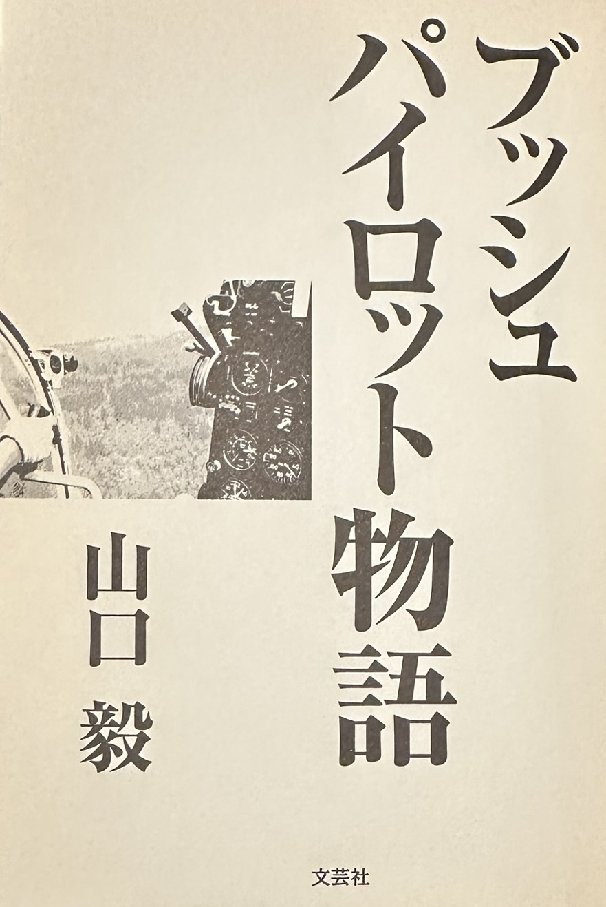
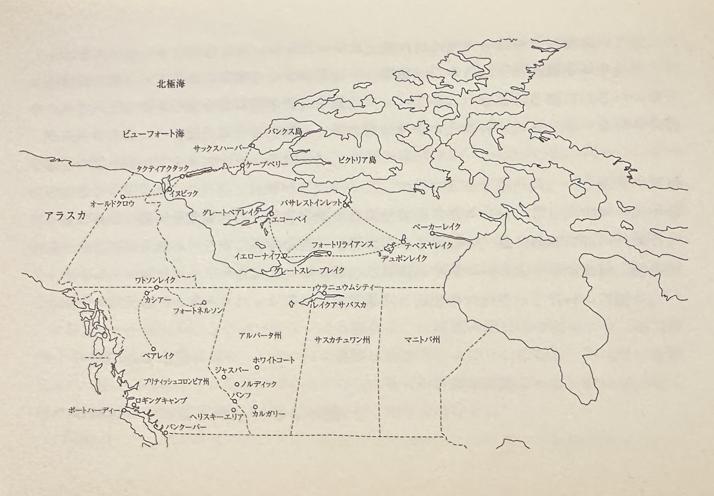
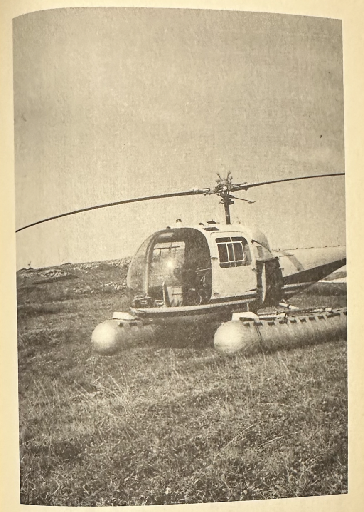
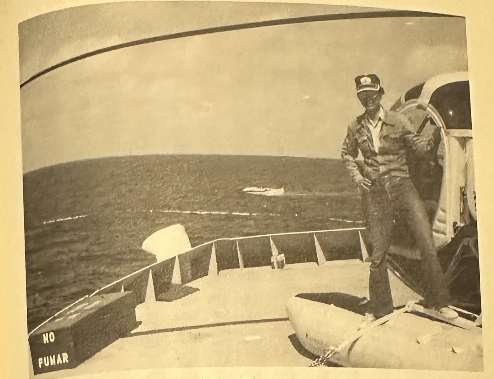
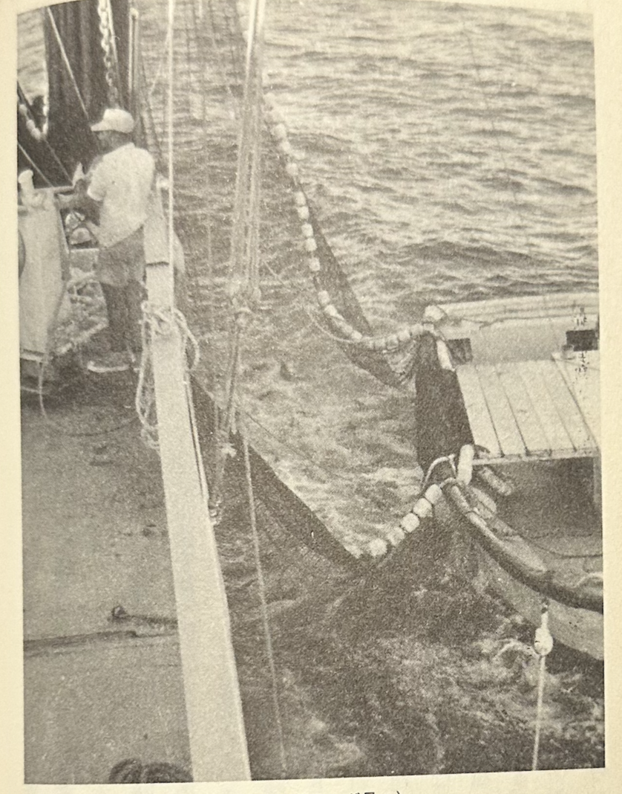
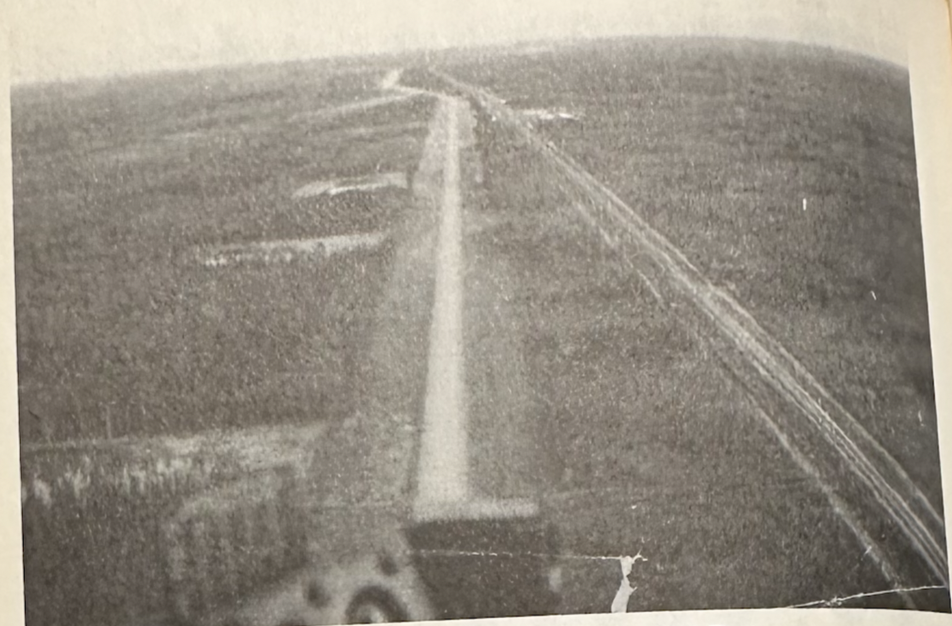

# ブッシュパイロット物語

山口毅

この本を製作するにあたり、先輩である上穂有氏より写真を提供していただいたことに感謝します。

## はじめに

言葉は違っていても、世界中で「ブッシュパイロット」と呼ばれている人たちが活躍している。ここに出てくるブッシュパイロットとは、カナダ北部ノースウエストテリトリーで、小型の飛行機やヘリコプターに乗り、客の求めに応じて、どんな場所にでも飛んでいくパイロット達のことである。ここに書かれてある物語は、私自身が体験した事実に基づいて書いたものである。

背景が一九七〇年初頭といささか以前のことになるが、その時期のカナダ北部はオイル
探査、ウラニウム探査と鉄物資源探査が活況を呈していた時期だった。そのため数多くの小型飛行機やヘリコプターがフロート（浮き）を付けて活躍していた。この中に書かれているのはそのような作業に従事していたヘリコプターパイロットたちの話である。

## よくもまあ今まで命があったもんだ編

### （1）イヌビックの町

今思うと、あのころのイヌビックはまだ開拓時代の面影をとどめていたように思う。

十分もメインストリートを歩けば、もう町の外に出てしまうような小さな町で、道の両側は木造の建物が並んでいる。建物全部が高床式になっており、凍土地帯に建てたため、毎年夏になると凍土が解けて建物自体の重さで柱が地中にめりこんでいってしまう。

そのため初めから床を高くして作ってあるのだそうだ。しかし何年か経てば、この高床も普通の建物と同じ高さになってしまうのだろう。

町はずれにはドーム型のローマ正教の大きな教会があり、ちょうどイグルーのような形をしていて、ドームの頂上には独特な十字架が立っている。この極北の地にこのような大きな教会が建っているのには驚かされる。

どんな経緯でここに建ったのだろうか。

十月のイヌビックの町のメインストリートは、泥と雪でグチャグチャになっていた。

たった二十メートルそこそこの幅しかないこのメインストリートを渡るのも容易ではない。

長靴を履いていてもバランスをくずして倒れそうになる。そこを石油会社のピックアップトラックが泥を跳ね上げながら走り抜けて行く。

メインストリートには、町で唯一のスーパーマーケットであるハドソンベイがあるが、南の都市にあるような大きなビルと違って、木造平屋建てで、小売店を少し大きくしたようなものである。

その反対側にはホテル兼レストランのエスキモーインがある。

町には二つのホテルがあるが、このエスキモーインのほうがパブ、レストランは繁盛しているようなのだ。

朝、アパートから、このエスキモーインのレストランに朝飯を食べに五分の道のりを歩いて行くのが私の日課である。

この町は、ノースウエストテリトリーの南に位置するグレートスレーブ湖を源としたマッケンジー川が北に流れ、ついには北極海にそそぎ込む河口のデルタ地帯東端に位置していて、今石油フィーバーのまっただ中にある。

ここから北へ百キロ先のマッケンジー川河口外側に広がるビューフォート海（北極海）に林立する石油採掘用プラットフォームに、資材、食料の補給をしたり人員の交代をするための拠点なのである。

私もここに到着して二、三日した後、ヘリコプターでこの人員交代、食料補給作業をさせられたのだが、何ぶん彼らの話している英語が解らず、どこのプラットフォームに何を持っていくのか、それだけに全神経を集中して聞くことに終始した。

そのためかどうかは解らないが、一週間程経ったある朝、ベッドから起きて歯をみがきに行くと、気持ちが悪くなり血を吐いてしまった。まあこれは薬を飲んで良くなったが、先が思いやられる。

この小さな町も欧米の巨大資本が入り、あたかも有史以前の恐竜がのし歩き、そこらじゅうの弱小恐竜が食いつくされるがごとく、その荒波に洗われて急激に変わってしまった。

実際、石油フィーバーが起こる前、この周辺は少数のエスキモー（エスキモーは彼らを蔑視した呼び方で、ここでは彼らをイヌイットと呼ぶこととする）の村が点在するだけであった。

イヌイット達は以前はカリブー（トナカイ）をハンティングしたり、アークティックチャー （北極イワナ）、プラウントラウトを釣ったり、野生のブルーベリーを採ったりする生活をしていたが、石油がビューフォート海で見つかってから様相が一変してしまった。

長年、狩猟で暮らしをたててきたイヌイットの人達が急な生活の変化についていくのは、実際大変なことであったであろうと思う。ある人達は町を離れ今までどおりの生活を選び、一方町で暮らすことを選んだ人達は、否応なく現代的な暮らしをしなければならなくなった。

ここにも現代生活にあるようなアルコール依存症、子供の喫煙などの害毒も入ってきているようなのだ。

ホテルの前の階段でイヌイットの少年達が、タバコをふかしながら立ち話をしている。

中には葉巻をふかしている子もいて、それを横目で見ながらホテルに入っていく。

ホテルの中は暖かく、人の話し声、葉巻のにおいが立ちこめている。そのままレストランに入ると、水蒸気で窓ガラスが繰り、黒く色あせた木の壁や油と泥で真っ黒くなった木のフロアー、壁に掛かった色あせた写真など、ゴールドラッシュ時代のホテルはこんな感じだったのかなー、と一瞬幻想の中に入ったような感覚にとらわれてしまう。

ホテルの入り口を入ったところに売店があり、貫禄のある白人のおばさんが紙巻きタバコ、噛みタバコ、葉巻、ガム、チョコレートなど売っている。

初めてこのホテルに来たとき、ここでタバコを買おうとしたが、どうしても私の発音がこのおばさんに通じなくて、あーだこーだとしばらくわたりあった。

それ以来、このおばさんは私の顔を覚えていて、毎朝ここを通るとハーイと声をかけてくる。

この町には日本人は私一人だけで、いやでも英語を話すしかないのだ。

ここに私が送られる前、ボスは三週間の猶予を私にくれたのだが、その間に仕事ができなければクビにすると言われているので、ここに来てからの毎日は、寝ても英語さめても英語、それでも彼らが何を喋っているのか解らず、時間だけが経ってしまっている。

早く一人前に仕事ができるまでにならないと、と思うと自分でもイライラしてくるが、どうしようもない。

ある日、英語の勉強のためと思い、町に一軒ある映画館に行き、席に座り開映を待っていた。

館内が暗くなり映画が始まったと思ったら、何とスクリーンに出てきたのは日本語なのである。

「海底大戦争」というタイトルの映画で、だいぶ前に日本で制作されたものらしいのだが。まあこれでは英語の勉強にはならなかったが、英語まみれの生活の中で少し息抜きができたのは幸運だった。

思えば二週間前、アルバータ州の空港から、チーフパイロットのジャン、同僚のマイクと共に飛行機に乗り、二時間のフライトで、ここイヌビックに到着した。ジャンは我々ニ人をここの基地の責任者であるジムに会わせ、彼から極地のフライトを学ばせるために連れてきたのである。

イヌビックの空港では整備チーフのラスが待っていた。小柄で小太りの彼は特別早口でしゃべる。

特にひっきりなしにスラングを連発するので、何を言っているのかまったく解らない。

ひとしきり話がすんで、我々は空港を後に雪でツルツルになった道を、彼の運転するピックアップ（小型トラック）を飛ばし基地に向かった。

十五分もアイスバーンの道を走ったか、前方に細長い湖が見えてきた。

湖に沿って格納庫が何軒も建っている。

ここに我が社の格納庫もあるのだが、その格納庫はあまり大きくなく、フロート付きジェットレンジャーを二機置くと、いっぱいになってしまう程度のものである。

ここのジェットレンジャーは、ばかでかいフロートがついていて足が遅く、時速八十マイルくらいしか出ない。

その上操縦桿を“中立”にしておかないと、すぐ地上共振を起こしてダンスを踊り出すという気むずかしい乗り物なのである。

とにかく、ここで三週間仕事ができるかどうかの試練の日々を過ごしている。

### （2）マイクの迷子

イヌビックに来て一週間経った日、それまでイヌビック周辺で飛行作業していたマイクに初めて本格的な仕事が来た。

彼はテキサス出身で、ベトナム戦争にもヒューイヘリコプター（武装中型ヘり）の機銃手として参戦した経験を持っている。

彼は陽気でよく喋る典型的なテキサス人であるが、あまり考えないで行動するところのある人物なのだ。

彼にはヘリの燃料の計算もそこそこに飛び上がり、飛行場に帰ってきたものの燃料切れで、タクシーウェイに座り込んでしまった経験もあるという。

そんな話を自分で語るくらいなので、綿密な計画を立てたりするのが苦手なのか、はたまたベトナム戦争の中ではあまり綿密な計算は必要なかったのか、とにかく無鉄砲な性格ではある。

極地での飛行はイヤでも綿密な計画が必要で、それを無視したら自分の命にかかわってくるのだ。

小雪まじりのどんよりしたある日、マイクと整備士のグレッグはイヌビックの基地からフロート付きのジェットレンジャーに乗り、ユーコン州にあるオールドクロウの町に向け出発した。

ユーコン州では、その頃、南北に走るデンプスターハイウエイを建設中で、その仕事に従事するためなのである。

オールドクロウの町は、ここイヌビックから西方二百五十マイルの所にあり、約三時間の飛行である。

このころはまだGPS（グローバル・ポジショニング・システム）もなかった時代なので、ヘリコプターはマグネチックコンパス、ディレクショナルジャイロぐらいで飛ぶしかなく、何の航法機器も付いてなかったのである。

そのような時代にヘリコプターで極地を飛ぶのは非常に苦労したものだった。

彼が飛び立って二日後、現地から電話が入り、「まだヘリが来ないがどうなっているのか？」とのことであった。

二日も経っているのだから迷子になったのは確実である。

これは大変だと、さっそく捜索のための連絡を開始したのだが、いまいち周囲の雰囲気は緊張感がない。

ここいらへんでは迷子は日常茶飯事なのだろうか、あるいはもう諦めてしまっているのだろうか、諦められたほうはたまったものではないのだが。

ジャンは「機体にELT（遭難信号発信器）が積んであるので捜索救難センターの捜索機がすぐ見つけ出してくれるよ」と言うのであるが、本当にすぐ見つけてくれるのであろうか？行方不明になったヘリには一週間分の非常食料も積んであるので、しばらくは大丈夫であろうが、熊やオオカミがウロウロする地域で猟銃もなくキャンプするのは、はなはだ心細いであろう。

とにかくジャンと二人で、もう一機あるジェットレンジャーに乗り、カナダ空軍の捜索と並行して捜索を開始することにした。

はじめはマイクが提出したフライトプランのコースを飛ぶことにして、イヌビックのロングレイクにある基地から出発して、広大なマッケンジーデルタを西へ飛ぶ。

このマッケンジーデルタは、グレートスレーブ湖を源として流れ出した川が、北極海に流れ出る河口に広がる広大なデルタ地帯で、周囲数十キロにも及び、無数の小川と大小の沼からなっている。

約三十分西へ飛ぶと、デルタを抜け丘陵地帯に入る。

ここから西は丘陵地から低い山岳地になっていて、ヘリはそのまま西へ西へ進み、緊急遭難電波がヘリの受機に入るのを期待しながら地上を探すが、受信機には何の応答もない。

山岳地を抜けて西へ進むと、また小川と沼地のツンドラ地帯に入る。

ここまで来るとオールドクロウの町はもうすぐそこである。

このルートでは見つけられなかったので、いったんイヌビックの基地に戻ることにした。

東にコースを変えて帰路につくことにしたが、帰りは山岳地の少し北のコースをとることにした。

山岳地の北側を越えて平地に出たとき、ジャンが、「あれを見てみろ！」と指さした。

白一色のツンドラの平原にウネウネと黒い線が地平線から続いているのが見える。

ヘリをそっちの方向に変えて近づいていく。

近づくにしたがってカリブー（野生のトナカイ）の大集団が移動しているのが目に入ってきた。

毎年この時期、北のツンドラ地帯でコケや草などを食べていたカリブーは、冬のはじめになると食料を求めて集団で南に移動するのである。

毎年移動するルートは決まっていて、冬の終わりには南から北へ、冬のはじめは北から南へと同じ道を通るのである。

先頭の一回り大きなカリブ1が黙々と歩いているのが見える。

上空から見るとちょうどアリの群れが連なって歩いているようにも見えるが、それが地平線まで延々と続いているのだ。

「どこまで続いているのだろう」と興味がわき、調べようとそのまま群れに沿って飛ぶことにした。

約十分程飛んで群れの最後尾に来た。

ここが終わりかなと思ったそのとき、その数百メートル後ろに、アークティックウルフ（北極オオカミ）の群れが続いているのが見えた。

それだけではない。

その後ろにはブラウンベア（ヒグマ）が続いているのである。これらの肉食獣は、その食料となる動物が移動するのに伴って動くのだ。

そして弱ったカリブーが群れから脱落したところを襲うので、非常に効率的な狩猟方法である。

わざわざ狩りをしなくても群れについていくだけで、ごちそうにありつけるのだ。

クマはクマでオオカミが食べている獲物を横取りすればよいのである。

このように限られた食料しかないところでは、一つの食物連鎖が丸ごと移動しているようなものなのだ。

後日偶然にも、アークティックウルフの群れがトナカイの狩りをしているところに出くわした。

上空から見ていると狩りの様子がよくわかる。狼たちはトナカイを追い込むグル1プと、待ち伏せするグループとに分かれていて、待ち伏せグループは地面に伏せ、トナカイが追い込まれてくるのを待っているのである。

これを見て彼らはなんと頭のいい動物なのだろうかと感心させられた。

話を元に戻そう。

その日以来、毎日マイクが飛んだ可能性のあるコースを捜索したが、ムダに終わった。

捜索救難センターからも有力な情報が入らない。一週間を過ぎた頃には事務所の空気も重苦しくなり、皆黙り込むようになってきた。そんなとき同僚のパイロットのディプが口を開き、「もしかするとアラスカに入ったかもしれない」と言い出したのだ。

彼らの目的地であったオールドクロウの町は、ユーコン州の西の端に近く、アラスカとの国境まで四十キロぐらいのところに位置している。

もし彼らがアラスカに迷い込んでいるならば、カナダの捜索救難センターは活動できない。

デイブはすぐにアメリカの捜索救難センターに連絡をとった。

デイブはマイクと同じアメリカ陸軍出身のヘリパイロットで、マイクより先にこの会社に入っていた。

通報後、アラスカにある捜索救難センターがすぐに動き出し、アラスカから出た捜索機が行方不明機を探し始めた。

三日目になって、アメリカの捜索救難センターから事務所に連絡が入った。

遭難信号をキャッチして行方不明機を発見したとのこと。

その話では、上空から見ても二人とも無事なようである、とのことだったので皆一安心した。

二日後、二人とも元気に基地に戻ってきたが、彼らの話によると、雪が降っていて視界があまり良くなく、目的地のオールドクロウの町を通り過ぎてしまい、そのまま国境を越えてアラスカの山缶地に迷い込んでしまったとのことであった。燃料も少なくなってきたので、近くの小川の側に不時着し救助を待つことにしたのだそうだ。

残っていた燃料を燃やして暖をとりながら非常食料を食べていたのだが、一週間で底をつき、しかたなく非常食料とともに入っていた釣り針と糸で、近くの小川で魚を捕って食料にしようと魚釣りを試みたようだが、自然はそんなにあまくなかった。

結局一匹も捕れずに、空腹からだんだん諦めの気持ちが強くなり出して、整備士のグレッグは自分の持ってきたカメラで最後の姿を撮っておこうと思い、二人してヘリの郷で写真を撮ったのだった。

後日その写真を見せてもらったが、なんとも情けない表情で二人がヘリの脇にたたずんでいる姿が写っていた。

熊や狼の多いこの地域で一週間以上もキャンプをして、それらの猛獣に出会わなかったのは幸運の一語につきる。

その後、当のマイクはイヌビックに帰ったとたん、その反省もなく以前のように遊び歩いていたが、一週間後に本社から呼ばれ、カルガリーに帰っていった。

あとから聞いた話によると、そのままクビになってしまったとのことであった。

少しの油断が、ここでは命に関わる事態に陥ることを知らされた事件であった。

### （3）シングルポイント始末記

ある日、ここイヌビック基地責任者のジムから、「新しい仕事が入ったから、おまえやってみるか？」と言われた。

それまでイヌビック周辺の海上プラットフォームへの人員や食料運搬のための定期便しか仕事をさせてくれていなかったので、私は喜んで「やらせてください！」と返事した。

ジムはしばらく考えていたが、「この仕事は難しいが、これができればここのパイロットとして一人前と見てやる」と言うので、俄然やる気が出てきた。

その仕事とは、ヘりを船に乗せて、船の行く先々の氷の状態を上空から見て回り、氷に閉ざされていない航路を見つけることであったが、問題はその船がもう出航してしまっていて、正確な位置がわかっていないことなのである。

そもそも、この船は政府に雇われて、冬になる前に極地にある島々のイヌイットの村に食料、燃料、雑貨、車両等を二艘のバージ（いかだ）に目いっぱい乗せて引き船で引いて行き、配り回るのである。

冬になると極地の島にある村々はまったくといっていいほど交通手段がなくなり、一冬中閉じこめられてしまうため、この筏に乗っている食料と狩りの獲物で、一冬の食料をまかなわなければならないのだ。

ところで、なぜその仕事が突然舞い込んできたのかというと、そもそもこの船には専用のヘリが常備してある。

しかし、このヘリが船の乗組員の食料を補給するため、航行途中の船から飛び発ち、イヌビックの町に戻って来た。

その後、キャビンいっぱいに食料を積み込んで離陸したところまでは良かったのだが、いかんせんパイロットが荷物の重量を考えずに積みすぎてしまったため、飛び上がったとたんそのまま近くの川に墜落してしまったのだ。

パイロットは無事だったが、食料を早く船に運ばなければならないし、それよりなにより、船の安全なルートを探すため、ヘりを早急に船に戻したいとのパイロットの要望であった。

だが問題は、その船が刻々と移動して正確な位置が分かっておらず、パイロットに聞いても「たぶんこの辺にいるはずだ」と地図を指さすぐらいで、まったく頼りにならない。

とにかく彼が地図上に指さした場所まで飛ぶことにした。

まずイヌビックから北百五十キロほどの北極海に面したタクティアクタックの町まで飛び、そこでいったん燃料補給をおこない、次に東北東に進路をとり鈴色の空の下、沼と小川のツンドラ地帯を進む。

一時間程飛ぶと前方が白くほやけてきた。

霧が立ちこめているのである。

ここで方向を変えると、目標地点が分からなくなってしまうので、そのまま真っ直ぐ進む。

だんだん霧が濃くなってきて、ついに地上すれすれまで下がって真っ直ぐに進むが、周りを見ても三十メートルぐらいしか見えない。

白一色の世界になってしまったのである。

少し登り坂になってきたのが分かるが、わきめもふらず真っ直ぐ進んでいく。

ここでちょっとでも方向を変えると、コンパスの針がグルグル回り出して、どっちへ進んでいるのか分からなくなるからだ。

しばらくすると、なにやら硫黄の臭いがしてきた。

ここら辺はスモーキーマウンテンと言って、近くに温泉があるらしいのだが、探している余裕はない。

具っ白い世界をどれほど飛んだだろうか。

実際は二十分程だったのであろうが、非常に長く感じられ、引き返そうかと思い始めたそのとき、急に霧が晴れた。

と同時に、そこには地面がなかった。

断崖絶壁を飛び越したのだ。

下を見ると、遥か下方に真っ黒い海面があり、流氷が浮いているのが見える。

ここから海が広がっていたのだ。

ここから先は、この氷の浮いた海の上をシングルポイントまで一直線に飛ばなければならないのである。

そこが二回目の燃料補給場所で、そこから北に進路を取る予定なのだ。

ところで、このシングルポイントという所は、本当の地名はケープ岬という。

当時ソビエトと冷戦状態だったアメリカが、ソビエトからの航空機攻撃に対してカナダと共同で防衛戦を張るため、デューラインサイトというレーダー網をアラスカからカナダ東部の極北に敷いた。

このシングルポイントも、そのレーダーサイト名の一つなのである。

そこから真北に変針して一時間程飛ぶと、彼が指し示した地点である。

しかし、一面流氷水の海面に浮かぶ小さな船を探すのは非常に難しいのだ。

燃料補給後、目標地点を目指し北に進路を取った。

一時間程して目標地点に到着したが、案の定、船は見つからず、徐々に探す半径を大きくしていき、周辺をしらみつぶしに探すが見つからなかった。

燃料が少なくなってきたので、一度シングルポイントのレーダーサイトに戻ることにした。

二度目の捜索でも船は見つけることができず、日も落ちてきて、今日の捜索はこれで打ち切りとし、レーダーサイトに泊めてもらうことにした。

サイトの内部に入ると、中は暖かく住み心地よさそうである。

軽い食事をした後、職員の人が内部の施設を案内してくれた。

レーダーを操作している部屋は立ち入り禁止であったが、窓からレーダー室の内部がかいま見える。

中は薄暗く、カナダ兵とアメリカ兵が合同で働いているのが見えた。

こんな最果ての地で家族から離れて二十四時間、ソビエトからの侵入機を見張っていなければならない人達がいることを初めて知った。

翌朝早く二日目の捜索を開始する。

今日は昨日の場所から、もう少し西側を捜索することにして、燃料を満タンにした後、北西に針路をとって出発した。

約一時間程飛んだとき、流氷の中にゴミくずのようなものを見つけて近づいていく。

近づくにしたがい、それが目的の船とバージであることがわかった。

曳舟が二のバージを引いているのが見える。

そのままバージの上にヘリを着陸させて船内に入ると、船長以下乗組員が出迎えてくれた。

「遅かったので心配していたのだ」と船長が嬉しそうに近寄ってきた。

私はつたない英語で挨拶をしたあと、船長のダンから、これからの予定について聞いた。

それによると、この船はこれから極北の島々の一つ、バンクス島にあるサックスハーバ1の村に積み荷を運ぶとのことだった。

船はヘリを待つため、丸一日ここで停船していたので行程が遅れている。

そのため我々が着陸した後、すぐサックスハーバーに向けて動き出した。

その後しばらくキャビンで休んでいると、船長が一人の乗組員を連れてきた。

船長曰く、「彼の肉親が危篤で、家に戻らなければならなくなるかもしれない、彼を乗せてすぐシングルポイントまで戻ってくれ。

そこまで行けば電話があるので連絡がとれるのだが、どうだろうか」と言うが、私は一瞬、どうすればいいのか迷った。

というのは、この船には燃料として「ベル47」のガソリンしか置いてなくて、ジェットレンジャーの燃料としては使えないだろう。

その上、今へりに残っている燃料は一時間ちょっとなのである。

燃料はシングルポイントまでの分しかないし、今朝燃料補給したとき、シングルポイントに残っているジェット燃料はドラム一本、二時間分しかないのがわかっていた。

もし今度帰って来たとき船を見つけられなければ、シングルポイントまで戻るギリギリの状態である。

船は予定が遅れているので、針路を北にとって進んでいるし、当の乗組員は早く飛んでくれとせっつく。

シングルポイント基地で残りの燃料を入れて、また船に戻るのだが、ただでさえ流氷の漂う海面で見つけにくく、船は動いているので捜索に時間がかかる。

万が一見つけられない場合は、シングルポイント基地に帰らなければならないが、燃料が足らなくなる可能性があるのである。

ヘリの下にばかでかいフロートが付いているのが邪魔してスピードが出ない。

このときほど、このフロートを恨めしく思ったことはない。

当の乗組員は一刻も早く出発してほしくて私をせかすので、とにかくシングルポイントまで出発することにした。

前日とは打って変わってよい天気の中、一面氷の海の上を一時間程飛ぶと、独特な丸いレーダードームが見えてきた。

シングルポイントに着陸した後、彼が基地に電話をかけにいっている間、燃料補給をして待っていた。

しばらくして戻ってきた彼は、そのまま家に帰ることになってしまったので、ここでチャーター機を待つと言う。

私一人で船に戻ることになった。

元の位置から移動してしまった船を見つけられるか自信がなかったが、とにかく元来た方向へ向け飛び出した。

一時間程飛んだが、案の定、船の姿が見えない。

「どうしよう。もう少し探すか、このままシングルポイントに引き返すか」

心の中でつぶやいた。

このまま行けばシングルポイントに帰れなくなる。

「えいままよ！もう少し行ってみよう」と、そのまま十分、二十分と進んで行くと、前方に小さく船が見えた。

「ああ、よかった。これで冷たい氷の海に降りなくていい」

ホッと心をなでおろしながら、船に近づいていった。

翌日の午後になって、目的地のサックスハーバーに到着した。

バージから食料、燃料、スノーモービル、トラック等の積み荷を降ろしている間、船から降りて村の周辺を見て回ったが、ちょっとした集落があるだけで、草も木もない荒涼とした所である。

こんな極北の地で生活している人達は、極寒の一日中真っ暗な冬をどう過ごすのだろうか、と思いながら村を通り抜け道を登っていく。

しばらく登ると、ジャリでできた滑走路が見えてきた。

その脇に飛行機の残骸が置いてある。

装も剥げて見た目にも古いもののようであるが、この飛行機にはどのような物語があるのだろうと思いながら歩いていると、船長が坂の下から、「あと一時間で出航だから遅れないように」と声をかけてきた。

これ以上見る所もないようなので、今来た道を戻ることにした。

積み荷を降ろしたあと、船はすぐに出発地のイヌビックへ向け出航した。

途中、ヘリで流氷の状態を調べるため二度程飛んだが、問題になるような状態ではなく、船もタクティアクタックの沖まで戻ったところ、船長から「もうヘリはいらないのでイヌビックへ戻っていい」と言われたので、すぐに船から飛び立ち、イヌビックへ機首を向けた。

ここからイヌビックまではひとっ飛びなので、気楽な帰り道であったが、無事にイヌビックへ帰着して、これで何とか無事に仕事が終了し、ホッとする気持ちと、次はどんな危険な仕事が来るのかと不安な気持ちが、頭の中で交錯しているのであった。

とにかく燃料がなくなって冷たい海に不時着するような事態にならなかったのは、幸運であった。

二度とあんな無謀なことをするのはやめよう。命がいくつあっても足りなくなる。

反省。

### （4）ヘリコプタースキー始末記

カルガリーの町を発って、三時間あまりも凍りついた道を会社の車で走り続けている。

道路は街灯もなく、真っ暗な中、ヘッドライトに照らされた白く光る雪が飛び去っていく。

ここからカリブーマウンテンスキーエリアまで、あと二時間あまり。

バンフを抜け、ゴールデンの町から国道一号線を外れ、六十五号線に入り南下するが、道路はいたるところで凍りついてブラックアイスになっているのである夜も更けて六十五号線に入ってからは行き交う車もない。

このブラックアイスの上でハンドルをとられたら、車は一瞬にして路肩のスノウバンクに突っ込んで、動きがとれなくなるだろう。

そして明日の朝まで車が通らなかったら、そのまま凍え死んでしまうかもしれないのである。

目的地カリブーマウンテンスキーエリアにあるモーテルに着いたのは、夜の九時過ぎであった。

モーテルの隣にレストランがあり、四十歳くらいのギリシャ系で、話し好きな男が両方とも経営している。

レストランに入っていくと、そのオーナーが「遅かったじゃないか？夕食はまだだろう。何か食べるか？」と話しかけてきた。

ヘリスキーの仕事は一週間交代なので、毎週日曜日の夜にのクルーが到着するようになっている。

「クラプサンドイッチとコーヒーをくれ」と言って席に着き、一人で食事をしながら明日からのフライトに思いをはせる。

昨年からジェットレンジャーでは、何回もここカリブースキーエリアのヘリスキーをやっているので、ここの地形はよく知っているが、今回会社は私に初めて「ベル204」でのヘリスキーをまかせてくれたのである。

このヘリスキーのために会社は204の機種を取らせてくれたが、まだ八時間程しか乗っていないため、この機種に慣れていない。

だが何とかやれるだろう。

とにかく、明日の朝スキー客が来るので、今夜またマニュアルを勉強しよう。

遅い夕食を取ったあと、ヘリスキー会社の責任者でオーストリア人のハンスに挨拶しに行った。

彼はここの責任者兼スキーガイドで、ここカリブーマウンテンスキーエリアを開拓した人物でもある。

ここカリブーマウンテンスキーエリアには、スキーコースだけでも三十以上あり、そのうち一番標高の高いのは八千六百フィートの山頂からの滑走コースである。

このコースは傾斜四十度の直滑降のコースで、途中傾斜五十度にもなるところがある。

そのバージンスノウを膝が隠れるくらいに雪を蹴散らしながら滑り降りてくる。

スキーができない私のようなものはよくわからないが、ここのバージンスノウを滑りに、カナダ、アメリカはもちろん遠くヨーロッパからも来るそうなのだ。

ここのヘリスキーツアーには、ディツアーとして一日ヘリスキーを楽しむコースと、ウィークツアーとしてロッジに泊まりこんで一週間スキー三昧するコースがある。

このウイ1クツアーは、道路もふさがれた山の中にある山荘にこもりっきりで、ヘリスキーを堪能するものなのであるが、ヘりは毎朝、麓にあるモーテル脇のヘリポートから飛び立ち、ロッジでスキー客をピックアップして、午前中三回、午後三回、それぞれ違うコースに連れていくのである。

ヘリは山頂にスキーヤ1を降ろしたらすぐ急降下して、スキールートの下端でスキーヤ1が降りて来るのを待って、次のコースへ連れていくのである。

山荘での一週間は昼間はスキー三昧、夜はテレビもなく静かなロッジでチェスや読書をして過ごすのだが、食事は専門のスタッフがいて、三食作ってくれる。

私はチーズが苦手なので、ここの食事はあまり口に合わなかった。しかし、山荘の造りはシックに出来ていて、壁も床も木目の綺麗に出ている板張りで、テーブルも椅子も木で統一されている。

このリビングルームの壁に、いろいろな写真が掛けられているが、その中で一枚おもしろい写真があった。

斜面をスキーヤーが滑り降りてくる写真なのだが、手前ではヘリコプターが羽を休めて、スキーヤーの降りてくるを待っている。

問題はスキーヤーの後ろから巨大な雪崩が押し寄せて来ていることである。

写真を見る限り、ヘリコプターがエンジンをかけてスキーヤーを乗せて飛び上がる時間はない状態なのだ。

その写真について、その後どうなったかハンスに聞こうと思っていたが、聞きそびれてしまった。

いまでもあの後どうなったか気になるのか、記憶に残っているのである。

翌朝、窓から外を見ると、昨夜からの雪は止んでいた。

空は薄い雲が一面覆っているが、視界はよく、風もないようである。

「これなら今日は大丈夫だな。まあまあの204初フライト日和だ」と独り言を言って、今日のスキースケジュールを聞きに、担当ガイドのハンスに会いに行く。

ヘリポートには紺色の204が羽を休めていた。

担当の整備士が近づいて来て、「昨日降った雪がメインローターにこびりついていて、取り除くので、しばらくかかる」と言い出した。

何で昨夜から雪が降っているのに、整備士はローターカバーをしなかったのだろうと思うが、あとの祭りである。

それにしても凍りついたのは俺が悪いのではない、天気が悪いのだとでも言い出しかねないこの整備士の態度には腹が立つ。

デイスキー客が到着する時間が近づいているので気は焦るが、思うようにローターに張り付いた氷が取れない。

そうこうしているうちに、スキー客を乗せたバスが着いてしまった。

スキー客たちはスキーガイドから、まずヘリの乗降時の注意、ヘリスキーをするときの注意を聞き、その後各人はビーコンを渡され、胸から掛けさせられる。

これは雪崩に巻き込まれた際、埋もれた場所をすぐ見つけるためのものなのである。

十時頃になり、やっと翼の氷がとれて、イライラして待っていたスキー客を乗せて飛び上がった。

今日は最初から八千フィート級の一番標高が高いところにあるコースに連れていくことになっている。

スキー客六名、ガイドと私でトータル八名を乗せたヘリはぐんぐん上昇して、低く垂れ込めた雲を突き抜けた。

雲の上は風もなく青空が広がって、周りの山は雪を被って白く輝いていた。

十分程上昇していくと、スキーコースの着陸地点が見えてきた。高度は八千六百フィートを指している。

着陸地点上空で旋回しながら、風の方向を見極めて着陸態勢に入った。

着陸地点は山頂近くにあり、ヘリコプターの長さの一・五倍くらいの場所が雪で平らになった所である。

そこから少しでもズレると四十度の斜面を転がり落ちてしまうのだ。

斜面の両側は山がせり出して、ウォーターシュートのようにスキーコースが直線で真下に広がっている。

ここから三千フィート下のヘりの待機場所まで滑り降りるのであるが、何せそこの着陸場所が狭いので、スキー客もヘリから降りたあと、遠くに離れられず、ヘリの近くでしゃがんで、ヘリからの強風を避けなければならない。

万が一ヘリの風圧で飛ばされたら、そのままスキーコース上を転がり落ちてしまう。

スキーコースの反対側は切り立った崖のようになっていて、それこそ遥か下に川が一条の線になって流れているのが見える。

一回目のスキー客を降ろして、二回目のスキー客を迎えにメインヘリポートに戻るが、朝方あった低い雲も消え失せて、絶好のスキー日和になった。

二回目のスキー客を乗せて胸び飛び上がり、同じルートを通って上昇し、最終のアプローチに入った。

少し高めのアプローチで、先ほど降りた地点を見ながら徐々に降下し始めたが、周りには、ここの山頂より高い山がないので、富士山の山頂に降りるようなものである。

アプローチも最終段階になり速度もだいぶ落ちてきた。

と思ったその瞬間、急に前方の着陸地点が上のほうにせり上がってきて、アッと言う間に遥か上方に移動してしまった。

機体が急速に降下してしまったのである。この時点では、もう前方に雪の斜面が迫ってきていて、機体はなおも急速に降下し続けている。

旋回して脱出する時間も高度もなくなっていた。

体は膠着し、アドレナリンが体中駆けめぐっているのがわかる。

「南無三！！」と心の中で叫んだ。

その数秒後、ヘりが巻き起こす雪煙に覆われて何も見えなくなり、「次は墜落の衝撃が来るぞ」と操縦桿を握りしめて固まっていた。

しかし、その衝撃はこなかったのである。

立ちこめていた周りの雪煙が徐々に消えていくと、周囲がうっすらと見えてきた。

どうなったのかと周りを見渡したが、エンジンもローターもまだ回っている。

何となく機体も着陸しているようだ。

隣に座っているガイドのハンスにできるだけ冷静に、「ちょっと違う場所に着陸したので客を出してくれ」と頼んだところ、彼はドアを開けて後ろ側を見てびっくりしている。

「これじゃスキー客を降ろせない。後ろは空中に浮いているし、飛び降りれば急斜面を転がり落ちてしまう」と大声を出し、「何とか正規の着陸場所に移動してくれ」と言っている。

しかし計器板のローター回転数の針は完全に正常範囲を外れて大きく低下していたし、ヘリそのものはスキッド（ヘリのスキーのような形をした着陸装置）前方が雪の斜面に着いているだけで、後ろは宙に浮いていて、かろうじてその状態を保っているのである。

これでよくメインローターが前方の斜面を叩かなかった、とホッとしたのもつかの間、この状態からどのようにして抜け出せばよいのか途方にくれてしまった。

コレクティブピッチレバーを下げて回転数を増そうとすれば、機体はバランスを失い、お尻のほうから真っ逆さまに斜面を転がり落ちてしまうのは目に見えている。

かといってピッチレバーを引けば、これ以上にローター回転数を下げてしまう。

後ろに座っている乗客は不安げに私を見ているのである。

「どうしても後ろから乗客を降ろせないか？」とハンスに再び聞いたが、彼の答えは同じであった。

どうしたらいいか、このまま燃料がなくなるまで、このままの状態で待つこともできない。

ここで一か八かの考えが浮かんだ。

機体を百八十度反転させて、斜面に平行にできればピッチレバーを下げられるし、ピッチレバーを下げられれば、メインローターの回転数をに戻せるだろうということであった。

今のところ、それ以外にはこの状態から逃れる道はなさそうである。

そう決めたら、次はこの機体を百八十度反転させる方法である。

前方には急斜面が迫っているので、まず、機体を左回転させ斜面に平行になるまで回した。

その後、テールが斜面に当たらないように機首を下げながら、そのまま左回転を続け、徐々に斜面の角度まで機体を傾けていった。

間もなく百八十度反転するというとき、機体がズルズルと斜面を滑り始めた。

前方を見ると新雪の急斜面でデコボコもないようで、機体は止まるどころか、だんだんスピードを増してきていた。

こうなるともう止めることはできない、と悟ったとき、ピッチレバーを最低にして、一秒でも早くメインローター回転数を回復させることに意を決した。

機体はヘリコプター用のスキーを履いているので、だんだん速度を増しながら斜面を滑り降りていく。

どれ程の時間だったのだろうか。

実際は数十秒だったのだろうが、私には非常に長く感じられた。

後ろの乗客に向かって「しっかりつかまっていろ！！」と大声で叫んだことは覚えているのだが。

ローター回転数を見ると、徐々に上昇してきている。祈るような気持ちで「早く回転数が戻れ」と思いつつ直滑降をし続けた。

一瞬フワッと機体が浮いたときは全身の力が抜けるようであった。

機体が滑り降りた数百メートルの間にデコボコがなかったのは、幸運以外のなにものでもなかった。

再び空中に飛び上がって、たった今滑り降りた場所を見ると、雪面にクッキリとヘリコプターのスキーの跡が付いている。

「よくも無事で飛び上がれたものだ！」と今さらながら感心した。

その後、懲りもせずに再度山頂の着陸地点へ向かった。

着陸地点上空に到着したとき、前回のときとは違い、反対方向から風が吹いていた。

そのためアプローチ中に急速に速度が失われてしまって、先ほどのようなことが起こってしまったのだ。

そこで今度のアプローチは反対方向からおこない、無事に着陸地点に降りた。

その後、スキーヤー達はこの一回のスキーで止めてしまい、あと二回のスキーをキャンセルしたので、メインヘリポートに帰ることにした。

無理もない。

あのような恐怖を味わったら、スキーをする意欲もなくなってしまうだろう。

私にしても冷や汗一斗だったので、その後のフライトは、できれば止めたかったのが本当のところであった。

それから二日ほどしてボスから電話があった。

「あのパイロットは危険だから辞めさせろ」という通報があり、そのため「ヘリスキーを降ろすので帰ってこい」とのことであった。

という訳で、私はあっさりヘリスキーを降ろされてしまった。

しかし204で八千フィートから直滑降をやったのは、世界広しと言えども私一人ではないかと思う。

とにかく二度とこのような無謀なことはしたくないと思うのと同時に、命があったのは本当に幸運であったと今さらながら思うのである。

## ブッシュパイロット南へ行く

私は今ロスアンゼルスへ向かう飛行機の中である。

何でこの飛行機に乗っているかというと、初めてカナダ以外で仕事をするため、バンクーバーを発って一路ロスに向け南下しているところなのである。

ロスアンゼルスでパイロットのトムと交代してパナマからマグロ船に乗る予定なのだ。

そのマグロ船に載っている「ヒューズ300」という小さなヘリコプターでマグロを探す仕事を請け負ったのだ。

ところが私はこの「ヒューズ300」というヘリには一度も乗ったことがない。

それで交代のパイロットのトムにトレーニングしてもらうことになっているのである。

しかし最初はパナマで会う予定になっていたトムが、実はロスに来ているらしい。

ロスには「ヒューズ300」の機体はないので、どのようにして私のトレーニングをしてくれるのか、皆目見当がつかない。

とにかくロスアンゼルスでトムに会って、どのようにするのか聞くしかない。

そこで今回担当する整備士ともはじめて会う予定になっている。

整備士はアメリカ人で、ロスで一緒になってパナマに行くのであるが、どういう人なのか何も聞かされていないので、これから一緒に仕事する上でうまくやっていけるか心配である。

ロスアンゼルス空港に到着して、その足で指定されたホテルに向かった。ホテルに着くと伝言があり、その夜交代のパイロットのトムと、今回担当する整備士に会うことになっていた。

その夜、予定時間になって一階のラウンジに行くと、すぐに一人の白人が私のほうに近づいてきた。

この時間はまだラウンジの中は客がまばらで、彼らはすぐに私に気がついたのだろう。

初めて交代のパイロットのトムと挨拶を交わしてバーのほうに行った。

そこで今回一緒に仕事をする燃備士のジョーを紹介された。

三十代後半の痩せて背の高い人物だ。

その彼が話しはじめた。

彼目く、自分は707、DCI8などエアラインの経験が豊富で、飛行機のことだったらまかしておけ、と言わんばかりにまくし立てるのである。どうもこの人は口から先に生まれてきたようだ。

*ツンドラに降りたベル47G5*

そこで、今回扱う「ヒューズ300」の経験はあるのか聞いてみたところ、彼曰く、「昔、ベル47を扱ったことはあるが、しばらくヘリには触っていない。でも大丈夫」との返事が返ってきたので、私は唖然として次の言葉が出なくなってしまった。

しかし彼は私の驚きには気がつかず、まだ自分の華々しい経歴をしゃべっている。

それにはかまわず私はトムに今回はじめてこの仕事をすること、「ヒューズ300」にはまだ乗ったことがないこと、少なくとも二、三回は離着陸をトレーニングしてもらいたいことをお願いした。

ところが彼の返事はそっけないものであった。

「このロスには、トレーニングする機体もなければ施設もないので、パナマの現地に行って自分でやってくれ。

俺もヒューズ300は乗ったことがないのだよ。今まではベル47で飛んでいたのだけれど、今回、船がドック入りする時点で新しい機体に入れ替えたんだ。それで新品のヒュ1ズ300が来ていると思うので、現地に行ってチェックがてら自分でトレーニングしてくれ」と言うのである。

私はそのとき頭の中が混乱してしまい次の言葉が出なくなっていた。

小さいながら今まで乗ったことのない機体をそれも自分でトレーニングしろと言う。

私は途方に暮れてしまい、このまま帰ろうかと思いはじめていたが、とにかく現地まで行ってから決めようと思い、炎の日、目的地パナマに向け飛び立つことにした。

当日は、ロスアンゼルスからパナマまで、パンアメリカンの飛行機で飛ぶ。途中ニカラグアのマナグア空港に立ち寄る予定である。

マナグア空港では待ち時間が数時間あるが観光しようにも時間が足りないし、とにかくスペイン語が話せないので空港から出るのは止めにした。

マナグア空港に着陸してロビーに出たら、ムッと南国の熱気が押し寄せてきた。

空港内の醤察官も軽機関銃を持っていて、カナダから離れたことを、そんなところで実感させられた。

パナマの空港に着いたときは夜になっていた。

私と整備士のジョーは、イミグレーション（入国審査）で長い列を作っている乗客を横目に、コーディネーターの指示で横の通路から出ることができた。

ここでも金の力が利いているのだろうか？

空港を出てタクシーに乗り、コーディネーターの言うホテルに向かうが、道路の周りは真っ暗で、どこをどう走っているのかまったく見当がつかない。

コーディネーターはタクシーの運転手とスペイン語で何か話しているが、まったく解らないし、隣に座っているジョーは眠っているのか、まったく口をきかないので、私もホテルまで眠ることにして目をつむった。

翌朝ベッドから起きてカーテンを開ける。

と、そこは緑一色の世界が広がっていた。

ホテルのすぐそばまでジャングルが来ているのである。

朝もやに広がる緑一色の世界にはなぜか感動し、やはり赤道近くにまでやって来たのだなあと実感が湧いてきた。

今日は朝食後、コーディネーターがジョーと私をホテルに迎えに来てくれる予定で、その後、港に向かうのである。

今回乗る船はドックでの修理が終わり、出航準備中だとのことであるが、肝心のヘリがどうなっているのかがわからない。

ましてやトレーニングはどうなるのかもわからないので、不安なことこの上ない。

ここバルボアの町は、パナマ運河の太平洋側にある最大の町で、そこからバルボア港に行くのであるが、港に入るにはパナマ運河ゾーンというパナマ運河の両側をアメリカ合衆国がコントロールしていて、アメリカのビザをもらわないと入れない仕組みになっている。

これも大国アメリカの安全保障政策とやらなのであろう。

とにかくパスポートにスタンプを押してもらい、バルボア港に入った。

目的の船はグラナダ号千百トン。

その真っ白いスマートな船体が埠頭に横付けしてあった。

私の乗るべきヘリは、船の一番上トップデッキの後ろに、ちょこんと乗っかっているのが見える。真っ白な新品の機体であった。

そのまま機体を横目で見ながら船長以下乗組員に会いに行く。

船長（ここではスキッパーと皆呼んでいるが）は、ジョンという自人で年齢は三十半ばであろうか。

であろうと言ったのは顔中ひげで覆われているので、年をとっているのか若いのか判断がつかないからである。

デッキマスターも白人、チーフェンジニアも白人で、その他の乗組員は中南米の人のようである。

後で聞いた話によると船長、デッキマスターともポルトガルからの移民の二世であるとのことであった。

なるほどポルトガルも日本と同じように漁業が盛んな国なのだなあと、変なところで納得した。

スキッパーから、今回新しいヘリコプターに変えたから出航前に全部チェックしておいてくれと言われたが、自分の中ではまだ行くべきか帰るべきか迷っていた。

そのことはスキッパーには答えず新しいヘリを少し離れて見ていたが、盤備士のジョーはもうヘリの部品庫に入って調べはじめている。

彼はこの仕事でできるだけ金をためるのだと張り切っているのだ。

私も「ここまで来たんだから、いつちょ金をたんまり稼いでいくか！」という気分になってきた。

そうなると現金なもので、少し離れて見ていたヘリのことが気になりだして、ヘリのキャビンに入り、マニュアルを片手に始動方法を学び始めた。

この「ヒューズ300」は最大で三人乗れるが、通常は二人がいいところである。

キャビンの後ろに左右一個ずつ燃料タンクが付いていて、約五時間飛行可能であるが、スキッドのところに馬鹿でかいフロートが付いているために、スピードが出ないのである。

また、このフロートの横には、万が一不時着水したときのために、発煙筒、食料、飲料水が入った小さな箱が取り付けてある。

サメよけのための粉末、これを撒くとサメの嫌いなニオイが出るということであるが、これを使うようなことにならないよう願うだけである。

先ほどからマニュアル片手に、モタモタとエンジンスタート手順をおこなっているのだが、初めてのエンジンスタートなので、モタモタするのはしかたがないとしても、先ほどから繋備士のジョーが、デッキの陰に隠れるようにして、こちらを見ているのが気にくわない。

彼は私が未だかって、このタイプのヘリに乗ったことがないのを知っているので、いつでも安全に隠れられる場所に避難しているのである。

無理もないことではあるが、私としては少々自尊心が傷つけられた。

まあ小型のヘりは、どれも操縦感覚はそう違わないだろうと自分自身に言い聞かせながら、初めてのエンジンスタートをする。

ローター回転数を百パーセントにして離陸準備完アだ。

緊張の一瞬である。

コレクティブピッチレバーをゆっくり上げていくと、機体は何事もないようにスムースに離陸した。

いったん飛び上がってしまえばこっちのもんで、ホバリングでしばらく静止した後、ホバリング旋回をしてみるが、非常に素直な機体のようである。

その後いったん着陸して、機体に装備してある機器の点検をする。

この機体にはADF（方向探知機）が付いているが、船の電波の発情状態が悪いのか、五キロくらい船から離れるとADFの針が船の方向を指さなくなってしまう。

何度かテストしたが、やはり駄目である。

船の機器を交換する時間もないので、どうしようかと思案に暮れているところに、スキッパーが、小さな四角い箱と短い棒のようなものを持ってきた。

スキッパー曰く、「これは船用のトランスポンダー（発器）で、この船に載んであるレーダースコープに映るようになっている。

これさえヘリに搭載すれば、どこにいても船が見つけてくれるから、大丈夫だ！このトランスポンダーをヘリのどこかに取り付けてくれ」そう言ったまま、さっさと帰ってしまった。

それからが大変で、そもそも船用のトランスポンダーなので、ヘリコプターに取り付けるようにはもともと出来ていない。

私と警備士のジョーは、あーだこーだと、この小さな鉄の箱とアンテナをヘリのあちこちへ持っていき、取り付けに適当な場所を探し回ったが、なかなか適当な場所がないし、ましてや改造して取り付ける時間もない。

最後に整備士のジョーが、「しかたがないが、この箱ごと機体の外部に取り付けるしかないな」と言って、テールブームにある衝突防止灯に並べてガムテープで止め、その上から安全線でグルグル巻きにしてしまった。

ジョーは、「これだけ巻いてあるから落ちないだろう」と言うが、飛ぶのは私なのだ。私としては非常に不安なのである。

万が一これが海に落ちれば、役に立たない方向探知機があるだけで、広い太平洋の真っ只中で迷子になってしまう。

とにかく唯一頼りになるのが、ヘリの後ろにガムテープで縛り付けてあるトランスポンダーだけなのである。

これさえあれば常時船からヘりを監視できて安心なのだが、これが壊れたときのことを考えると恐ろしくなる。

とにかく出航まであと一日半しかないので、急遽ジョーと一緒に市街に必要な物を買い出しに行く。

ここはスペイン語圏なので、タクシーも店での買い物も英語が通じず、ジョーの持っているスペイン語ハンドブックが頼りであったが、どうにか必要な物は買いそろえることができた。

出航当日は船上でチーフェンジニアのダグが、後方デッキに積んである五台の競争用のモーターボートに似たボートの一台のエンジンをしきりに分解している。

このグラナダ号には五台のモーターボートと、一台のカッターと呼ばれる少し大きな船が搭載してある。

これらのボートをどのように使うかは後で述べることにしよう。

出航当日は晴天で風も微風、絶好の日和である。船は埠頭を離れ、いよいよマグロ漁に出発した。

私はトップデッキに座って、バルボアの港を出て行くグラナダ号からぼんやり通り過ぎる景色を眺めていた。

ヤシの木が静かに目の前を通り過ぎ、大きな橋をくぐって外洋に出るまで南国の風に吹かれ、燦々と照りつける太陽の下を静かに滑っていく船のクルージングを楽しんだ。

そのときデッキマスターが上がってきて、前方の島を指差して、「あの島が最後に見える陸地だ。そのあとは海ばかりだからしっかり見ておけ」と言う。私もこれが見納めになるのだろうか、はたまた生きてこの港に帰れるだろうかとほんやり考えていた。

船は一路南西に向かっているようだが、実際どのあたりに行こうとしているのかまったくわからない。

漁師にとって漁場というのは秘密中の秘密らしく、船長室には誰も入れないし、ましてや船長の海図は絶対見せてくれることはない。

外洋に出てしばらくすると、船員が三名程トップデッキに上がってきた。

後で聞いた話だと、彼らはコスタリカからの出稼ぎだということであった。

彼らは各々双眼鏡を持って船の左右に陣取り水平線を見つめているのである。

双眼鏡でマグロが見えるのか、それとも何か他の物を探しているのか、興味をそそられ彼らに話しかけたが、彼らはスペイン語で答えるので要を得ない。

しばらくそんなふうに会話にならない会話をしていて、ようやく彼らがイルカを探していることがわかったが、何のためにイルカを探しているのかがわからない。

この船はマグロを探しているはずだが？

*グラナダ号の飛行甲徴にて。日にあるへりはヒューズ300ヘリコプター*

そうこうしていると、むさくるしい髭を顔じゅうはやしたスキッパーのジョンが、葉巻をふかしながらトップデッキに上がってきた。この髭なのだが、彼曰く、髭を剃ってしまうと不漁になるという迷から漁から帰るまで剃らないらしいのである。

さあ、初めてのマグロ探しに出発だ。

ちょっと緊張しながらヘリのエンジンを始動する。

スキッパーはトレードマークの葉巻を吸っている。

その煙が心地よく私の募をくすぐる。両側のドアは取り外してあるので風がキャビンを通り抜ける。

ローター回転を百パーセントに上げた時点で、整備士のジョーがヘリをデッキに固定しているチェーンを外しにかかった。

それで離陸準備完了になる。

緊張しながらコレクティブレバーをゆっくり引き上げていくと、それと同時にヘリはゆっくり船から離れて空中に浮かび上がった。

上空から見るグラナダ号は、青い海に真っ白い船体をくっきりと浮き上がらせて滑るように走っている。

その光景がひとつの絵のようだ。

「この方向で飛べ」とスキッパーが指さす。船の進行方向から九十度方向に向かって高度ーチフィートでしばらく進む。

スキッパーは双眼鏡を持って、ときどき水平線を見ているが、「たぶん船長もイルカを探しているのかなあ」と思いながら飛んでいると、「あそこにイルカがジャンプしているのが見えるか？」と私に話しかけてきた。

指差す方向を見たが何も見えない。

船長はよほど目が良いのか、それとも当てずっぽうで言っているのか、と思いながらその方向に飛んでいった。

十分ほどして、やっと私にもイルカがジャンプしているのが見え出したが、しかしスキッパー目く、このイルカはダメだと言う。

何がダメなのかまったく私には理解できない。

彼らはマグロ漁に来ているのにイルカばかり追いかけているのだ。

今の私には疑問がたくさんあるが、それより無事に船に帰れるかどうかのほうが重要なのである。

もうだいぶ前に船の姿は視界から消えている。

方向探知機も作動していない。

*マグロの水揚げ（20トンのマグロをグラナダ号へ）*

唯一へりの尾部にガムテープで止めてあるトランスポンダーの肩号が、船のレーダースコープ上に現れていることを逐無線で知らせてくれることだけが、私を安心させてくれているのだった。

しかし万が一、このトランスポンダーが働かなくなったときや、無線が通じなくなってしまったら、と思うと恐ろしくなる。ヘりは一応フロートが付いているので水には浮くし、食料も一週間分は積んであるので、すぐに死ぬことはないが、それでも船が見つけてくれなかった場合は、死ぬまでの苦痛が延びるだけなのである。

そういうことを考えていてもまったく危機感を感じないのは、この燦々と降り注ぐ日光と青い空と海のせいなのだろうか？

スキッパーは時間をおいて逐次進路を変更していく。

どうも船の周りを大きな円を描いて飛んでいるようだ。

そう思っていると、突然、「あっちの方向へ行け」と指差した。

例によって私には何も見えない。しばらく飛ぶと、やはりイルカがジャンプしているのが見えてきた。

「あれはスピナーだからマグロがいるぞ」とスキッパーが言う。

なんであのイルカをスピナーと呼ぶのかスキッパーに聞くと、ジャンプするとき体を回転するからスピナーなのだとの答えであった。

非常にわかりやすい名前ではある。

イルカの群れに近づいていくと、イルカたちはヘリの音に驚いたのか一目散に逃げ出す。

スキッパーは群れの一番先頭に行け、と指示を出した。

ヘリのスピードを増して群れの先頭に来ると、先頭のイルカの前に黒い塊が一緒に移動しているのが見えた。

スキッパーが「あれがマグロだヨ、この群れは二十トンくらいかな」と言って無線で母船を呼んでいる。

船が来るまでヘリはイルカの群れの上空で待機するのである。

ここでなぜイルカの群れにマグロが付いているのか、説明しておこう。

マグロはイルカの餌となる魚を探す。

その代わりマグロがサメ等の敵に襲われて危険になると、イルカの腹の下に入って身を隠し、イルカがその敵を追い払うのである。

下に泳いでいるイルカたちは、これから自分たちの運命がどうなるのかも知らず修々と泳いでいる。

三十分程して、遠くにグラナダ号が白い船体を見せた。

グラナダ号はイルカを驚かさないように群れから離れて船を止め、そこでグラナダ号に搭載してあるスピードボートを一台一台海に下ろしていく。

それぞれのスピードボートには、いつもトップデッキで双眼鏡を見ている例の出稼ぎ乗組員が乗っているようだ。

上空のヘりからスキッパーが無線でゴーの指令を出すと、グラナダ号の横一線に並んだスピードボートは、一台一台間隔を置いて一列縦隊になって、イルカを遠巻きに大きく円を描いていく。

ちょうどカウボーイが馬で牛の群れを追い込んでいくようなものである。

スピードボートは間隔を保ちながら、広がっているイルカの群れを徐々に円を小さくしていき、一箇所に集めるようにするのである。

イルカとマグロは何が起こっているのかわからず、危険を察知して、バラバラだった群れが一箇所に集まってくる。

そのタイミングを見て上空のヘリにいるスキッパーが合図を送ると、グラナダ号の後ろに積んであるカッターボートが海に滑り出す。

このカッターボートとグラナダ号には、まき網の両端が接続してあり、この二はイルカを真中にぐるりと一周するのであるが、ここが一番緊張するところなのだ。

網で囲む間、必死に逃げようとするイルカとマグロは、まだ網が下ろされていない方向に進むが、そこをスピードボートがエンジンの音で驚かして逃げ道をふさぐのである。

もしイルカがその音にも休まず、その円内から逃げれば漁の失敗である。

一度網が下ろされるとスキッパーは人格が変わる。

次々とスピードボートの乗組員に怒鳴り散らしながら指示を出し、右に行け左に回れと、横で聞いていても耳が痛くなるくらいがなりたてるのである。

挙句の果て逃げられそうになると、ヘリを海面すれすれまで下げさせて、逃げられないようにヘリの音で脅かそうと試みるのであるが、スピードボートの音に比べたら、あまり効果がないように思う。

それでもイルカに逃げられれば、私の操縦が悪いから逃げられたと言うのである。

私としてははなはだ不本意なのであるが、黙っている。

網が一周して出口を塞げば、もうヘリの出番はない。

海では出口を塞がれたまき網の中でイルカたちが逃げようと必死にもがいている。

まき網の底を閉めるまでは下に逃げようとすればまだ逃げられるのだが、そこがマグロとイルカの悲しいところで、深いほうにはなかなか行かないのである。

網の底が閉められたらもう脱出の道はない。

網の底を閉めたあとで、乗組員が海面上の網の一部を少し下げてイルカだけ逃がすのであるが、大半のイルカは水中で網に引っかかり溺れてしまう。

運良く生き残った数頭のイルカだけが逃げ延びられるのだ。

スキッパーはヘリから降りるとすぐ後方デッキに行き、マグロの水揚げがどれくらいか見るのである。

私は着陸した後はスキッパーから怒鳴られ、がなり立てられてヘトヘトになり、自分の部屋に戻り、少し休息をとるのが常であった。

ところで、この部屋には一本のカジキマグロの角が転がっている。

誰が何のために置いていったのかわからないが、この角は非常に硬く重いので、ちょうど棍棒として使えるのだ。

いつかこれでスキッパーの頭を叩いてやろうと思っている。

後部デッキでは、巻き網に入っているマグロとイルカを大きな玉網ですくって、甲板上に出しているところであった。

そこで死んだイルカは海に捨て、マグロだけ船倉に入れるのである。

この光景を見ていると、西側諸国は今どき魚を取っちゃダメ、イルカを食べちゃダメと他の国の食習慣に難癖をつけるが、そういう国々こそ、最初にこのように無駄にイルカを殺して富を築いた会社や個人を責めるべきではないだろうか。

このころはまだ自然保護団体はあまり世間に出てきてなかったが、かといって、その時代にやりたい放題して自然破壊した人たちが、今はやってないから良いだろうというのでは、はなはだ不公平だ。

以前であろうが今であろうが、自然を破壊したり自然保護に反したことをして富を築いたら、その代償として自然破壊税なり自然保護法違反税なりの税を課すべきではないだろうか。

そのときは何も疑問に思わず仕事をしていたが、今思うと、あのときの漁の仕方は根こそぎ取り尽くすものであったようだ。

ところで、この船にはポルトガル人のコックが乗っていて、彼の作る料理はなかなか美味しいのである。

パエリヤ風の料理や、ツナサンドに入れるようなパテ風のようなもの、限られた食材で毎日工夫した料理が出てくる。

私はここの料理は口に合っているようで、毎日食べても飽きない。

整備士のモンタナジョーなどは毎回大盛のおかわりをしている。

その割には痩せているのが不思議である。

食べた栄養はどこへ行ってしまうのだろうか。

この整備士のジョーは、だいぶ前からモンタナジョーと呼ばれるようになっていた。

彼特有の自分の経歴を誇大にひけらかす癖を乗組員の皆は見通していて、誰かが「それじゃあ、あんたは生まれ故郷のモンタナでは有名人だな！」と言ったことから、彼のニックネームが決まってしまった。

とにかく毎日彼の仕事ぶりを見ているが、とうていヘリの整備経験があるとは思えない。

まあ今のところへリも順調に飛んでいるので、あまり心配の種を増やしてもしょうがないと自分自身に言い聞かせ、毎日無事に一日のフライトが終了するのを祈るのみなのである。

ある日、いつものようにスキッパーを乗せてマグロ探しに出かけた。船からは約三十マイル程離れて飛んでいるのだが、空の青と海の藍が水平線で分けられ、空に浮かんだ白い雲が海面に影を落として黒いシミを作っている。

その中をゆっくり私のヘリが進んでいく。

ふと海面に目を移すと、巨大な何かが浮かんでいるのが見えた。近づくにしたがい、その巨大さは三百メートル上空からもよくわかった。茶色の肌に斑点があるが鯨とは少し違うようだ。

「あれはホエールシャークだよ」とスキッパーが教えてくれた。日本ではジンベエザメと呼ばれているやつであるが、それにしても全長三十メートル以上はあるであろう。

その時、突然船から無線が入った。

「レーダースコープから機影が消えた、そのままそこにいて移動するな」との緊張した声が無線機から聞こえる。

私はスキッパーの顔を見たが、「そのままのコースで進め」とスキッパーが言うので、「この地点から動くなと言ってたんじゃないのか」と言うと、スキッパーは無言であった。

一瞬の沈黙があったが、スキッパーの言うとおり、そのままのコースを進むことにした。

無線からは逐次状況を知らせてくるが、まだレーダースコープには機影が映らないようである。スキッパーは変針のつどコースを船に伝えているが、私は前にこの船で飛んでいたパイロットの話が思い浮かんでくる。

この話は数日前、チーフエンジニアから聞いた話なのであるが、前に働いていたパイロットがやはりトランスポンダーがダメになり、すぐに母船の方向に向かったが、船に出会えず燃料が少なくなり、やむなく太平洋上に着水して母が見つけてくれるのを待つことになってしまった。

ヘリコプターにはフロートが装備されているので、いちおう海面には浮くが、不安定なので、いつひっくり返るか分からない。

このときは幸運にも母船が見つけてくれて何事もなかったのであるが、我々もそうなるとはかぎらない。

とにかくスキッパーの変針と時間を考えると、もう前方にグラナダ号が見えなければいけないのだが、青い空広い海が広がっているだけである。

燃料はまだ二時間半飛べるだけ残っているが、だんだん心に不安が広がっていく。

そのとき無線にレーダースコープに機影が映ったとの連絡が入ってきた。

無線によると少しコースは左にズレていたものの、だいたい予想していたところであった。このときは少しスキッパーを見直した。

そのときに限って、キャビンで彼が吸っている葉巻の灰が顔に飛んでくるのも気にならなかった。いつも飛行中、灰が風で顔に飛んでくるので文句を言っていたが、今日一日は文句を言わないでおこう。

船に帰ってレーダースコープから機影が消えた原因を究明したが、解明されずじまいで、不安材料の一つとして残った。

クラナタ号もそろそろ赤道近くまで南下してきたようである、あるときデッキマスターのアルに、今どの辺りにいるのだと聞いたところ、ガラパゴス諸島の西方まで来ているとの答えであった。

実際島が見えないのでその実感が湧かないが、強烈な日光がいやが上にも赤道近くにいる感じを与えてくれる。

トップデッキで双眼鏡を覗いている乗組員と話をしながら水平線を見ていたとき、傍らの乗組員がフリッパーと叫んだ。

私も双眼鏡を覗くと、やはり水平線にイルカがジャンプしているのが見えた。

ジャンプしながら体を回転しているのが見える。

スピナーのようである。

さっそく機体の準備をしてすぐさま飛び上がり、群れの上空に来ると、スキッパーは一旨、「ナトンくらいかな」と言い、漁の準備を無線で指示した。

例によってパワーボートが下ろされ、漁の開始である。

上空から見ていると、彼らの漁の仕方は幌馬車を襲うインディアンのようにも見えれば、牛を追い込むカウボーイのようにも見える。

巻きがいったん閉まると、そこはいつもの修羅場になった。必死に逃げようとするイルカが、下に潜ったり海面にジャンプしたり、溺れて腹を見せて浮いているもの、網に引っかかって死んでいるもの、それらのイルカごと大きな玉繝で船の甲板にぶちまけるのである。

死んでいるイルカはそのまま海に捨てられるので、船の周りは死んだイルカがたくさん浮いている状態である。

私は船の舷側に立ってタバコをふかしながら、その光景を見るとはなしに見ていた。

そのとき一匹の小ぶりなイルカが船の近くまで近寄ってきているのに気づき、私はなんでこんな所にきているのか不思議に思って、そのイルカを注意して見た。

彼らイルカにとってみれば、地獄の鬼のような人間から早く逃げたいだろうに、何で近くに浮かんでいるのかわからなかった。

そのイルカは、なんと一匹の小さな死んで浮いているイルカの傍まで行き、つついて起こそうとしているではないか。

そのとき初めて私には、このイルカの行動が理解できた。

たぶん母親であろう、死んで浮いている子供を必死に起こそうとしているではないか。

子供はとっくに溺れて死んでいるのが船から見てもわかる。

母親はこの恐ろしい船からは一刻も早く逃げたいであろうが、それ以上に子供が心配で必死に助けようとしているのである。

この光景を見ていた私は、何かやりきれない気持ちと情けなさで一杯になった。

そのとき、その母親イルカをイルカとは思えず、一人の母親のように思えて、これが人間の世界であったら、どれだけの人がこの母親イルカのように自分の恐怖に打ち勝って子供を助けにこられるだろうか。

そう自分自身に問いかけたとき、自分自身が恥ずかしくなった。自分の利益のためだけに、それも直接食料としての対象でない生き物を殺しているのである。

人間とは自分の利益のためだけに他の生き物を決々に殺していく自分勝手な生き物なのだなア、とだんだん気が滅入ってしまった。

その日以来、この仕事に対してやる気が削がれたことは確かである。

漁に出て一ヶ月が過ぎようとしていたが、まだ船倉には半分くらいしかマグロが入っていない。

聞くところによると、このマグロは丸ごと日本の商社が買っていくとのことであった。

これだけ毎日毎日マグロを探し、見つけるたび根こそぎ取っていったら、近い将来マグロは絶滅するのではないかと思えてならない。

とにかくここ数日、マグロに出くわさないのである。

船長はいろいろ自分の知っている漁場に向かうが、ことごとく外れている。

船長がマグロを見つけられなくなると、乗組員の中にも船長をこき下ろす輩も出てきて、船長自身もイライラしているのが、はたから月ていてもわかる。

とうとう食堂に来て皆と食事もしなくなった。

船は船倉いっぱいにならないとバルボア港に帰れない。

いっぱいになるには、あとどれくらいの日にちがかかるか見当もつかないのである。

ある日、ハンマーヘッドシャーク（しゅもくざめ）の大群を見つけたスキッパーは、フカヒレを取ろうと網をかける指示を出した。

網から上げて甲板に下ろしたら、サメで甲板がいっぱいになり、それが勢いよく跳ね回っていて、甲板に出てヒレを切り落とそうにも、近づけばこちらが噛み付かれてしまう。

そこで棍棒で一匹一匹頭を引っぱたいて気絶させて、その後ヒレを切り落としていった。

サメの体は海に捨ててしまうのだが、このときコックが数匹のサメの背中の肉を切り取った。

今日の晩飯の材料にするらしい。

その晩、思ったとおりサメ肉のステーキが出た。

バーベキューのように炭で焼いてあり、臭みもなく、あんがい美味しく食べられたのには驚いた。

バルボアの港を発って早一ヶ月半が過ぎたが、まだ船倉には三分の二くらいしかマグロが入っていない。

水や食料もだいぶ底をついてきていた。

私とスキッパーは、毎日午前二時間、午後二時間飛行して、マグロ探しをしているのだが、まったく見つからないのである。

これも乱獲が原因なのではないかと思えてくる。

デッキマスターのアルの話では、十年前にはスピードボートもへりもなかったが、それでも一ヶ月でマグロを船倉いっぱいにして帰ってきたそうだ。

その後、年を追うごとに獲れなくなり、スピードボートを一台二台と増やして、とうとうスピードボート五台、その上へりまで載んでも、船倉いっぱいにするには一ヶ月以上かかるようになってしまったとのことであった。

このようにいたる所で巻き網をつかって根こそぎマグロを獲っていったら、近い将来マグロは絶滅してしまうだろう。

ある日、スキッパーが皆の所に来て、「獲れるかどうか疑問だが、アンタッチャブルを探そうと思う」と言う。

私はアンタッチャブルが何なのか分からず、デッキマスターに聞いてみた。

それによると、南米ペルー沖の海域にいるマグロだということであった。

何故アンタッチャブルかというと、そこに生息しているマグロとイルカは、頭が良いのか巻き網にもかからないので、いつの間にか漁師のあいだでは、そこのマグロには手をつけなくなってしまったのだそうだ。

そのアンタッチャブルに手を出そうとしているのは、よほどスキッパーは焦っているのだなあと察しがつく。

船は数目かけてペル1神のその海域に到着した。

ヘリからの探索で程なくイルカの群れが見つかり、群れの上空で母船が来るのを待っていた。

上空から見た限りでは他のイルカと変わりはないように見えるのだが。

今回はボートを下ろす前に一度着陸して、スキッパーはボートの乗組員一人一人に葉巻を配り火をつけてやっている。

なんと気前がいいのだろうと思うのと同時に、何かのおまじないなのか。

乗組員は乗組員で、小さな石ころにタバコのようなものをテープで巻いている。

その後再び上空にスキッパーと舞い上がった。

「今回は新しい方法を試してみようと思う、うまくいくといいのだが」とスキッパーが私に話すが、これから何をしようとするのかわからず、興味しんしんで見ていると、いつものように母船から下ろされたスピードボートが、一列になってイルカの群れに向かっていった。

漁の始まりである。

スキッパーがいつものように、無線でそれぞれのスピードボートの乗組員に、あっちへ行けこっちへ回れと、がなりたてながら指示を出している。

しばらく見ているとスピードボートの乗組員が、先ほどの小石に引っ付けた細長い物に葉巻の火をつけているのが見え、それをボートから投げている。

しばらくして海中で一瞬光が見え、そのとき初めて花火を水中で爆発させていることが分かった。

あとで聞いた話では、普通のイルカは一定の深さまでしか潜らないのであるが、ここのイルカだけは危険を感じると深い所へ潜ってしまう性質があるようで、巻き網で囲んでも底の開いた部分からマグロもろとも々と脱出してしまうのである。

そのため石を付けた花火を投げ込んで深い所で爆発させて、下に潜らせないようにするつもりであったらしいが、結果的には、この実験は失敗で全部逃げられてしまった。

やはり、ここのイルカは頭がいいと感心したのと同時に、捕まらなかったことで内心ホッとした。

その後二週間ほどの漁で、船倉も八割がたマグロで埋まり、グラナダ号は帰路についた。
私もやっと帰れるのでホッとしたのと同時に、このマグロが全部日本に送られることを知って、これからはあまりマグロを食べないようにしようかな、とも考えるのであった。

### 初めての北の夏

この年初めて一人で一機まかされて、カナダの北で一夏過ごすことになる。

ヘリコプタ！

会社にとって夏は稼ぎ時なので、ゆっくり夏を楽しむことなど、しょせん無理な話であった。

夏のカナダはキャンプに旅行に一番いいときなのであるが、私の計画などはお構いなしに会社は仕事を押しつけてきた。

七月に入ったある日、出社したら、マネージャーのエディーからオフィスに呼び出された。

「三日後に、格納庫にあるヘりを持ってテベスヤ湖に行け。

今回はウラニウム探査の仕事だが、最初にグレートベア湖にジャンが行っているので、そこに立ち寄って、少しトレーニングを受けてから現地に行ってくれ。

今度の仕事では濁に着水することが多いのと、着水してから一点で止まっていなければならないので、そのトレーニングと、水上でのエンジンスタートの仕方をジャンに教わってから行けよ。

ちょうど今、格納庫におまえが乗るヘリがあるから見ておけ」とエディーが言うので、その足で機体を見にいく。

格納庫では、整備士がなにやら奇妙なものを機体に取り付けている最中だった。

一つは操縦席の前方下部窓の下にちょうど風鈴のようなもの、もう一つは後方キャビンの中に小型のウインチのようなもの、そのほか操縦席の隣には測定機材のようなものがゴチャゴチャ積んであった。

その機材を取り付けている整備士に、このへんてこな器具は何なのか聞くと、「風鈴みたいなのは、湖に降りたとき一点で止まっているために必要なんだ。

おまえのへリが水面を動くと、この風鈴が流されて、どちらかに移動するので、ヘりが動いているのがわかるようになっている。

後ろのウインチは湖のドロを採取するためだ。

ヘリが動くとドロがうまく採取できないのだよ」と得意げに話してくれた。

また操縦席の隣にある測定機材は、ガンマー線記録機器で空中から測定するらしい。

今回私と一緒に行くのは、ポールといって、まだ二十歳そこそこの若者である。

彼の父親はこの会社のパイロットだったが、事故で亡くなったとのことである。

私も今回二千キロ以上の飛行と、現地での作業を一人でまかされたので、よしやるぞとの意欲と、本当に無事に終わって帰ってこれるかとの不安がわいてくる。

しかし、この仕事を成し遂げなければ一人前にはならないので、否応なく出発準備にとりかかった。

当日の朝、私の乗るヘリはエプロンにそのブルーの機体を休めていた。

機体は二個の大きなフロートの上に乗り、その張り出したフロートの上には十ガロンドラムが片側二個ずつ計四個くくりつけてある。

この燃料を含めると計約四時間は飛べることになる。

しかし、この馬鹿でかいフロートのために、スピードがせいぜい八十ノットしか出ない。

ノロノロとアリが進むがごとく北を目指して上っていくのである。

朝八時、真っ青な空の下、カルガリーを離陸。

眼下に延々と続く黄色や緑をした畑や牧場がゆっくり流れていく。

カルガリーから北に二百マイルほどの所にあるホワイトコートの町まで二時間半かけて飛び、そこの燃料給油場所で燃料を補給し、再び飛び上がる。

最初の目的地であるグレートベア湖にあるエコーベイの南にあるキャンプまで、延々と燃料補給をしながら北上していくのだ。

ピースリバー、ハイレベルの小さな飛行場を経由してN・W・T （ノースウエストテリトリー）最大の町、南からの入り口に当たるイエローナイフに十一時間かけてたどり着いた。

ここイエローナイフは、グレートスレーブ湖の北に位置していて、この町が北の極北ツンドラ地帯での作業をするときの拠点になり、食料その他の補給基地になる。

町にはそのため、飛行機やヘリのチャーター会社が何軒も軒をなしている。

この町より北は道路がないので飛行機かヘリコプターを使わざるをえない。

もうこの辺はツンドラ地帯が広がり平らな平原が続くが、一面沼、湖、小川のほかは湿地で、コケや地衣類が密生していて、夏の間は道路が作れないが、冬になると一面凍ってしまい、容易に道路が作れるようになる。

そのため冬は陸路で移動できても、夏はその道路がなくなってしまう。

ここイエローナイフは、N・W・T最大の町とはいうものの、メインストリートには舗装もなく、モダンな建物というと、今日我々が泊まるエクスプローラーホテルくらいなものである。

今日はここに一泊して、明日またグレートベア湖に向けて飛び立つ予定なのだ。

空港から歩いて町に入り、メインストリートを通ってホテルに向かう途中、両側に立ち並ぶ木造の店が、西部劇に出てくるシーンに見える。

しかし、その後ろに近代的なホテルが見えるのが何とも興ざめである。

ここにも所々片手にウイスキーのボトルを持った人が道行く人を眺めている。

ここで一番繁盛しているのは酒屋じゃないのかなと思いながら、その人たちの横を通り過ぎてホテルの中に入ると、そこはもう文明社会に戻ったようで、ゴールドラッシュの西部の町から一瞬で現代にワープした感覚に陥る。

ロビーを見渡すと、一流とはいかないまでも、そこそこのホテルと比べても劣らない雰囲気で、「ここでの宿泊が、この夏最初で最後の文明的生活になるのかな。

無事に文明社会に戻ってこれるかなあ」と考えながら自分の部屋に向かう。

翌日も天気は快晴。

風もなく最高の飛行日和である。飛行場を八時に飛び立ち、グレートベア湖目指して一直線に飛ぶ。

もう燃料補給する飛行場もない。

あるのは前方に広がるツンドラの平原と湖沼だけである。

迷子にならなければ三時間ちょっとの距離である。

燃科満タン、そのほかに十ガロンドラム四本両脇に抱いているので、目的地までは十分なのだ。

マネージャーのエディからもらったグレートベア湖のキャンプがある緯度経度が書かれたメモだけが頼りで、脇目もふらずに一直線に進んでいく。

前にも話したが、ここでコンパスを使うとき、公差といって真北と磁北の差が大きく、その上少しでも旋回しようものなら、コンパスが回り出して止まらなくなる。

止まるまで待っていたら燃料がなくなってしまうだろう。

そのため頼りになるのは五十万分の一の地図と、ディレクショナルジャイロだけで、航行援助無線なんぞという気の利いたものなどまるでないのである。

ましてや現在のようにGPSもカーナビもない時代だったので、ナビゲーションには非常に苦労した。

悪天候に遭遇したりナビゲーションミスを犯せば、即燃料切れの心配が出てきて、最悪の場合、ツンドラの平原のど真ん中に取り残されるのである。

運が良ければ救出されるが、運がなければ一週間分の非常食料を食べつくし、その後に餓死するかグリズリーの餌になるしかない。

今回はヘリにライフルを積んでないので、自分を守る武器はオノとナイフだけである。

まあこんなものは巨大なクマにとってみれば爪楊枝みたいなものであろう。

実際のブッシュパイロットは、仕事に行くときは自分のライフルを持っていくことが多い。

私は自分のライフルを持ったこともなく、ましてや撃ったこともないので、実際クマに出会ったときは、ライフルを持つ手が震えて当たらないと確信している。

詳しくは別の章で述べる予定だが、突然目の前にクマが現れて、持っていたライフルをその場に捨てて、木に登って危うく難を逃れた人がいたが、間違いなく私もその部類の人間であろう。

地図に引いた線に沿ってヘリは一路北へ北へと進んでいく。

沼と小川とツンドラの単調な景色のなか、三時間余り進んだとき、前方に大きな湖が見えてきた。

グレートベアレイクである。地図上に印をつけた目的地はもうすぐそこまできているが、まだ何も見えない。

一抹の不安が心をよぎるが、このまま一直線に進むしかない。

進むにしたがって、巨大なグレートベアレイクが全貌を見せてきた。

キャンプはその湖の岸辺にあるはずである。

私とポールが目を皿のようにしてキャンプを探していると、前方に数個の白い点が見えてきた。白い点は見る見る大きくなり、テントの姿を見せてきたが、上空から見ると数個のテントが固まって立っているだけで、あとは何もないのである。

キャンプの上空で旋回してテントから少し離れて着陸した。

チーフパイロットのジャンの見慣れた顔がテントから出てきた。

挨拶もそこそこに彼にも同乗してもらって今回の仕事用に特殊機材を取り付けたヘリの扱い方を教わるため飛び立った。

ジャンもここで同じような仕事をしているので、彼の仕事の合間をみて、我々にこの機材の操作方法を教えてくれるのだ。

我々は今日一日で操作方法をマスターして、次の目的地（そこが我々の本当の目的地なのである）に移動しなければならない。

ジャンと私が前席に座りポールが後席に座っている。

湖に着水して前後左右に動かないようにヘリをコントロールしている間に、後ろに座っているポールがウインチの腕を外に出して、その先についている鉄製の円筒を湖に落とすのである。

円筒が底のドロに食い込んでからウインチを巻き上げる。

巻き上げた円筒はその中に湖底のドロが詰まっていて、それをサンプルとして採取した場所を記した袋に入れて、トロントの研究所に送るようになっている。

湖底のドロを採取する円筒が落下中に、水面に浮いているヘリが動いてしまうとサンプルが採取できないのである。

そこで必要になってくるのが、操縦席の前についている風鈴なのだ。

ヘリが動くと風鈴が反対方向に流されるので、その風鈴をセンターに保つように操縦を動かすのである。

また操縦席の隣にはガンマー線の検知器が積んであり、一定の高度で飛ぶように指示されている。

次に水上に浮かんでいるヘリのエンジンを止めて、再びエンジンをかける訓練に入った。

ジャンが「最初は俺がやるから見ていろ」と言って再始動し、左ペダルいっぱい踏み込んでいるのだが、エンジンが回り始めたら機体が右に回り出した。

これは危ない、このまま回転が止まらないと横倒しになると思ったとき、なんとか回転が止まった。

こんな所で水に浸かりたくはないので二、三回練習をして、早々にこの水上での練習を切り上げた。

一時間の同乗教育を受けた後キャンプに帰ると、ちょうどフロートつきのセスナが食料をキャンプに運んできたところであった。

毎週一回定期的にイエローナイフから運んでもらっているのである。

ヘりがキャンプに着陸したとき、ちょうどセスナのブッシュパイロットが食料を下ろしているところであった。

整備士のポールが近寄って来て小声で私に言う。

「あのパイロットを知っているか？」

私が「知らないよ、彼は誰だい？」と言うと、ポールは彼の話を始めた。

ある時小さな村でイヌイットの子供が急病にかかり、すぐ町の病院で手術しなければならなくなって、緊急輸送のため飛行機を呼んだが、あいにく悪天候のためどこの航空会社もその緊急フライトに応じなかった。

最後に彼が応じてくれて、悪天候の中その村までたどり着いた。

すぐにその子供と看護婦を乗せて飛び立ったが、天候は来たときよりも悪くなり、とうとう飛行機は地面に衝突してしまった。

機体はバラバラになったが、幸運にもパイロットと子供は命をとりとめた。

しかし、看護婦は衝突のショックで死亡し、パイロットは足を複雑骨折して動けず、なんとか動けるのは急病の子供だけであった。

二人は救助が来るまで、積んであった非常食料を食べながら命を永らえていたが、その食料も底をつき、二人とも極限の状態までになってしまった。

彼は生き永らえるには取るべき手段は一つしかないと決断し、看護婦の死体を食料として食べることにした。

最終的に彼は救助されたが、不幸にも病気の子供は救助が来る数日前に力つきて死んでしまった、とポールは話し終わった。

この話を聞いたときほど、極北での仕事は死と隣り合わせでの危険なものなのだ、と今さらながら背筋が寒くなる思いであった。

この物静かなパイロットからは、その壮絶な体験のかけらも感じられないが、私には彼のその静かなしゃべり方一つをとっても、何か重々しく感じられ、心を打つものがあった。

ここでのトレーニングも一時間の即席で終わり、あとは一人ですべてこなさなければならない。

なんと簡単でいい加減な教育なのだろうとも思ったが、我が社のパイロットのほとんどが出払っている状態では、この教育を受けられたのも幸運と思わなければいけないのか。

とにかく来た道をイエローナイフまで戻って、そこで指定された飛行機チャーター会社に向かった。

最終目的地であるテベスヤク湖までは、直線距離にしてイエローナイフから五百キロほどある。

約六時間の飛行であるが、ここを出発すればその間には飛行場はない。

グレートスレーブ湖の東端にあるフォートリライアンスの村で燃料補給をしたあとは、ツンドラの荒野が延々と続いているだけである。

そのため我が社からこのチャーター会社に対して、テベスヤク湖に行くまでの中間地点に燃料ドラムを何十本も運んでもらうよう要請してあった。

この給油場所は、我が社の人間だけに知らせてあるので、極北のほかのキャンプで飛んでいる我が社のヘりも利用できるようになっている。

イエローチイフにあるこれらの飛行機チャーター会社は、資源探査のためのヘリが給油する燃料を、会社ごと冬の間に別々の場所に運んでおき、翌年その会社の人間が訪ねてきたら、その場所を緯度経度で知らせてくれるのである。

我々はそこで聞いた給油地点の緯度経度を倍じて、この不毛な荒野を飛びぬけていくのである。

ドラムを運んだというパイロットから、その場所のあらましを聞き出して、航空地図に記入する。

彼の話では、その場所にある湖のほとりにドラム二十本置いてきたとのことであった。

翌朝、目的地テベスヤク湖へ向け、ポールと二人でイエローナイフの空港を飛び立った。

二時間ほどでフォートリライアンスの村に着陸した。

ちょうどレンジャーステーションの側に降りたので、カナダの国旗が風にはためいているだけで、そのほか数軒の家がひっそりと建っているだけの寂しい所だ。

フロートの両側に付けてある十ガロンドラムから燃料を補給して再び飛び立った。

これから先は村も部落もない、まったくのツンドラの荒野である。

地図と首っ引きでコンパスを揺らさぬように一直線に飛んでいく。

しばらくすると前方にキラッと光るものが見えてきた。

「あそこに光るものが見えるが、まだ給油地点には早すぎる。何だろう？」と、隣に座っているポールに話かけたが、彼も首を横に振っている。

近づくにしたがって、だんだんとその形が見えてきた。

それは飛行機の尾翼が湖の中から突き出ているのであった。

塗装ははげ落ち、ジュラルミンの地肌がむき出しになって、それが日の光に反射しているのである。

一見して相当古いもののように思える。

湖に降りてチェックする方法もないので、ヘリの無線機でイエローナイフのチャーター会社に連絡をとるが、なかなかうまく連絡がとれない。

無線が悪いのか私の取り扱いが悪いのか、とにかく連絡を試みてもダメであった。

これ以上時間を無駄にできないので、そのまま目的地に向かって進むことにした。

飛行機の残骸を発見したのはこれが初めてではなく、前にも数回見ている。

ここいらで着水に失敗して機体を壊せば、人は救助されるが機体はそのままにされてしまう。

引き上げにかかる費用を考えれば、放置することもしごく自然に思える。

今までに見た残骸は、すべて乗っていた人は救助されたのだろうか。

とにかく、この場所を地図に印を付けて、目的地のキャンプについたら連絡を取ることにした。

そういえば、この旅の途中でフロート付きNナンバーのセスナを見かけた。

はるばるアメリカから飛んできたのであろう。

胴体の横にはアルミ製のボートをくくりつけ、カナダ北部まで魚釣りに来たのだ。

このような釣り好きなグループが、毎年夏になると北に上がってきて、何日もキャンプを張り、魚釣りを満喫するのである。

しばらく進むと、同じセスナが今度は反対方向に飛んでいくのが見えた。

釣り場を探しているのか、はたまた迷子になってしまったか。

グレートスレーブ湖近く、マッケンジーハイウェイ上空を飛ぶ

とにかくアメリカ国内と違って、そのころは航行援助無線がきわめて少なかった時代で、その上コンパスの誤差が極めて大きく、前にも述べたが、旋回をするとコンパスが回り出して止まらなくなり、航法が非常にやりにくいのである。

このような夏だけ魚釣りをしにくる飛行機が事故を起こしやすいのである。

私としてもはじめての仕事であるし、湖の上での作業になるので、一つ間違えばあちこちに墜落している残骸の中の一つになってしまう。

気持ちを引き締めて仕事にかかろう。

フォートリライアンスを出て、間もなく二時間半が過ぎようとしている。

もうそろそろチャーター会社が教えてくれた場所である。

モスキート湖の北の端にあたるところである。

その近くまで来ているのだが、燃料ドラムの影さえも見えない、だんだん不安が広がってくる。

二人とも目を皿のようにしてあたりを探す。しばらくして、隣に座っているポールが「あった、あった。

あそこの岸の所にドラムが並んでいる」と嬉しそうに私に言う。

私も心の中ではホッとしながらも、「どうだ、俺のナビゲーションもなかなかのものだろう」と彼に言うが、何の答えも返ってこないのが少し不満である。

上空から見ると二十本ほどのドラムが立てて置いてあり、その横にスノーモービルがあった。

昨年の冬に燃料を運び込むのに、このスノーモービルを使ったのであろう。

ドラムの近くに着陸し、燃料補給の準備に入った。

そのときスノーモービルの座席が目に入った。

座席のクッションはボロボロで、よくもまあこんなオンボロのスノーモービルを使っているな、とよく見ると、歯の痕がついているではないか。

確かにクマが食いちぎった痕である。

この辺には巨大なブラウンベアがいると聞いているので、いちおう周囲を見回した。

何も見えないのでホッとしたが、早くここを離れよう。

以前にほかの整備士から写真を見せてもらったことがある。

それは彼一人でキャンプの留守番をしているときに、巨大なクマがキャンプにある食料の匂いに引きつけられて来たので、やむなく近くにあったライフルで撃ち殺した写真であった。

これから行く所もそんな場所であろうと思うとゾッとしない。

ここでは主役はもう人間ではない。

野生の動物が闊歩する場所なのだ。

こういう場所で二ヶ月もの間キャンプしなければならないことを思うと、射撃の練習をしておくのだったと後悔した。

とにかく燃料満タンにして、一路目的地のテベスヤク湖目指して飛び立った。

間もなく前方に大きな湖ディウポン湖を横切っていく。

これを過ぎれば目指すテベスヤク湖はすぐである。

しばらく飛ぶと、前方に目的地のテベスヤク湖が見えてきた。

対岸に真っ白い点が数個見える。

目指すキャンプである。

キャンプ上空で旋回してゆっくり着陸態勢に入った。

着陸しエンジンを止めると、待ちかまえていた人達が近寄ってきた。

キャンプの人たちとの挨拶もそこそこに、すぐに働いてくれとキャンプチーフに言われた。

「今から食料、機材など飛行艇で持ってきた荷物をキャンプまで運んでほしい。最初にキャンプを設定した場所があまり良い場所ではなかったので、二日前にここに移動した。ほんのハキロ程度離れた場所だが、人力では荷物を移動できないので、ヘりで運んでくれ」とチーフのテッドが言う。

天気がだんだん悪くなってきているし、雷も鳴っているので、早いとこ終わらせてしまおうと、すぐさまヘりで飛び上がった。

現場に着くと、荷物はもうモッコに入れてあり、準備ができていた。

すぐに荷物をつり下げて、新しいキャンプ地まで五分の距離を往復し始めたが、先ほどからの黒雲が雷を落としながら徐々に近づいてくる。

こちらは早く終わらせたいのであるが、いかんせん荷物をぶら下げているので、速度が出ない。

すぐそばで雷が落ち出したが、周りは何もないツンドラの平原なので、雷が落ちるとすれば、このヘリしかないだろう。

もし着陸して雷をやり過ごそうとしても、着陸したほうがもっと危険なのだ。

あとはもう心の中で雷が落ちないように祈るだけである。

心の中で雷が落ちないよう祈りながら、ノロノロ飛んでいるこのヘリの遅さが、そのときほど恨めしく思ったことはなかった。

とうとう真っ黒い雲に覆われてしまった。

周りではあちこちでピカドカーンと雷が落ちている。

いつヘリに落ちてもおかしくない状態のなか、一刻も早くこの黒雲を抜けてキャンプ地にたどり着かなければと、コレクティブレバーを引くが、スピードメーターの針は五十ノットを指したままである。

このときほど命からがらという言葉が似合うように思われたことはなかった。

とにかく無事にキャンプにたどり着き、この黒雲が通り過ぎるまで小休止をとることにした。

ここで、このキャンプで働いている人達を紹介しよう。

まずキャンプチーフのテッド、彼はシェルオイルのジオロジスト（地質学者）である。

その他に、同じジオロジストのマークとボブ、アナリスト（分析担当）のキース、コックのジム、それから私とともに仕事をしてくれるイヌイットの少年トミーとマークの二人である。

ついでに少しカナダの法律を述べると、ここノースウエストテリトリー（N・W・T）で作業する場合、イヌイットを雇わなければならないという規則がある。

このシェルのキャンプでも、これに則って二人の少年を雇っているのである。

彼ら二人はあとで私のヘリに乗って仕事をしてもらうようになる。

ところで、ここのキャンプは、ウラニウムを探すのが目的で、毎年あちこち探しているが、今年はこの場所が割り当てられたのである。

このキャンプには、ヘリコプターー機セスナー機の計二機が常駐していて、この二機で分担して、この地区をくまなく調査するのである。

両機とも空中からガンマー線、湖に着水してドロの採取をするのだが、このような仕事はヘリのほうが有利である。

なぜならば小さな水たまり程度の池にも着水できるが、セスナではそうはいかない。

この湖底のドロを採取して分析し、それにより、この地区のウラニウム調査の地図を作成するらしいのだが・・・・・。

”らしい”というのは、ここのキャンプの人たちもあまり詳しく教えてくれないのである。

私のような化学音痴な人間に、ある程度教えても何も影響がないことが分からないのであろうか？

採取したドロは、ここでは分析せず、トロントの研究所まで送って分析するらしい。

とにかくヘリとセスナは、この地区をしらみつぶしに飛ぶことになる。

セスナを受け持っているパイロットは、年のころ六十代であろうか。

頭髪からあごひげまで真っ白で、見るからにブッシュパイロットという姿をしている。

彼は朝、二人のジオロジストを現場に送り込む。

このジオロジストは地層、鉄物を調査するためリュックを背負い、ライフルー丁持って毎日出かけていくが、いつかブラウンベアと出会ったら、本当に弾がクマに当たるか、はなはだ疑問に感じている。

私と蒸備士のポールは、このイヌイットの少年トミーとマークに、ドロの採取を教えるべく二人を実際にヘリに乗せ飛び去った。

彼らは呑み込みが早く、すぐにコツを覚えた。

一人がウインチを操作してドロを採取し、隣に座っているのがそのドロをサンプル袋に入れ、採取した場所を記入して箱に入れていくのである。

この二人のイヌイットの少年が、なかなか活発なのである。

いつも朝一番に食堂テントに来ていて、パンケーキをほおばっている。

特に彼らのお気に入りは粉末のオレンジジュースで、テーブルにはいつも大きなジャグに作って置いてあるのだが、いつの間にか彼らが全部飲んでしまう。

彼ら曰く、こんなおいしいジュースは、どこを探してもないと言うことだが、本当のところ、普段はあまりジュースを飲むチャンスがないようなので、体がビタミンCを欲しているのだろうと私は思っている。

ところで、最初にこのキャンプに来たとき以来、蚊の大群に襲われ続けている。

ヘりの羽が回っている間は蚊も襲ってこないのだが、いったん羽が止まると、周りから湧き出すようにいっせいに人間めがけて押し寄せてくる。

それこその大群によって周囲の景色が薄暗くなってしまう。

よく漫画に出てくるシーンで、人が歩く後を矢印のように群れをなして襲ってくるのがあるが、それは本当にあったのである。

体中のどこでも皮膚を露出している所があれば容赦なく刺してくる。

食事のときなどはスープにしろほかの料理にしろ、全部に蚊が止まっている。

それを払いながら口にもっていくのであるが、スープなどは表面に浮いて死んでいる蚊をスプーンで捨てながらすするしかない。

それこそ世界中の蚊がここで生まれて飛び立っていくのか、と思えるくらいである。

ここツンドラ地帯は一面池、沼、小川などが無数にあり、彼ら蚊にとっては絶好の繁殖場所なのだろう。

しかし、ここで生きられる期間は夏の二ヶ月間に限られており、その間に産卵しなければならないのだ。

だから彼ら蚊にとっては、我々人間がここにいることは、それこそ目の前にビーフステーキが歩いているようなものなのだ。

我々は我々で頭、顔、手、足くまなく防虫剤のスプレーを吹き付け、着るものは長袖、ズボンの裾はブーツの中に入れ、その上防虫ネットを頭からかぶってからテントの外に出るのである。

まあ、しばらくするといちいちスプレーしたりネットをかぶったりするのも面倒になり、蚊がきても放っておくようになるのだが。

それにジュースやスープに蚊の死骸が浮いていても、指で取りながら飲むようになってしまう。

驚くことに、毎日我々を悩まし続けるこれら蚊の大群が、八月のある日を境に、まったくいなくなってしまう。

あとにはおびただしい蚊の死骸が、池や沼の水面に浮かんでいる、それら蚊の死骸は、マスやほかの魚の餌になってしまう。

ああこれで蚊に悩まされることもなくなると思っていると、それから一週間も経たないうちに、次はブヨの大群が湧き出てくる。

これがまた回介な虫で、刺されると非常に痒くて、掻くとその部分がただれてきてしまい始末が悪い。

ブヨはこの後、夏の終わりごろまで飛び回る。

キャンプの電気は小型発電機でまかなっており、それも事務所とキッチンだけで、我々の個人テントには電気がない。

照明には山登りのときに使うガソリンランプが一つあるだけで、テレビもなければラジオも聞こえない。

夜、整備士とテントに戻ると、しばらく無駄話をするくらいで、あとはランプを消して眠りにつくのである。

キャンプでの楽しみというと、食事と魚釣りくらいなもので、特に食事については毎週一回、飛行機で一週間分の食料を運んでくるので、毎日なかなか豪華な食事が食べられる。

しかし問題は、冷蔵庫が小さくて一週間分の食料を入れておけないことだ。

やむなく入りきらない食料をツンドラの地面を掘って埋めてしまう。

天然の冷蔵庫というわけであるが、掘り出すときがまた大変なので、皆手伝いたくないため、料理の前にはキッチンには近づかない。

キャンプ内ではアルコールは禁止なので楽しみが少ないが、それはそれ、どこからともなくウイスキーのボトルが現れる。

私と整備士は、毎晩どこからともなく現れるウイスキ1を求めて、あっちのテントこっちのテントと渡り歩くのである。

ここでの魚釣りは豪快なもので、それこそ一メートルくらいのマスが、あっと言う間にかかってくるのだからたまらない。

ふつうであれば飛行機をチャーターして、はるばる飛んでこなければならないところであるが、我々はタダで魚釣りをやらしてもらっているようなものなのだ。

しかし、最初のうちは面白くて毎日魚釣り三昧なのだが、一週間もすると皆飽きてきて、その後は誰も魚釣りをしようとする人がいなくなった。

ここでは魚もスレていないので、誰がやってもすぐにメートル級の魚が何匹も釣れてしまう。

そうなると釣り人としては興味が薄れてくるのであろうか。

人間とは何と勝手なものなのだ。

ここまで来ると北極イワナが釣れるのだが、近くに川が流れておらず、一匹でも釣ろうと思っているのだが、まだチャンスがない。

話を完に戻そう。

この二人のイヌイットの少年を最初の二日間で訓練して、三日目から、 私とこの二人のクルーで飛ぶことになった。

この二人の少年とのフライトは楽しく、二人ともヘリが飛び上がって降りるまで話し声が止まらない。

話をしていると思ったら次には大笑いをし、時にはイヌイットの言葉、その次には英語を使って一日中話をしているのである。

私のほうは地図上のルートに沿ってヘリを飛ばし、ポイントポイントの番号がついている地点に着水してドロを採取していく。

飛行中はコーパイ席にあるガンマー線記録装置の針の動きを注視しながらのフライトなので、気が抜けない。

その緊張した中で彼ら二人の笑い声は、私をリラックスさせてくれる。

ある目、いつものように彼ら二人とともにドロ採取に飛び上がった。

その日は雲一つない晴天で、風もまったくなかった。

私にとっては絶好の飛行日和だと、るんるん気分である。

ドロ採取を一カ所一カ所おこなっていき、大きな湖の真ん中辺のドロを採取する番になった。

私は地図上に示されている場所めがけて徐々に降下を開始した。

前方の岸は遥か遠くに見えている。

湖面はさざ波一つなく、まったく鏡のようになっていた。

高度計を注視しながら降下していき、まもなくゼロフィートになるところで降下率を下げるため、コレクティブレバーを少し引いた。

その瞬間、ドカンと大きな音とともに体が座席に押しつけられた。

ヘリコプターが水面と衝突したのだ。

後ろの二人も外には投げ出されなかったが、頭が前にあるウインチとぶつかったらしく、頭を押さえてかがみ込んでいた。

私はヘりが心配で、水面に浮いているヘリがダメージを受けていないか、しばらく計器チェックしたり、異常音がないか振動が出てきてないか調べたが、何の異常もないようなのでホッとした。

前に飛行機で引き起こし（着陸前、操縦桿を引いて機体を水面と平行にすること）が遅れて水中に突っ込んだ話は聞いてはいたが、今回のように速度も遅く降下率も少ない場合でも、こんなに衝撃がくるのだから、飛行機だったらいかばかりかと思う。

私の場合、何事もなかったので本当によかった。

もし水面に突っ込んでいたら、それこそいままで見てきた残骸の現場が一つ増えてしまったところだった。

運良く命が助かっても水温十度以下の水の中、泳いで岸までたどり着く自倍はない。

二人の少年は若いから助かるかもしれないが、泳ぎができるかが問題である。

私はたぶん泳いでいる途中で力つきるのがおちである。

そう考えると一回一回の着陸は慎重におこなわなければと思うのであった。

実際、その湖へ降りる際、どのようにしたかというと、速度と降下率を前より少なくして、操縦席から首を出して後ろを見ると、羽で押し下げられた風が水面に波を立てているのを参考にして、水面があとどれくらいか判断して降りるようにした。

これを実行してからは水面に激突することもなくなった。

あるとき、トミーとマークの二人の少年と、いつものようにドロ採取に出かけた。

しばらくするとトミーが後ろから声をかけてきて、「俺のおじさんのキャンプがこの近くにあるから寄っていこう」と言うので、私もちょっと休憩するのもいいなと思い、彼のおじさんのキャンプに向かった。

五分ほど飛ぶと、前方に小さな小屋が見えてきた。

その小屋の近くに着陸し、トミーとマークが小屋に駆けていくのを見ながらエンジンを止めた。

しばらくして彼ら二人はおじさんと共に小屋から出てきた。

トミーは私をおじさんに紹介したが、このおじさんというのが英語がまったく通じず、トミーとマークを通訳にして話すのである。

このおじさん、私を見て最初の言葉が「おまえはどこの部族だ」というのである。

これを聞いた二人の少年は大笑いをして、通訳どころではなくなってしまった。

私は必死に「私は日本人で日本の国から来た」と言うのだが、このおじさん、日本人というのが、どこかのイヌイットの部族なのだろうと思っているらしく、「ここからどっちのほうにいった部落だ」と聞いてくる。

最後には面倒になり、ここからずう1つと西に行った所だと話を切り上げた。

まあ日本人もイヌイットもモンゴロイド系だから、一概に嘘をついてはいないだろう。

その後おじさんは、「今、旨いものを食わしてやる」と言って小屋に入っていった。

しばらくして黒い固まりを持って外に出てきた。

興味深げにその黒いものを見ていると、おじさんは、ナイフでそれを切って私たちにくれた。二人の少年はそれを口に放り込んでムシャムシャ食べている。

私も仕方なくその一切れの黒いものを口にほおばった。

噛んだとたん肉であることはわかったが、何の肉だかわからない。

味も塩気も何もない、ただ肉を干したもののようである。

そのときトミーが私に教えてくれた。

「これはカリブーのジャーキーだよ」

おじさんは私においしいだろうと言っているらしいが、口の中では小さかった肉片が唾と混ざって口いっぱいになっているのである。

その上、肉から血がしみ出してきて、血の臭いが塩をつく。

おじさんの手前、吐き出すこともできず、「えい、ままよ！」と一気に飲み込んでしまった。

おじさんのほうでは、これは貴重な肉らしく、これ以上は食べさせてくれなかったので、私としては助かった。

このおじさんとの話でわかったのは、おじさんは毎年夏になると、このキャンプに来て、魚を捕って薫製を作ったり、トナカイを捕って干し肉を作って、冬に備えるというのである。

それから時々南から飛行機で来る白人のためのフィッシングガイドもするという。

しかし、おじさんは自人があまり好きではないようなのだ。

彼は「自人はいつも金にものを言わせて命令するから嫌いだ」と身振り手振りを加えて言うのである。

実際、自人とのやりとりを見ていないので本当のところはわからないが、たぶんおじさんの言っていることは正しいのであろう。

しかし、このおじさんの生活を見ても、今で言う自然と共存などという生半可なものでない。

必死に生きていかなければならない厳しい環境に住んでいるのだ。

だけどおじさんは、町で暮らしたいとは思っていないらしく、伝統的な狩猟生活をかたくなに守って生きているのである。

あるときトミーが彼の家のことを話してくれた。

彼の村では夏の間にある程度食料を確保するのであるが、その年は獲れるはずのトナカイの群れが、待ち伏せ場所に彼らが来る前に通過してしまい、狩りができなかった。

そのため、その年の冬になってとうとう食料が底をついてしまい、これでは冬は越せないと判断して、彼と彼の兄二人でスノーモービルに乗ってトナカイを探しに出た。

二日経ち三日経ってもトナカイの姿は見えず、持ってきた食料も底をついて何も食べるものがなくなってしまった。

それでも獲物を持って帰らなければ、一家全員飢え死にするのは目に見えているので、探し続けなければならなかった。

一週間目に幸運にも一頭のトナカイを発見して、彼の兄さんがライフルで仕留めた。

彼は空腹のため、そのままトナカイに走り寄り、自分のナイフを取り出してトナカイの肉をそぎ取って食べたという。

彼曰く、そのときのトナカイの肉ほど美味しかったことはなかったとのこと。

後の話になるが、トミーは同じ少年達とカヌー遊びをしていて、水に落ちてそのまま帰らぬ人となった、と次の年にまたここに来たとき彼の友達から聞いた。

ここでの生活は一歩間違えれば、すぐに死と直面しなければならない現実があるのだ。

彼の活発で話し好きな姿が今でも記憶に残っている。

このキャンプには私が乗るヘりと、もう一機フロート付きのセスナが常時待機している。

このセスナのパイロットの容姿がすばらしい。

前にも述べたように頭髪から顎髭まで真っ白で恰幅が良く、年は六十代前半か。

これこそブッシュパイロットそのものかと思わせるような姿をしている。

彼の名前はフランク。

彼の仕事は、毎朝地質学者をそれぞれの地区に送り込んで、夕方ピックアップするのであるが、昼間空いている時間は我々と同じドロ採取を受け持っている。

彼は十五歳の少年助手のビリーと毎日飛び上がって行く。

しかし、ドロ採取する場所は水たまりのような小さな所でもおこなわなければならず、セスナではしょせん無理なのであるが、彼はヘリには負けたくないと思っているらしい。

彼の受け持った地区の全部の池沼湖に着陸を試みるのである。

はたから見ていると、無謀としかいいようがないのであるが、彼は止めようとする気はなく、それでも毎日無事にキャンプに帰ってくる。

あるとき助手のビリーが私に話してくれた。

彼曰く、

>「今日降りた所は、上空から見ても着水したら絶対飛び上がれないような小さな池だったので、ここは止めて次の所に行こうと言ったんだけれど、彼は降りてしまったんだ。
>
> しょうがないから、そのままドロを採取したんだけど、飛び上がる段になって本当に飛び上がれるのか心配で、じっと見ていたんだ。
>
> フランクは池の端からエンジンをふかして滑走を始め、だんだん池の反対側の端が迫ってくるので、気が気じゃなかった。
>
> 池の端が目の前に迫ったときは、もうダメだと思ったよ。
>
> そのときフランクがどうしたと思う。
>
> フランクはフラップのレバーを思いっきり引いたんだ。
>
> 次の瞬間、機体はフワッと宙に浮き、”やった"と思ったんだ。
>
> だけどスピードがなくなった機体は、今度は地面に向かって突っ込んでいく。
>
> ”ああ地面に衝突する”と思った一瞬、地上すれすれになんとかすり抜けて上昇できたんだ。
>
> だけどこんな思いをするなら、もうフランクとは一緒に乗りたくない」

このような命知らずのパイロットが、この辺にはまだまだいるのだろうか。

その後同じようなパイロットに会った。

あるときキャンプに毎週送り込まれる食料が、悪天候が続き届かなくなっていた。

何とかやりくりして次の週までもたせたが、とうとう底をつき、無線で緊急に食料を運んでもらうよう要請したが、悪天候が回復する兆しはなく、どこのチャーター会社も請け負ってくれなかった。

そのとき、ビーチ一機持って飛び回っているブッシュパイロットが請け負ってくれ、雨と視界不良の中飛んできてくれたときは、プッシュパイロットの本質をかいま見た感じであった。

キャンプの生活も八月半ばを過ぎると、冬の足音がかすかに聞こえてくる。

毎日七時間のフライトは、燃料補給と昼食の時間を入れると十時間近くになり、こちらもいささか疲れが出てくる。

風は夏の風のような優しさはなく、北極からの冷たさを持ったような強い風が頬を刺していく。

このごろは夕食をすますと、すぐにテントに入って寝てしまう。

夜中小用に起きてテントを出ると、夏の極北のつかの間の夜空に星が輝き、風の音しかしないツンドラ平原の中、一人で小便をするのは、この上ない開放感を味わえるものだ。

八月も半ばを過ぎたとき、交代のパイロットとヘリがキャンプにやって来た。

交代のパイロットは会社の命令だと、私にできるだけ早くバサレストインレットへ飛び、そこで待っているパイロットとヘリを交代させてから帰ってこいと言う。

バサレストインレットは、南に帰るどころか北に上がってしまう。

いやな予感がするが、会社の命令とあらばしかたがない。

へりから見たカナダ北部の原野

バサレストインレットは、ここテベスヤ湖から北西に三百マイルほど行った所にある小さな村である。

すぐさま無線でフライトプランを入れようと試みるが、なかなか繋がらない。

ようやっと繋がったと思ったら、雑音が多くなかなか聞き取れない。

とにかくフライトプランだけは送って空輸の準備に入った。

例によって十ガロンドラムを二本ずつ両脇にくくりつけ、二ヶ月近くお世話になったキャンプを飛び立つ。

見慣れたツンドラ地帯の景色を飛び続け、バサレストインレット入り江が見える所まで来た。

初めて見るこの入り江は、水面がいやに緑をしていて波も全然ない。

鏡のような水面は緑色に染まり、対岸は切り立った崖になっていて、さながら地の果てに来た感がある。

前方に数軒の家が見える。近づくにしたがって、それぞれの家がサイコロのように四角で、天井に半円形のドームのようなものがついている。

観測窓のように見えるが確かなことはわからない。

一番大きな家の側に着陸すると、その家から奥さんらしき人が出てきた。

彼女が言うには、二日前までヘリとパイロットが待っていたが、時間がないのでそのまま行ってしまったとのことであった。

ここまで飛んで来たのが無駄足になってしまったのだ。

とにかくここには居られないので、燃料補給をしたあと、イエローナイフに向け再度飛び立った、今度は三百五十マイルほどで、燃料もギリギリな所である。

今度は途中で給油する場所がないので、ウロウロしたら目的地に着かなくなる。

天候は幸運にも晴れて風もないので、このぶんならイエローナイフまで着けると判断して、バサレストインレットを飛び立った。

燃料がギリギリの時は、いつもより頻繁に燃料計に目がいく。

燃料計の針がいつもより早くゼロのほうに動くような気がして気が気でない。

地図に記入した距離とにらめっこしながら、予定の距離を飛んでいることを確認しながらのフライトである。

途中で積んである十ガロンドラムを給油したら、あとはそれだけでイエローナイフまで飛ばなくてはならない。

四時間を過ぎたあたりから、前方にイエローナイフの空港が見えないか、燃料計の針と交互に目がいってしまう。

しかし隣に座っている整備士には、安心させなくてはいけないので平気な顔を装うが、自然と顔に出てしまうのだろう。

彼も私を見て「燃料はもつだろうか」と言い出した。

燃料計の針が五ガロンの線に近づいて来たとき、前方に町が見えてきた。

そのときほど嬉しかったことはなかった。

もうここまで来たら今落ちても歩いて町まで帰れると、ポールに言いながら空港に向かう。

燃料計の針がゼロに近くなってきたときは、もう滑走路にアプローチしていた。

タワーと交信をしたとき、意外にもフライトプランが入っていないと言うのである。

タワーから、どこから飛び立ったのか、いつ飛び立ったのかといろいろ聞いてくるが、もう燃料計の針はゼロの所でふらふら動いているので、こちらはそれどころではない。

エンジンが止まる前に、なんとかエプロンまで滑り込まなくてはならない。

前に同僚のマイクが誘導路の途中でエンジンが止まって立ち往生した話が頭をよぎる。

タワーとの交も上の空で応答していたが、やっとエプロンに着陸した。

そのとき燃料計の針は完全にゼロを指していたが、これでやっと南に戻り、ふつうの生活ができるのだ、との嬉しさが先にたってしまって、危機感が全然ない。

空港事務所に呼ばれて、フライトプランが入っていないことを、こっぴどく叱られていても、頭はもう飛行機に乗って自宅へ向かっているのである。

その後、機体を蒸備士のポールにあずけて、一足先にカルガリー行きの定期便に乗り込んだ。

座席に座りスチュワーデスがくれたジュースを飲みながら、今年もなんとか命を永らえたなと思いながら眠りについた。

